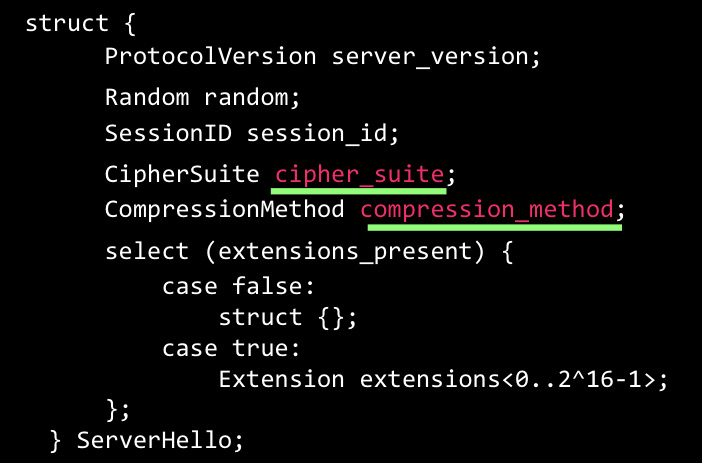

# 第 4 章：传输层安全协议 TLS

## 目录
[[toc]]

## Handshake protocol

### 完整流程

### 包结构图示

### HandshakeType

#### HelloRequest

这是一个简单的通知，特殊的是这是 Server 主动发送的，这是用于告知 Client 重新开始协商过程。响应需要在合适的时候发送 ClientHello。

#### ClientHello

##### 简介

新的握手流程中，ClientHello 总是第一条消息。将支持的功能和首选项发送给服务器。建立新连接或者重新协商时发送。

##### 消息格式和图示

> 协议设计中，涉及变长数据都需要标识长度，用于客户端解析。上图中的 SessionId 是个可变长数据，因此存在 SessionIdLength。

- 密码套件：CipherSuites，客户端支持的密码学选项，客户端最倾向于使用的放于第一个。如果 SessionId 不为空，表示需要使用之前的存在会话，则至少包含这个会话需要的密码套件。
- 压缩方法：没有使用，指的是当前的模块没有使用，后面会详细说。
- Extension 结构
   - 是 TLS 的一种扩展机制，**一定程度上**在不修改协议本身的条件下增加功能。但是不绝对，后续出现的 TLS1.3 说明扩展机制具有局限性。
   - 以扩展块形式出现在 ClientHello 和 ServerHello 末尾，扩展一个个堆叠形成扩展块。
   - 扩展的格式和期望行为有扩展自己决定。

##### 实例包

#### ServerHello

Server 接收到来自客户端的 ClientHello 消息后，能够找到一套能够接受的算法，发送 ServerHello 响应，找不到将响应 handshake failure alert。

##### 消息格式和图示

**两项高亮的就是相关的加密算法等**

##### 实例包

#### Certificate

Server 向 Client 发送，使 Client 能够认证 Server 的身份。匿名通信情况下不需要发送。

##### 消息格式和图示

> ASN.1：抽象语法表示法 1
> 在电信和计算机网络领域，ASN.1 (Abstract Syntax Notation One) **是一套标准，是描述数据的表示、编码、传输、解码的灵活的记法**。它提供了一套正式、无歧义和精确的规则以描述独立于特定计算机硬件的对象结构。															
> --Wikipedia

##### 实例包

#### ServerKeyExchange

Server 发送 Certificate 消息后，立刻发送 ServerKeyExchange 消息，匿名协商在 ServerHello 后立即发送。仅当 Certificate 消息包含的信息不足以让客户端交换一个 premaster secret 是才发送 ServerKeyExchange 消息。比如 DHE_DSS、DHE_RSA、DH_anon，而对于密钥交换算法 RSA、DH_DSS、DH_RSA 则是非法的。

##### 消息图示

##### 示例包

通过对 client_random、server_random 和 pubkey 进行 hash 后，**签名**。确保收到的 pubkey 就是来自真正的 server。

> 疑问：上面的信息应该都是明文传输的，那么如果替换成攻击者的公钥，能否完成攻击？

> 回答：签名并不能完成，我们没法获取 Server 私钥，我们能够获取到 Pubkey 并替换，但是没有用处，因为签名值无法匹配，并且这个是生成 premaster secret 的**额外**信息，所以也无法生成具体密钥。

#### CertificateRequest

Server 请求 Client 的证书进行身份验证，包含服务器可接受的证书类型和可接受的 CA 列表。

##### 消息格式和图示

#### ServerHelloDone

服务器发送 ServerHelloDone 消息表示 ServerHello 和相关信息结束，密钥交换已经可以完成，等待客户端响应。ServerHelloDone 消息不包括任何内容。

##### 消息图示

##### 示例包

#### ClientKeyExchange

如果 Client 发送 Client Certificate 消息，Client 应该紧接着发送 ClientKeyExchange 消息。否则在客户端收到 ServerHelloDone 消息后立即发送该消息。

- Client 发送消息向服务器提供用于生成对称加密密钥等所需的数据。
- 套件包含 RSA，会睡消息发送**经过 RSA 加密的 Premaster Secret**
- 套件包含 Diffie-Hellman 密钥交换时，随消息发送 **DH 算法公开值**

##### 消息格式和图示

 

##### 示例包

#### CertificateVerify

Server 发送了 CertificateRequest 消息的情况下，Client 才会发送 CertificateVerify 消息，向服务器证明自己的确持有客户端证书的私钥。

##### 消息格式和图示

> handshake_messages：迄今为止收到和发送的所有握手消息的拼接，从 client hello 开始，不包括当前这个消息。包括握手消息的 type 字段和 length 字段。用于证明，客户端确实就是证书的拥有者。

#### Finished

- 发送 ChangeCipherSpec 激活协商的密码套件后，**客户端**发送 Finished 消息，表示 TLS 握手协商完成，握手结束。
- **此处使用密文，因为协商完成了，接下来的交流都是密文。**
- 消息采用 PRF 函数生成，输入包括 master_secret，finished_label，
- 服务器可以通过对收到的东西验证，确认收到的 Finished 消息是否正确，从而可以确认握手协议和密码套件的切换是否正常。

##### 消息格式和图示

##### 实例包

##### 防止降级攻击

MiTM 攻击者修改 ClientHello 消息里面的密码套件列表，用较弱的密码套件替换较强的密码套件，从而降低所建立的通信信道的安全性。
Finished 消息，包含了所有握手消息的 hash，如果攻击者篡改前面的握手消息，则无法通过验证。

#### ChangeCipherSpec

激活协商的密码套件，**之后的消息全部使用加密通信**，用协商的密码套件。

##### 消息格式和图示

##### 示例包

## Alert Protocol

以简单的通知机制告知通信出现异常状况。

### AlertLevel

Alert 消息分成两类，警告和致命消息。

- 致命消息：导致连接直接中断，并将所有的相关会话作废，以避免这个会话被继续用来建立新连接。
- 警告消息：仅仅通告对方有关的报警消息，不导致连接关闭。

### AlertDescription

### TLS 报警消息类型和触发原因

### Closure Alert (关闭连接警报)

一旦一端确定无数据发送，决定关闭连接，就会发送 close_notify 警报。另一端收到后会丢弃任何还未写出的数据发送自己的 close_notify 警报。警报后任何消息都会被忽略。

#### 目的

防止截断攻击 (truncation attack)，攻击者可以主动发送 TCP 的 FIN 包，提前结束通信，没有加密消息告知结束，是无法分辨出结束是不是合法的。

## Application Data Protocol

## 参考资料

## TLS Cipher Suite

### 属性

- 身份认证算法
- 密钥交换算法
- 加密算法
- 加密密钥大小
- 加密算法模式 (可用时)
- MAC 算法 (可用时)
- PRF (TLS1.2)
- 用于 Finished 消息的散列函数 (TLS1.2)

#### 密码套件格式

#### 密码套件名称和解析

#### IANA 列表

满足要求的组合很多，因此 IANA 给每个密码套件分配了一个 2 字节表好来表示密码套件。

#### 特殊密码套件

在 TLS 的初始连接时，使用的是特殊的密码套件 TLS_NULL_WITH_NULL_NULL。
改密码套件不可协商，不提供任何安全保护。

## 密钥导出

### TLS 的密钥

密码学的实践原则之一：用于不同使用目的的密钥应该不同，主要是提高系统安全性，即使某个密钥泄露也不至于整个系统沦陷。TLS 需要三种密钥

- 用于消息加密的对称密码密钥
- CBC 模式的初始化向量
- 用于消息认证码的密钥
> 新的 AEAD 型算法不需要 MAC Key，此处不讨论

Server 和 Client 各有一个密钥，共六个。

### TLS 密钥生成流程

#### PreMasterSecret

- 假设采用 RSA 进行密钥协商，Client 生成一个随机值，在发送 ClientKeyExchange 消息时用 Server 的公钥加密，发送给 Server，这个秘密就是 pre_master_secret。
- 假设采用 DH 进行密钥协商，Client 在发送 ClientKeyExchange 消息时，将 DH 的公开值发送给 Server。Server 也会发送一个 DH 公开值给 Client。根据 DH 算法，最终通信双方获得一个相同的秘密值，即为 pre_master_secret。

#### MasterSecret

48 字节数值生成方法如下，其中 master secret：一个常量标签字符串，用于表示所生成数据的使用目的。  

#### TLS PRF 定义

PHash 用于生成任意长度的输出，使用 secret 和 seed 两个参数。如果需要，该函数可以迭代多次。

#### 密钥导出

最终通信双方产生相同的 master secret，且进一步产生相同的 keying material，通过相同顺序的切割，最后得到一致的 6 个密钥。

## 修复以前的 Session

完整的握手过程开销较大，一方面是时延，一方面是计算开销。事实上，可以重用已有的会话信息。
### Session ID 机制

#### ClientHello 中 SessionId 为空

此时 Client 表示没有可重用会话，或者之前的会话没有重用的意愿。

- ServerHello 返回 SessionId 为空：继续进行握手流程，表示将来没有重用该会话的意愿
- ServerHello 返回 SessionId 为不空：标识当前会话，表示将来可能重用该会话；同时客户端会保存此 ID 和相关信息

#### ClientHello 中 SessionId 不为空

此时 Client 想要重用之前的会话，此时 Server 可以接受与拒绝：

- ServerHello 返回 SessionId 为空：没有找到匹配项或者**没有重用的意愿**，继续进行握手流程
- ServerHello 返回 SessionId 为不空：检查 Session cache 中是否有匹配项。如果找到一个匹配的且服务器愿意以指定的会话状态重建连接，服务器将以相同的 SessionID 值发送 ServerHello 消息。发送 ChangeCipherSpec 消息且直接继续发送 Finished 消息，重连完成。

#### 方案缺陷

- 服务器需要维护创建 Session Cache
- 服务器的负载均衡，多个服务器 Session Cache 的同步问题

### Session Ticket 机制

Ticket 指的是一个由服务器创建和使用的且受密码学保护的数据结构，服务器使用 Ticket 来重建与特定会话相关的状态。

#### 结构

-  key_name：用于识别保护 ticket 的一组特定的密钥
- encrypted_state：加密过的 state 结构
   - state：
- mac：采用函数 HMAC-SHA-256 输入 key_name (16 octets)、IV (16 octets)、Length of encrypted_state field、encrypted_state

####  Session ticket 的创建

TLS 服务器把会话相关信息构造一个 Session Ticket 并发送给客户端，回复时需要带上此 Ticket，服务器解密后按照内部信息恢复。

> Ticket 加密过，无法得知哪个接口可复用，也无法在过期后使用。
> 攻击者可以获取到 SessionTicket，但攻击者无法伪造 SessionTicket，因为是服务器加密且认证的，因此在使用 session ticket 之前，服务器可以验证 session ticket 的有效性。

## TLS 的应用

### 分设端口

### 向上协商

通过应用层协议来协商是否采用 TLS 而不是分设端口。
