# 第5章:无线局域网安全WLAN

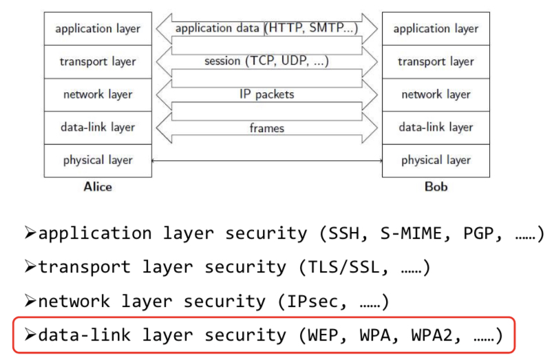

## 目录
[[toc]]

## 无线局域网简介

### 无线局域网组件

- 无限媒介：Wireless Medium，射频和红外，主要是射频
- STA：Station，具有无线网卡的设备
- AP：Access Point，无线接入点，能为已经关联的 STA 提供 DS 服务
- DS：Distribution System，用于连接一系列基本服务集 (BSSs) 和局域网从而建立的一个扩展服务集 (ESSs) 的系统

### 无线局域网的构建

- SS：服务集，运行在相同联网参数下的**无线网络设备**
- BSS：基本服务集，运行在相同媒介访问特征 (如无线频率、调制模式等) 下的一组设备
   - Independent BSS：简称 IBSS，不需要 AP，自组网络
   - Infrastructure BSS：需要 AP 参与构建网络
- ESS：扩展服务集，在同一逻辑网段下的一个或多个基本服务集构成的逻辑单元。逻辑网络 (包括 ESS) 通过 SSID 来识别，SSID 作为网络名称，通常表现为自然语言命名的标签。
> 服务集指的是一堆设备，同一个网络网段中的一般为 ESS，而一个 ESS 可能具有多个 AP，因此会有多个 BSS。

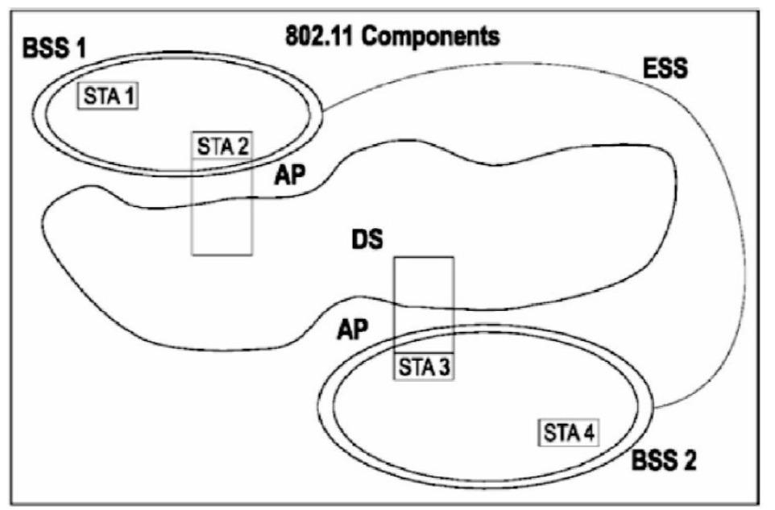

### WLAN 的基本工作原理

1. AP 周期性发送 Beacon 帧，用于宣布网络的存在和网络参数 (可关闭)
2. STA 发送 Probe Request 帧主动探测某个 AP (主动探测)
3. STA 发送认证请求，AP 回复认证响应
4. 通过认证，STA 发送关联请求，AP 回应关联响应，实现 STA 和 AP 的关联
5. STA 和 AP 之间传输数据帧

### 帧格式

#### Ethernet II 对比 802.11 MAC 帧格式

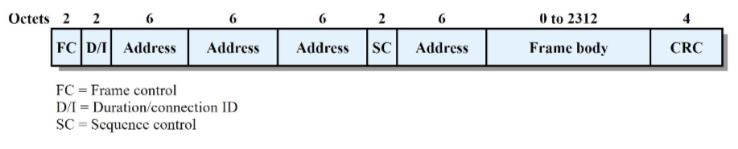

- Mac Header：包括帧控制 (Frame Control)，时长，地址等
- Frame_Body：表示数据域，这部分长度可变。具体根据类型和子类型字段决定。
- FCS：帧校验序列，保障帧数据完整性
:::warning
Octets 表示一个八位组，协议中用于标准化表达
:::

#### Frame Control

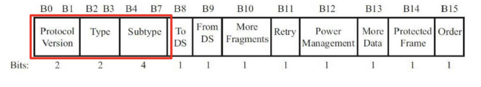

- Protocol Version：代表 802.11 MAC 帧的版本号，目前是 0
- Type 和 SubType：这两个字段用于指明 MAC 帧类型，目前三种类型：Control、Data 和 Management，每种对应不同的功能。具体分类如下：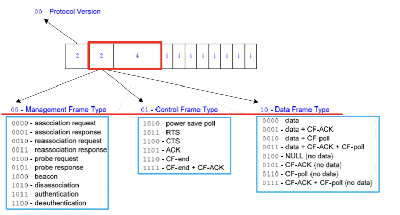

### 帧分类

#### 控制帧

控制帧得名于媒体访问控制，用来控制通信媒体访问。通常于数据帧搭配使用，负责区域的清空、信道的取得及载波监听的维护，并于收到数据时予以应答，借此促进工作站间数据传输的可靠性。

#### 数据帧

数据帧用来携带上层协议数据 (如 IP 数据包)，负责在工作站之间传输数据。

#### 管理帧

用于管理无线网络，如节点的加入和退出无线网络等，主要包括：

- Beacon (信标) 帧
- Association Request/Response (关联请求/回复) 帧
- Probe Request/Response (探测请求/回复) 帧
- Authentication/Deauthentication (认证/取消认证) 帧

##### 管理帧格式

管理帧包括 MAC Header (六个字段)，Frame Body 和 FCS，其中 Frame Body 携带具体的管理信息数据。管理信息数据包括：

- 定长字段
   - Authentication Algorithm Number：2 个 octets，用于说明认证过程中所使用的认证类型
      - 0：代表开放系统身份认证 (Open System Authentication)
      - 1：代表共享密钥身份认证 (Shared Key Authentication)
      - 2：代表快速 BSS 切换 (Fast BSS Transition)
      - 3：代表 SAE (Simultaneous Authentication of Equals)。用于两个 STA 互相认证的方法，常用于 Mesh BSS 网络
      - 65535：代表厂商自定义算法。
   - Beacon Interval field：该字段占 2 octets。用来表示 Beacon 信号之间的时间，其单位为 Time Units，1024 微秒，一般设置为 100。
   - Capability Information (能力信息)：该字段长 2 octets，一般通过 Beacon 帧、Probe Request 和 Response 帧携带它。该字段用于宣告此网络具备何种功能。2 octets 中的每一位 (共 16 位) 都用来表示网络是否拥有某项功能
- 信息元素

##### 常用管理帧：Beacon 帧

AP 通过定时发送生命自己的存在，STA 通过 Beacon 感知存在的网络，就是无线网络的心跳帧。主要携带：Timestamp、Beacon Interva、Capability、SSID。

##### 常用管理帧：Probe Requset/Responce 帧

STA 用 Probe Request 帧来搜索周围的无线网络，包括信息 SSID、Supported Rates、Extended Supported Rates。
AP 收到 Probe Request 帧后。会用 Probe Responce 响应，携带信息与 Beacon 帧类似。

##### 常用管理帧：Association Request 帧

当 STA 要关联 AP 的时候，发送 Association Request 帧，主要携带信息是：

- Capability：AP 将检查该字段来判断 STA 是否满足要求
- Listen Interval：指 STA 两次苏醒之间，跳过多少 Beacon 帧
- SSID：AP 将检查 SSID 是否为自己所在网络
- Supported Rates：AP 将检查该字段是否满足要求

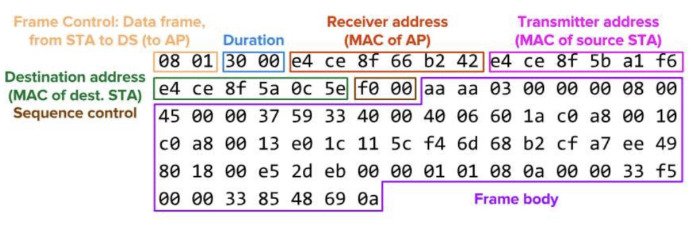

##### 常用管理帧：Association Response 帧

针对 Association Request 帧，AP 会回复一个 Association Response 帧来通知关联请求的处理结果，主要包括如下信息：

- Capability：AP 设置的 Capability
- Status Code：AP 返回的关联请求处理结果
- AID：AP 返回关联 ID 给 STA
- Supported Rates：AP 支持的传输速率

##### 常用管理帧：Authentication 帧

主要用于身份认证，主要包括以下信息：

- Authentication Algorithm Number：认证算法类型
- Authentication Transaction Sequence Number：认证过程可能需要好几次帧交换，所以每个帧都有自己的编号
- Status Code：有些类型的认证会使用该值返回结果
- Challenge Text：有些类型的认证会使用该字段

#### 地址字段

- Receiver Address (RA)：用于描述接收 MAC 数据帧的接收者地址，可以是 STA 或者 AP
- Transmitter Address (TA)：用于描述将 MAC 数据帧发送到无线媒介的实体的地址，可以是 STA 或者 AP
- Destination Address (DA)：用于描述 MAC 数据帧最终接收者 (finalrecipient)，可以是单播或组播地址
- Source Address (SA)：用于描述最初发出 MAC 数据帧的 STA 地址。一般情况下都是单播地址

#### 帧实例分析

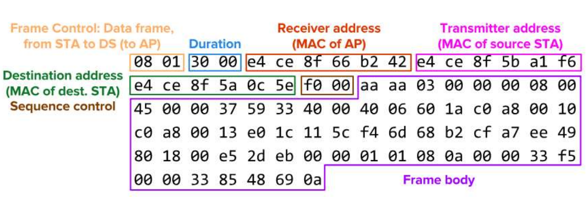

### WLAN 的安全发展过程

- WEP：有线等效保密，达到和有线网络相同的安全性
- WPA：实现了 802.11i 草案的一个子集，只需要更新固件，不需要更新硬件即可实现
- WPA2：实现了 802.11i 规范
- WPA3：更安全的算法，GCMP，ECDH 等等

## WEP
主要解决身份认证，保密性和完整性。

### 身份认证

#### 开发系统认证

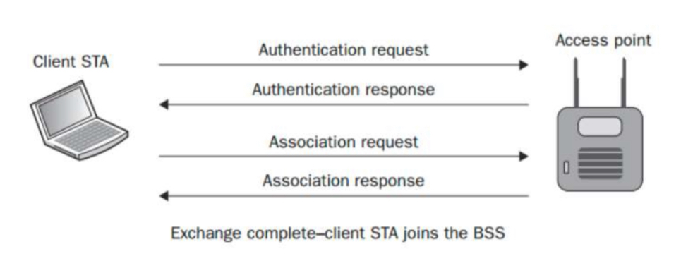

#### PSK 身份认证

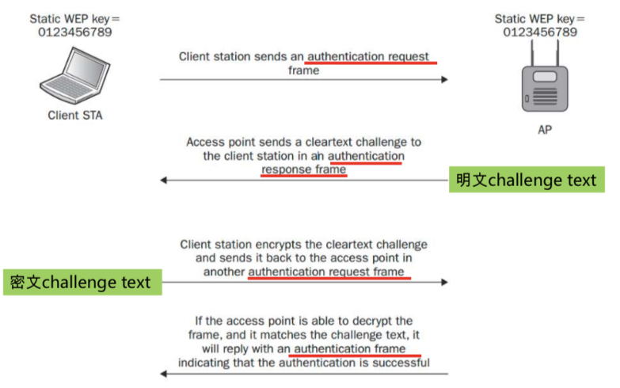
通过静态密码进行身份认证，只要能够解密就证明身份。

> 为什么能够提前共享一个密钥 Web Key 呢，是何时设置的？

> 是提前设置的，对于 PSK 身份认证都是如此，因此所有的 STA 共享 AP 的 Web key。在企业版的 802.11x 中有专门的服务器负责这一功能，更加安全。

### 加密封装

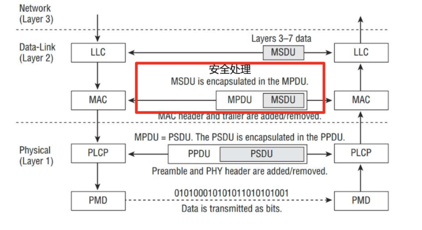
仅对无线帧进行加密，没有 MSDU 的帧无需加密，如：管理帧，控制帧，空帧 (无数据字段)。
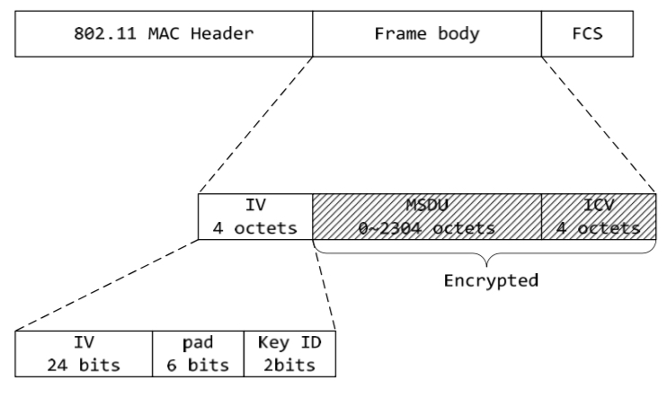

### 加密流程

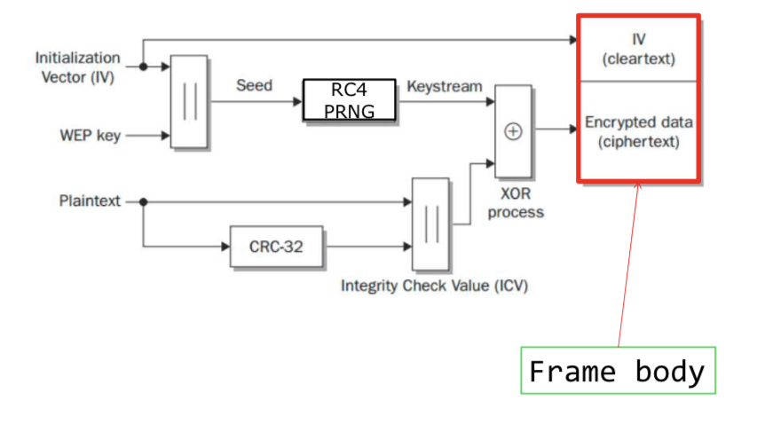

1. 生成 24bit 随机数作为 IV，与 WEP Key 组合作为 RC4 算法的输入，产生密钥流；IV 随数据帧以明文方式发送
2. 对需要加密的数据应用 CRC-32 生成 ICV，追加该 ICV 到明文数据后面
3. 将 2 的数据与 1 的密钥流做 XOR 运算生成密文
4. 将 IV 添加到密文前面作为 Frame body 封装成帧并发送

####  RC4 种子

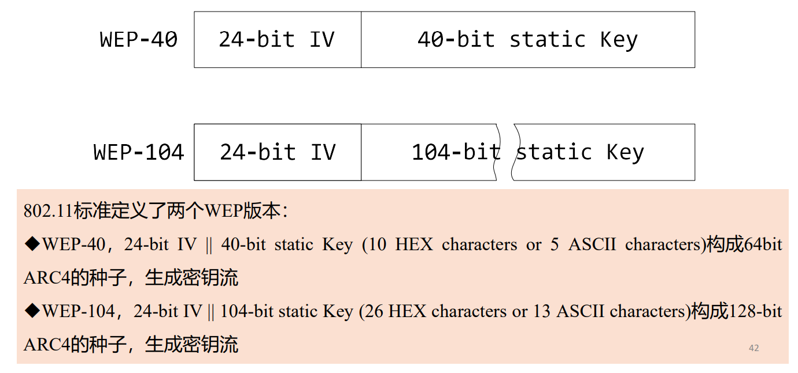

### 解密过程

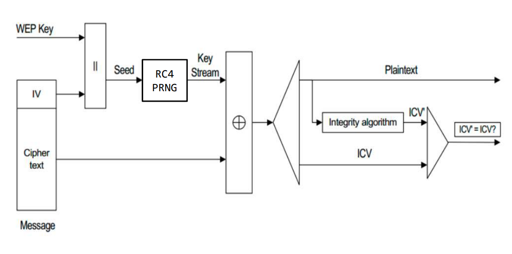

1.  提取 Frame body 中的 IV，与 WEP Key 组合作为 RC4 算法的输入，产生密钥流。
2. 将密钥流与密文做 XOR 运算得到数据明文和 ICV。
3. 对数据明文计算 ICV，并与 2 中的 ICV 进行对比以确定数据完整性。

### 缺陷

#### RC4：FMS attack*

Scott Fluhrer，Itsik Mantin，and Adi Shamir
Attackers can recover the RC4 key after eavesdropping on thenetwork。

#### 同一网络下的 STA 可相互窃听流量

- 相同的 WEP Key
- 明文传输 IV

## WPA

### TKIP

临时密钥完整性协议 (Temporal Key Integrity Protocol)，基于 802.11i draft，对 WEP 进行改进，只需更新固件。
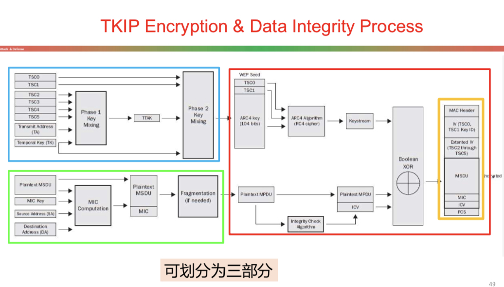

#### TKIP 加密过程

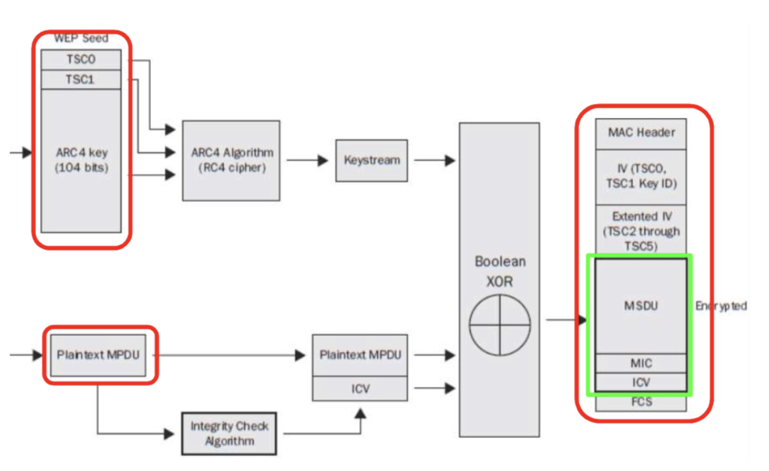
对照 WEP，改动地方有：

- WEP Seed 的生成
- Plaintext MPDU
- 帧封装：WEP 在 MAC Header 后面紧随 4octet 的 IV 字段，然后是加密的 MSDU ICV；TKIP 的 MAC Header 后面紧随 8octet 的 (IV || Extended IV)，然后是加密的 MDU || MIC || ICV。

##### TKIP：Plaintext MPDU 生成

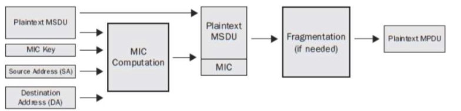

- Plaintext MSDU：未加密的 MSDU
- MIC Key：是从 TK 中取出来的制定 64 位
- SA：指发送端的 MAC 地址
- DA：指接收端的 MAC 地址
> TKIP 除了保护 MSDU 的数据，还保护了 SA 和 DA，虽然在 MAC Header 中也有，但是能**防止篡改**。

##### MIC 计算

TKIP 使用称为 Michael 算法的 Keyed Hash function 来生成 MIC。Michael 的输入为 64 比特 key 和任意长度的消息，输出为 64 比特的 Michael 值。MIC Key：

- 如果是 AP 发送给 STA，则为 TK 的 128 - 191 比特
- 如果是 STA 发送给 AP，则为 TK 的 192 - 255 比特
> 这里把 PTK (TLS 的密钥流中切割下来的) 的最后的 256(128+128) 比特统称为 TK，而 MIC key 是从 128 比特开始，其实就是最后 128bit 构成 MIC key

##### WEP Seed 生成

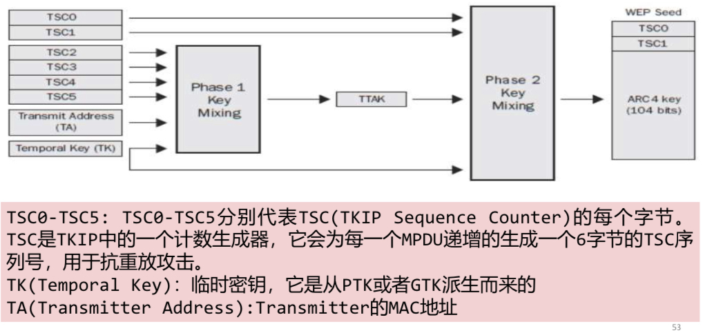
KeyMixing：阶段一为了增强强度，每次连接只运行一次，但是阶段二每个包运行一次。最后生成结合 TSC0，TSC1，ARC4 key。

#### TKIP：解密过程

- 阶段 1 的密钥混合有三个输入，即：TA、TK 和 TSC，结果为 TTAK，然后输入给阶段 2 的密钥混合，同时将 TK 和 TSC 作为输入，生成 WEP seed。WEP seed 喂给 ARC4 算法生成密钥流
- 同时对帧的 TSC 进行检查，判断是否与预期相符，如果不相符，则丢弃；否则与密钥流做 XOR 运输，恢复出明文 MPDU，如果存在分片，这里还需要重组。以相同的方式生成 MIC 值，并与明文 MPDU 中的 MIC 进行比对，以确定是否完整。

## RSNA 密钥管理

- Robust Security Network Association
   - 强健安全网络关联
   - WIFI 联盟认可的、对 802.11i 的完整实现称为 WPA2，也称为 RSN。
- WEP：Pre-RSNA
- WPA/WPA2：RSNA

### 密钥管理

- WEP
   - 所有 STA 使用相同的 WEP Key 进行数据加密
   - 安全性较差
- RSNA
   - 关联后，不同 STA 和 AP 之间使用不同 Key 进行数据加密，即：Pairwise Key

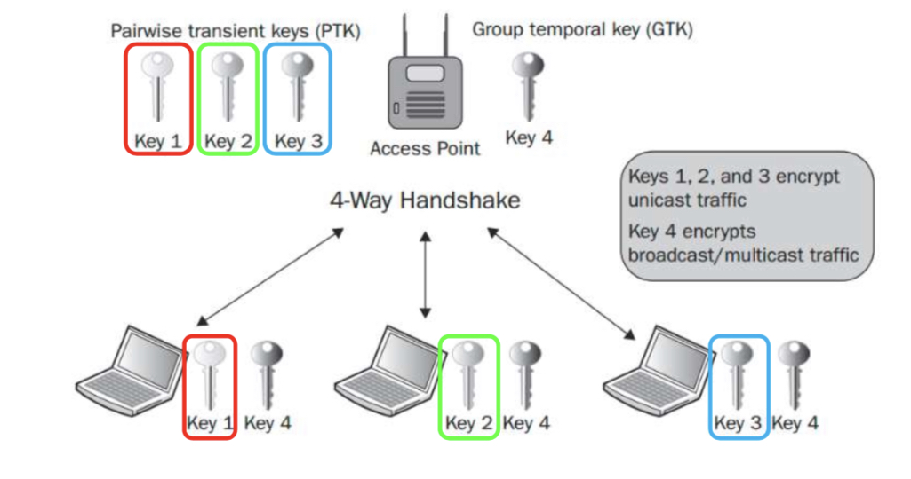

### 密钥层次

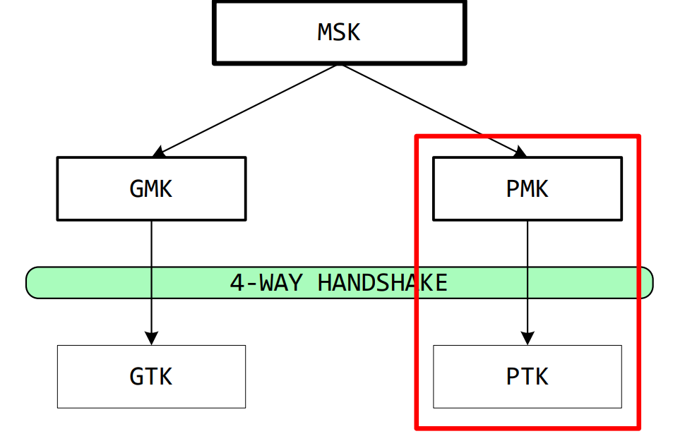

### 密钥导出

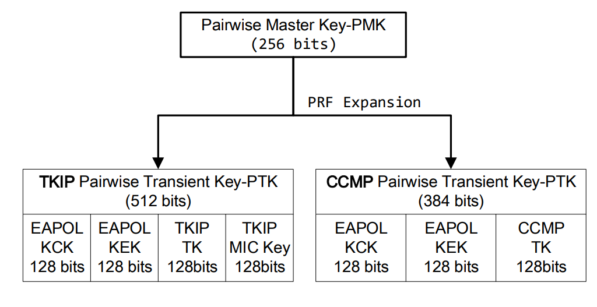

### 密钥用途

- KCK：用于计算 WPA EAPOL-Key 消息中的 MIC
- KEK：AP 用 KEK 加密发送给 STA 的附加数据，在 Key Data 字段，比如 EAPOL-key 消息中的 GTK 信息字段
- TK：用于加/解密单播数据帧
- Tx：用于计算 AP 发送的单播数据帧的 MIC
   - Michael MIC Key
- Rx：用于计算 STA 发送的单播数据帧的 MIC
   - Michael MIC key

### 无线安全设置界面

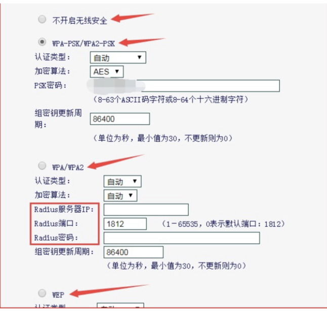

- WPA/WPA2：企业版的需要服务器认证

### RSNA 过程

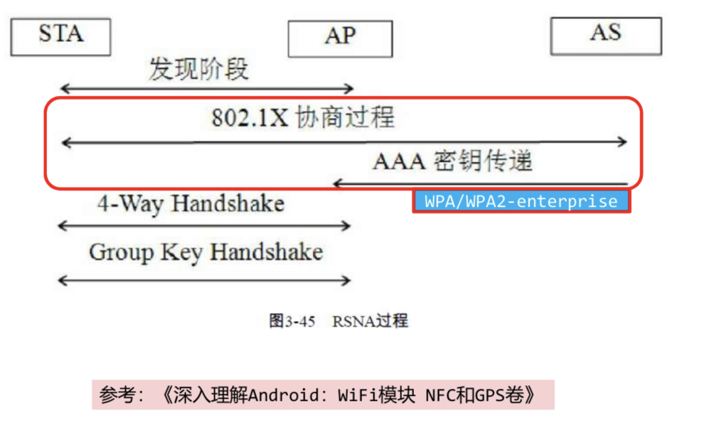

#### EAP 架构

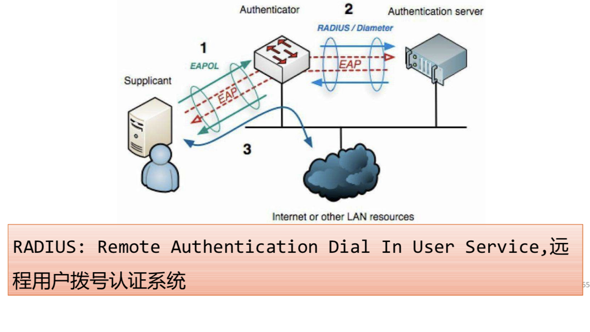
用户请求连接，鉴权者向 AS 请求验证，通过认证可以开放受控端口，可以访问。

#### 802.1x 受控端口/非受控端口

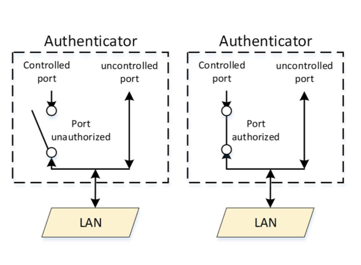
认证者设备为客户端提供接入局域网的端口，这个端口被划分为两个逻辑端口：受控端口和非受控端口。任何到达该端口的帧，在受控端口与非受控端口上均可见。

- 非受控端口始终处于双向连通状态，主要用来传递 EAPOL 协议帧，保证客户端始终能够发出或接收认证报文。
- 受控端口在授权状态下处于双向连通状态，用于传递业务报文；在非授权状态下禁止从客户端接收任何报文。

#### PMK 导出

对于企业版，需要协商后的 MSK 前 256bits。
对于 PSK，PMK 就是 PSK，通过 Password 和 SSID 导出。
`PMK = PBKDF2(HMAC−SHA1, PWD, SSID, 4096, 256)`
####  4-WAY HANDSHAKE

4 次握手用于鉴别通信两端的真实性和建立加密密钥
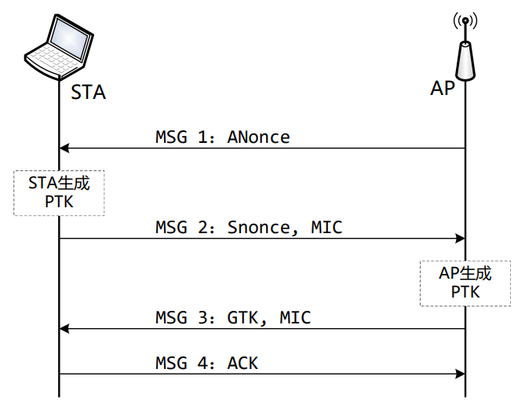
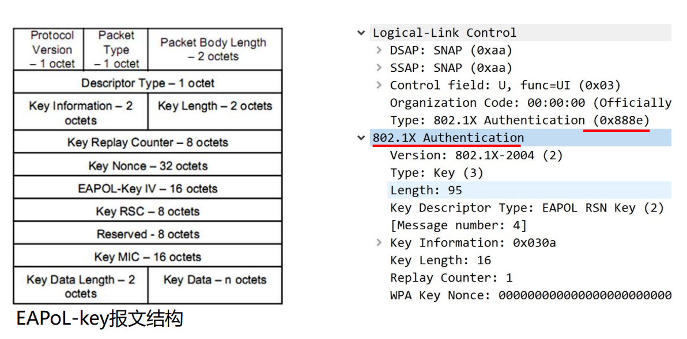
