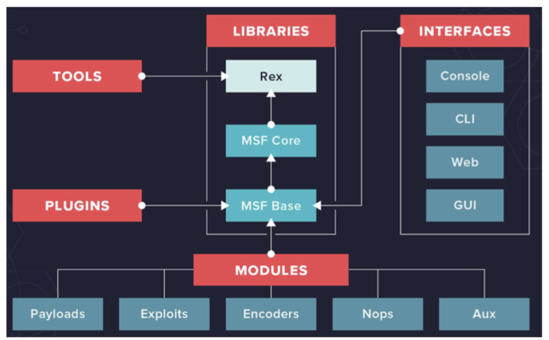

# 第 6 章：渗透测试-Metasploit 框架

## 目录
[[toc]]

## MSF 简介

Rapid7 LLC 开发的一个开源渗透测试工具。用于开发和运行 exploit 代码，其中还包括 Opcode 数据库、shellcode 等。

### MSF 软件架构

#### Rex

即 Ruby Extension Library，本质上是一些 class 和模块的集合，开发者可以基于这些类和模块来开发工具，比如包括：应用于大多数任务的基本库；处理 socket、协议、文本传输等；处理 SSL、SMB、HTTP、XOR、Base64、Unicode 等。

#### MSF Core

MSF Core 由各种子系统组成，比如模块管理、会话管理、事件分派、数据存储等核心功能。

#### MSF Base

MSF Base 在 MSF Core 基础上构建，提供了接口以便更容易使用 MSF Core。主要包括：配置 (configuration)，用于维护一个持久的配置和获取安装信息，比如安装根目录和其它属性；日志 (logging)，MSF 提供灵活丰富的日志支持；会话 (session)，用于维护用户会话行为信息和控制用户会话行为。

#### MSF 接口

用户通过接口与 MSF 框架交互，包括命令行交互接口 msfconsole，命令行非交互接口 msfcli，web 接口 msfweb 和 REST API。

#### MSF 模块

- 模块：其中包含了 exploits、Payload、NOP generator、Encoder、辅助模块、插件等。如果 exploit 包含了 payload，则定义为模块；否则，定义为辅助模块 (auxiliary)。
- 插件：是 MSF 里面用来修改框架自身的模块，也就是通过插件可以扩展 MSF 的功能，使得 MSF 成为一个安全工具开发平台。

