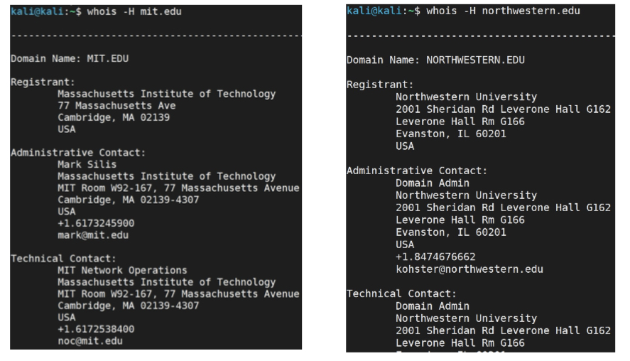
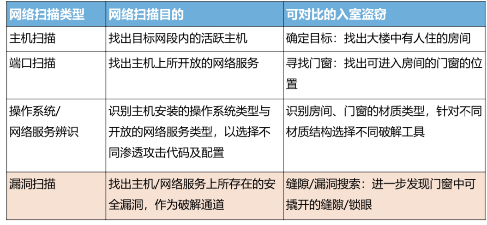

# 第6章:渗透测试-情报收集技术

## 目录
[[toc]]

## 间接信息收集

- whois 查询
- nslookup
- IP Geolocation
- Google hacking
- 网络空间搜索引擎
### whois 查询

whois 是一个协议 (RFC3912)，也是一个命令，用来查询互联网资源的注册用户 (或者是持有人) 的相关信息


### nslookup

nslookup 命令用于查询域名系统来获取域名与 IP 地址之间的映射或者其它 DNS 记录
nslookup 命令以两种模式查询域名服务器

- 非交互式模式，命令行后直接输出查询结果
- 交互式模式，允许以更灵活的方式查询域名信息

  > 同一个域名解析为什么出不一样的 IP 地址

### Google Hacking

物理世界的很多信息会通过各种方式反映到 Web

- Google 搜索引擎索引了整个互联网绝大多数网页
- Google 搜索引擎提供了灵活的搜索结果过滤方法
- Google hacking 来搜集攻击目标的情报
### IPGeolocation

- 如何确定一个 IP 地址对应节点的地理位置？
   - 网络测量
   - IP Geolocation 数据库
### 网络空间搜索引擎

#### Shodan

与 Google 这种搜索网页的搜索引擎不同，Shodan 是用来搜索网络空间中的联网设备，通过 Shodan 可以搜索满足特定条件的网络节点，比如：webcam，linksys，cisco，netgear，SCADA 等等。
#### ZoomEye

Shodan 主要针对的是设备指纹，也就是与某些特定端口通信之后返回的 banner 信息的采集和索引。而 ZoomEye 除了设备指纹的检测，还针对某些特定服务加强了探测，比如 Web 服务的细节分析
## 网络扫描

网络扫描的基本目的是探测目标网络，以找出尽可能多的活跃主机，然后再进一步探测目标 OS 类型、存在的安全弱点等信息，为下一步攻击选择恰当目标和通道提供支持。
通过对待扫描的网络主机发送特定的数据包，根据返回的数据包来判断待扫描的系统的端口及相关的服务有没有开启。
扫描类型：

- 主机扫描
- 端口扫描
- 操作系统/网络服务辨识
- 漏洞扫描


### 主机扫描

#### ICMP

通过对目标网络 IP 地址范围进行自动化的扫描，确定这个网络中都存在哪些活跃的主机与系统。
Ping 程序利用 ICMP 协议中的 ICMP Echo Request 数据包进行探测，如果目标主机返回了 ICMP Echo Reply 数据包，说明主机真实存在。
#### TCP

在三次握手中，ACK 表示确认握手过程。但是，如果根本没有进行 SYN 的请求，而去确认连接，目标主机就会认为一个错误发生了，而发送 RST 包来中断会话。
#### UDP

#### 主机扫描工具-Nmap

#### 主机扫描防范措施

- 入侵检测：网络入侵检测系统
- 防火墙：通过 ACL 访问控制列表把外来 ICMP 通信限制在只能到达受信任的主机范围
   - 仔细设计 ICMP 报文的过滤策略。最简单的办法是只允许 ICMP Echo Reply、HOST_UNREACHABLE、TIME_EXCEEDED 等响应报文进入 DMZ (非军事区) 网络并只允许他们到达特定的主机。
   - 配置个人防火墙，如 nftables
##### 主机扫描防范措施：DMZ

DMZ(DeMilitarized Zone)，称 “非军事化区”。是为了解决安装防火墙后外部网络不能访问内部网络服务器的问题，而设立的一个非安全系统与安全系统之间的缓冲区，这个缓冲区位于企业内部网络和外部网络之间的小网络区域内，在这个小网络区域内可以放置一些必须公开的服务器设施，如企业 Web 服务器、邮件服务器、FTP 服务器等。
### 端口扫描

是一种用来确定目标主机 TCP 端口和 UDP 端口状态的方法。开放某个端口，意味着提供某种网络服务。
#### TCP Connect

调用 connect() socket 函数连接目标端口：

- 如果目标端口开放：完成完整的 TCP 三次握手 (SYN，SYN|ACK，ACK)，timeout/RST
- 如果目标端口未开放：SYN，RST

优劣势：无需特权用户权限可发起，目标主机会记录大量连接和错误信息，容易检测
#### TCP SYN

半开扫描 (half-open scanning)

- 如果目标端口开放：攻击者 SYN，目标主机 SYN|ACK，攻击者立即反馈 RST 包关闭连接
- 如果目标端口未开放：攻击者 SYN，目标主机 RST

优劣势：目标主机不会记录未建立连接，较为隐蔽，需特权用户权限构建定制 SYN 包
#### 隐蔽端口扫描

TCP 连接扫描和 SYN 扫描并不隐蔽：防火墙会监控发往受限端口的 SYN 包

- 隐蔽端口扫描通过构造特殊的 TCP 标志位，以躲避检测，同时达成端口扫描目的。通常可以穿越防火墙。
- FIN 扫描 (只带 FIN 位)，NULL 扫描 (全为 0)，XMAS 扫描 (FIN/URG/PUSH)
- FTP 弹跳扫描：利用 FTP 代理选项达到隐蔽源地址
   - 例如：利用 192.168.1.100 对目标 192.168.1.200 进行弹跳扫描
   - nmap -p 21,22,80 -b 192.168.1.100 -Pn 192.168.1.7 -v

#### 端口扫描防范措施

- 网络管理员利用端口扫描确定开放必要服务 (关闭非必要端口)
- 网络入侵检测系统：Snort 中的 portscan 检测插件。
- 系统扫描检测工具：scanlogd，PortSentry，Genius
- 端口扫描的防护：开启防火墙
   - 类 UNIX：netfilter/NFTables；
   - Win32：个人防火墙
- 禁用所有不必要的服务，尽可能减少暴露面 (缩小攻击面)。
   - 类 UNIX： /etc/inetd.conf
   - Win32：控制面板/服务

### 操作系统/服务类型探测

#### 系统类型探查

系统类型探查目的是探查活跃主机的系统及开放网络服务的类型
操作系统类型识别 (OS Identification)：基于操作系统类型和版本实现机制上的差异

- 协议栈实现差异：协议栈准确度更高
- 开放端口的差异：端口扫描
- 应用服务的差异：banner 获取

##### 主动协议栈指纹鉴别

Fyodor 提出了用来探测不同操作系统类型和版本的技巧，包括：FIN 探测报文、假标志位探测报文、ISN 采样、DF 位监视、初始窗口大小，ACK 值，ICMP 出错消息抑制，ICMP 消息引用，ICMP 出错消息回射完整性，重叠分片处理，TCP 选项等。
```bash
nmap -O TargetIP
```
#### 网络服务类型探查

探测目标网络中开放的端口以确定服务的类型和版本信息，了解目标系统更丰富信息，可支持进一步的操作系统辨识和漏洞识别。网络服务主动探测：

```bash
nmap -sV
```

#### 扫描结果报告：STATE 字段

- open：端口处于开放状态，例如：当 nmap 使用 TCP SYN 对目标主机某一范围的端口进行扫描时，如果目标主机返回 SYN+ACK 的报文，就认为此 TCP 端口开放
- closed：端口处于关闭状态，例如：TCP SYN 类型的扫描，如果返回 RST 类型的报文，则认为端口处于关闭状态。
- filtered：由于报文无法到达指定的端口，nmap 无法确定指定端口的开放状态，这主要是由于网络或者主机安装了防火墙所导致的。当 nmap 收到 icmp 报文主机不可达报文 (例如：type 为 3，code 为 13 (communication administratively prohibit) 报文) 或者目标主机无应答，常常会将目标主机的状态设置为 filtered。
- unfiltered：当 nmap 不能确定端口是否开放的时候所打上的状态，这种状态和 filtered 的区别在于：unfiltered 的端口能被 nmap 访问，但是 nmap 根据返回的报文无法确定端口的开放状态，而 filtered 的端口直接就不能够被 nmap 访问。端口被定义为 Unfilterd 只会发生在进行 TCP ack 扫描时，返回 RST 的报文。
- open|filtered：这种状态主要是 nmap 无法区别端口处于 open 状态还是 filtered 状态。这种状态只会出现在 open 端口对报文不做回应的扫描类型中，如：udp，ip protocol，TCP NULLl，FIN，和 XMAS 扫描类型。
- closed|filtered：这种状态主要出现在 nmap 无法区分端口处于 closed 还是 filtered 时。此状态只会出现在 IP ID idle scan

#### nmap 输出控制

缺省情况下，nmap 的输出是显示到标准输出 (stdout)，我们也可以将输出同时写入到指定文件。命令行：-oN(N 表示 Normal) 表示将输出写入指定文件
```bash
nmap -O scanme.nmap.org –oN os-scan.txt
```
也可以将输出以 XML 格式写入指定文件，这种方式便于其它软件或者工具使用 nmap 的输出。命令行：nmap -O scanme.nmap.org -oX os-scan.xml
#### nmap 扫描速度控制
nmap 可以进行扫描速度控制，提供了 6 级扫描速度控制，不同的扫描速度会对 IDS 产生不同的影响，也就是速度越快越容易被检测到，因此需要根据具体的需求和网络状况来选择具体的扫描速度。

- T0 = Paranoid (0) 入侵检测系统逃避。
- T1 = Sneaky (1) 入侵检测系统逃避。
- T2 = Polite (2) 降低扫描速度以减少网络带宽使用和目标主机的资源消耗。
- T3 = Normal (3) 缺省使用的速度。
- T4 = Aggressive (4) 加速扫描，如果你的网络较快且稳定，可以采用这个速度。
- T5 = Insane (5) 加速扫描，如果你的网络超快，可以考虑采用这个速度。

#### nmap 拓展

- nmap 的功能比较丰富，组合多种选项可以提高扫描的效率，达到所需的扫描精度。
- nmap 还支持通过脚本方式扩展其功能，因此用户可以基于 nmap 的基本框架来开发特殊的扫描功能，比如对工控系统 (ICS) 的支持。
- ZenMap 是 nmap 的一个图形前端，用户可以通过 ZenMap 对 nmap 进行操作。

### 高性能扫描

#### Zmap

- 45分钟扫描全网
- 10GigE 连接 + PF_RING，5分钟之内扫描 IPv4 地址空间

#### Masscan

- 低于5分钟扫描全网

## 网络流量分析

### 流量嗅探

#### 危害与作用

- 攻击者：内网渗透技术，窃取机密信息，为发起进一步攻击收集信息
- 防御者：管理员可以用来监听网络的流量情况，定位网络故障，为网络入侵检测系统提供底层数据来源
- 开发者：开发网络应用的程序员可以监视程序的网络行为，排除程序错误

#### 嗅探原理

- 交换机毒化：向交换机发送大量虚构 MAC 地址和 IP 地址数据包，致使交换机 “MAC 地址-端口映射表” 溢出，交换机降级为广播模式
- MAC 欺骗：假冒所要监听的主机网卡，将源 MAC 地址伪造成目标主机的 MAC 地址，交换机不断地更新它的 “MAC 地址-端口映射表”，交换机就会将本应发送给目标主机的数据包发送给攻击者
- ARP 欺骗：利用 IP 地址与 MAC 地址之间进行映射时的协议漏洞，攻击机通过 ARP 欺骗声称为嗅探目标主机甚至网关
- 交换机镜像端口

#### 嗅探工具

- WireShark
- Tcpdump
- Sniffer Pro

软件形态：

- 软件嗅探器
- 硬件嗅探器 (协议分析仪)：专用设备，速度快，额外功能 (如流量记录与重放等)，价格昂贵

### 流量分析

#### 流程

- 嗅探获得数据
- 二进制格式数据报文
- 解析和理解二进制数据，获取各层协议字段和应用层传输数据
- 网络协议分析

#### 网络协议分析的粒度和层次

- 原始数据包：最细粒度、最低层次
- 网络流 (/会话)：通过 5 元组进行流 (/会话) 重组，sip，sport，dip，dport，ipproto
- 网络流高层统计：IP 会话列表\<sip，sport\>，目标端口流统计\<dport\>

网络报文分析集成工具：Wireshark

### 流量分析开发库

#### 类 Unix 平台

- Libpcap：一个用户态的一个抓包开发库
- DPDK：数据平面开发套件 (DPDK,Data Plane Development Kit) 是由 6WIND，Intel 等多家公司开发，主要面向 Linux 系统，用于快速数据包处理的函数库与驱动集合
- PF_RING：一种新型网络套接字，可显著提高数据包的捕获速度

#### Windows 平台

- 内核本身没有提供标准的接口
- 通过增加一个驱动程序或者网络组件来访问内核网卡驱动提供的数据包
- 在 Windows 不同操作系统平台下有所不同
- WinPcap 是一个重要的抓包工具，它是 libpcap 的 Windows 版本

