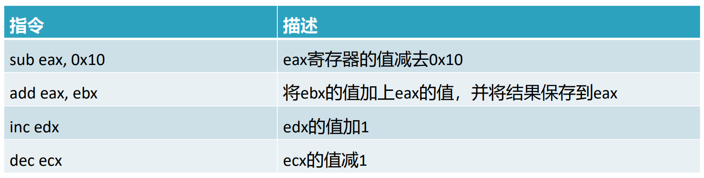
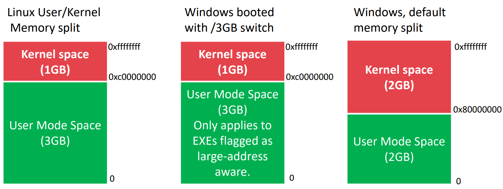

# 第 7 章：软件安全-缓冲区溢出

## 目录
[[toc]]

## x86 汇编

### 冯·诺依曼体系结构


冯·诺依曼体系就是一次次取指令，不断重复执行过程实现的。

### x86 指令结构

x86 汇编语言中，一条指令由一个助记符，零个或者多个操作数构成。

```	asm
mov ecx 0x42 ;
```

### 操作数

- 立即数：特定的值，如：`0x42`
- 寄存器：操作数是寄存器里面的数，如：`ecx`
- 内存地址：操作数是某个值指向的地址空间上的值，如：`[eax]`

::: info [eax]

方括号表示取值，括号内可以是计算公式或者寄存器或立即数，表示取括号内地址指向的值。

:::

::: tip 提示

x86 汇编语法有 Intel 和 AT&T 两种，我们以 Intel 语法为例进行说明

:::

### 寄存器

常用的 x86 寄存器可以分为四类：

- 通用寄存器，CPU 在执行期间使用
- 段寄存器，用于定位内存节
- 状态标志，用于做出决定
- 指令指针，用于定位要执行的下一条指令


#### 通用寄存器

通用寄存器一般用于存储数据或者内存地址，长度 32 位，可以按 32 位或者 16 位引用，而 EAX，EBX，ECX，EDX 还可以 8 位方式引用。


#### 寄存器使用约定

- 一些 x86 指令只能使用特定的寄存器，如：乘法、除法指令只能使用 EAX 和 EDX
- EAX 通常存储一个函数调用的返回值

#### 指令指针 EIP

在 x86 架构中，EIP 寄存器 (又称为指令指针或者程序计数器)，保存了程序将要执行的**下一条指令**在内存中的地址。

::: danger 

- 当 EIP 被破坏时，可能指向一个不包含合法指令的内存地址，则 CPU 取得的指令为一个不合法的指令，程序崩溃，报告 illegal instruction。
- 当 EIP 被人为控制，那么则控制了 CPU 的执行流程，从而攻击者可以通过控制 EIP 来执行恶意代码。

:::

#### EBP 和 ESP


::: tip

栈的生长空间是从上往下，从高地址到低地址空间生长，堆则相反。

:::

- EBP：基址指针寄存器，存储当前栈帧的顶部地址 (当前栈帧的最高地址)，又称为帧指针。通常通过把 EBP 作为一个参考点来引用局部变量和参数。
- ESP：栈指针，存储当前栈帧的底部地址 (当前栈帧的最低地址)。`pop`、`push`、`call` 指令会隐含修改 esp。

### mov 指令

用于将数据从一个位置移动到另一个位置 (内存或者寄存器)

``` asm
mov destination, source ;
```


::: warning

指令在 Intel 与 AT&T 是相反的。AT&T 语法先写源操作数，再写目标操作数；Intel 语法先写目标操作数，再写源操作数。

:::

### lea 指令
加载有效地址 (load effective address)，用于将一个内存地址赋给目的操作数。

```asm
lea destination，source ;
```

lea 的速度较快，有时用于计算值。


### 算术运算指令
```asm
add destination，value ; 加法
sub destination，value ; 减法
```

::: tip

减法指令会修改 ZF 和 CF 两个标志。如果结果为 0，ZF 被置位；如果目标操作数比要减去的值小，则 CF 被置位。

:::



### 函数调用相关指令

- push 
- pop 

- call：当前指令指针压栈，跳转到被调用的函数 (callee) 地址，相当于：

    ```asm
    ; call memory_location
    push eip ；
    jmp memory_address ;
    ```

- leave：函数结束栈帧，需要消除当前栈帧，相当于：

    ```asm
    mov esp, ebp ;
    pop ebp ;
    ```

- ret：函数返回上层函数，相当于：

    ```asm
    pop eip ;
    jmp eip ;
    ```

## GDB 程序调试

### 启动 GDB

- 调试指定的可执行文件

  ```bash
  # gdb <filename> 
  gdb stack
  gdb -q stack # 不显示版权信息
  ```

- 调试一个运行的进程

  ```bash
  # gdb -p (pid)
  gdb -p 123
  ```

- 进入 gdb 环境，用 file 命令来加载一个指定的可执行文件

  ```bash
  gdb
  >>> file <stack>
  ```

### 常用命令

- `quit` 或者 `q`：退出 gdb

- `list` 或者 `l`：列出指定的函数或者行号的源代码，缺省情况下是在前一次 list 之后或者附近的 10 多行代码

  - `list [line_number]`：显示指定行号前后的源代码
  - `list [start_line_number]，[end_line_number]`：显示指定起始，结束行号之间的源代码
  - `list [function_name]`：列出指定函数的代码

- info 命令：用于显示关于程序调试的信息通用命令，可以简写为 inf 或者 i。示例：

  ```bash
  info all-registers #列出全部寄存器及内容
  info b #显示断点信息
  info locals #显示当前栈帧的全部局部变量
  info args #显示当前函数的参数名及对应值
  ```

- `run` 或者 `r`，启动被调试的程序

- `next` 或者 `n`，步过。

- `step` 或者 `s`，步入。进入函数的前提是，此函数被编译有 `debug` 信息

- `continue` 或者 `c`，继续往下运行，直到再次遇到断点或程序结束

- `print` 或者 `p`

  ```bash
  # p variable_name
  p age # 显示 age 变量的值
  ```

### 断点

- 在 (file 文件内的) function 处设置一个断点，如：

  ```bash
  # break [file:]function
  b main
  ```

- 通过地址在指定的指令设置断点，如：

  ```bash
  # break *address
  b *main+6
  b *0x080484ee
  ```

- 在源代码的指定行设置断点：

  ```bash
  break [line_number]
  ```

- 设置条件断点

  ```bash
  break 34 if count == 50 # 如果count == 50
  ```

- 查看断点

  ```bash
  info breakpoints 
  info break
  i b 
  ```

- 删除断点

  ```bash
  delete N # 表示删除断点N
  delete   # 表示删除所有断点
  clear N  # 表示清除行N上的所有断点
  ```

### 设置命令行参数

```bash
r arg1 arg2 arg3r arg1 arg2 arg3 # 每次都需给出参数设置
set args AAA BBB CCC # 可重复使用
show args # 显示命令行参数设置
```

### 设置汇编格式

gdb 默认的汇编格式是 AT&T 格式

```bash
set disassembly-flavor intel # 切换为intel格式
set disassembly-flavor att   # 切换为AT&T格式
```

### 反汇编

```bash
# disassemble (function-name)
disas main
# 带源代码的反汇编命令 disas/m (function-name)
disas/m main
```

反汇编输出如下，开头地址对应的指令在内存中的位置，尖括号是相对于函数的偏移量。


### 查看寄存器的值

```bash
i all-registers # 显示所有寄存器的值
i registers # 显示除浮点寄存器和向量寄存器之外的所有寄存器的值
i registers esp # 显示指定寄存器的值
i r esp ebp # 简写，显示指定寄存器的值
p/x $esp  # 另一种方式，显示 esp 寄存器的值
```

### 查看内存

命令：`x/<n/f/u> <addr>`

- n、f、u 是可选的参数，`<addr>` 表示一个内存地址
- n 是一个正整数，表示需要显示的内存单元的个数，即从当前地址向后显示 n 个内存单元的内容，一个内存单元的大小由第三个参数 u 定义
- f 表示显示的格式，参数 f 的可选值：
  - x 按十六进制格式显示值
  - d 按十进制格式显示值
  - u 按无符号十进制显示值
  - o 按八进制格式显示变量
  - t 按二进制格式显示值
  - a 按地址格式显示值
  - c 按字符格式显示值
  - f 按浮点数格式显示值
  - s 以字符串形式显示值
  - i 以指令形式显示值
- u 表示将多少个字节作为一个值取出来，如果不指定的话，GDB 默认是 4 个字节。当我们指定了字节长度后，GDB 会从指定的内存地址开始，读取指定字节，并把其当作一个值取出来。
  - b 表示单字节 (byte)
  - h 表示双字节 (halfword)
  - w 表示四字节 (word)
  - g 表示八字节 (giant word)


### 修改寄存器或者内存的值

```bash
set $esp = 0x080484ee # 设置 esp 的值为 0x080484ee
set {unsigned int} 0x080484ee=0x90909090 # 设置地址为 0x080484ee 的内存值为 0x90909090
```

## 进程内存空间布局

### 从源代码到进程


- Compiler：把 C 代码转换为汇编代码 (如：RISC-V，x86)
- Assembler：把汇编代码转换为机器码
- Linker：处理依赖和库函数
- Loader：设置内存空间并运行机器码

### 进程内存布局
运行时，loader 请求 OS 给程序分配一个内存空间，内存空间地址由系统位数决定。每个字节均有一个地址，因此 32 位系统的内存空间是 2<sup>32</sup> 字节。


多任务操作系统每个进程都运行在自己的虚内存空间，通过操作系统借助页表映射到物理内存。虚内存空间分为内核空间和用户空间。用户直接读写内核空间会触发段错误 segmentation fault。



:::info

相对于 linux 而言，windows 在虚地址空间划分方面存在一些差异。

:::

### 进程内存空间布局：栈


栈用于存放局部变量和函数参数。调用函数时，会创建一个对应该函数的栈帧，当函数返回时，对应的栈帧也被销毁。栈的设计方式主要是计算机体系结构方面的考虑，可以把活动栈区缓存到 CPU cache 中，这样可以加速数据访问。

### 进程内存空间布局：内存映射段


内存映射是一种高性能的文件 I/O 方式，比如用于加载动态链接库。在 linux 上，如果你用 malloc() 来请求一大块的内存，则会创建匿名内存映射而不是使用堆区。这里的大块内存是指大于 MMAP_THRESHOLD 字节，缺省情况下是 128 字节，可以通过 mallopt() 函数进行调节。

### 进程内存空间布局：堆区


堆区提供运行时的内存分配，也就是动态内存分配。与栈区的内存分配不同，堆区分配的内存在函数返回时如果没有释放的话，还是有效的，会导致内存泄漏。

:::tip 堆区碎片化

因为堆区是动态分配及释放，因此可能造成堆区是碎片化，也就是不连续。

:::

### 进程内存空间布局：数据段


BSS 存放未初始化的全局变量或者静态变量，也就是在源代码中未被程序员赋值的变量。而初始化的全局变量或者静态变量则存放在 Data 区。代码段 (code segment/text segment) 通常是指用来存放程序执行代码的一块内存区域。

## 函数调用栈
