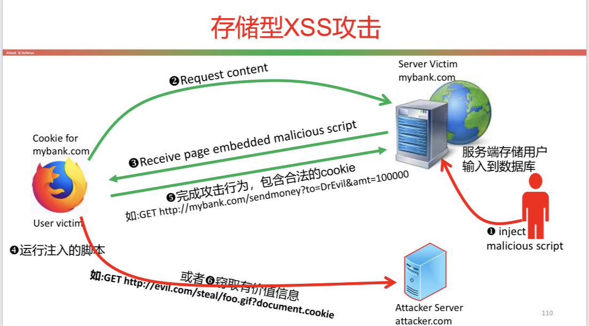

# 第 8 章：Web 应用安全

[[toc]]

## Web 应用安全

### HTTP 协议

- 是 client-server 模式下的一种 request-response 协议
  - Client 提交一个 http-request 消息给 server
  - Server 端根据 client 提交的请求返回 response 消息，且包含关于请求的完成状态信息

#### HTTP Request

HTTP REQUEST 包括：

- 一个请求行：大小写敏感的 request method，一个空格，请求的 URL，一个空格，协议版本，\<CR\>\<LF\>
- 0 个或者多个请求头字段 (request header field)
- 仅包含\<CR\>\<LF\>的空行
- 消息体 (可选)

##### HTTP Request Method

- GET：获取资源
  - GET 提交的数据会放在 URL 的后面部分，以？分隔 URL 的前面部分和传输的参数，参数之间以&相连
  - GET 提交的数据大小有限制 (因为浏览器对 URL 的长度有限制)，而 POST 方法提交的数据没有限制。
- POST：提交资源
  - 参数通过 request body 传输，不会出现在 URL 中，不会被缓存，不会被保存在浏览器历史中，不限制长度
- HEAD：获取头部信息
  - 请求目标资源传输其状态描述，类似 GET 请求，但是没有响应体 (Response Body)

#### HTTP：Response

- 状态行：协议版本，一个空格，响应状态码，一个空格，一个可能为空的状态说明文本
- 0 个或者多个响应头字段
  - 字段名 (大小写敏感)，一个冒号，一个可选的前导空格，字段值，一个可选的拖尾空格， \<CR\>\<LF\>
- 一个仅包含\<CR\>\<LF\>的空行
- 响应体 (可选)

##### HTTP：状态码

- 2XX Successful (请求被成功收到、理解并接受)
  - 200 OK
  - 204 No Content
- 3XX Redirection (为了完成该请求还需要进一步的操作)
  - 301 Moved Permanently (总是重定向到新的 URL)
  - 302 Found (重定向一次，不存储重定向)
  - 304 Not Modified (从客户端上次访问后，内容没有变动)
  - 307 Moved Temporarily (仅在这一次重定向到新的 URL)
- 4XX Client errors (request 里面有语法错误或者不能完成)
  - 400 Bad Request
  - 401 Unauthorized
  - 403 Forbidden
  - 404 Not Found
  - 405 Method Not Allowed
- 5XX Server errors(Server 端无法响应一个明显有效的请求)
  - 500 Internal Server Error (一种通用性的错误消息)
  - 502 Bad Gateway (该服务器作为网关或者代理，且收到了从上游服务器返回的无效响应)

## URL

URL 是 URI(Uniform Resource Identifier) 的一种具体类型，URL 需要遵守 URI 的语法：包含 5 个部分的层次化序列

- URI = scheme：[//authority]path[？query] [#fragment]
- 其中 authority 部分又分为 3 个部分 authority = [userinfo@]host[：port]

### scheme

Scheme：所使用的协议，例如：

- ftp：文件传输协议
- http：超文本传输协议
- https:http over tls
- file：本地文件
- git + ssh：走 ssh 隧道的 git

### location

- //... 表示远程位置
- userinfo 后面是@，这部分是可选的
- host 是远程主机，可以是主机名或者 IP 地址
- port 表示远程主机端口，如果是缺省的则不用写出 (比如 http 配的是 80)，否则需要写出 (比如 http 配置为 8080)

### path

- path 部分是必须，且以 / 开始
  - 如果只有/ ，则表示为目录树的根，且必须出现
- 目录和子目录之间用/ 分隔，注意不是 windows 风格的 \
- path 用于告诉远程主机，如何定位所共享的资源

### query

- query 部分是可选的，以？开头
- 如果在 URI 的其它地方需要出现？ ，则以编码%3f 表示
- 通常以 key-value 的形式成对出现，每一对之间用 & 分隔，用于给动态网页 (如使用 CGI、PHP/JSP/ASP/ASP.NET 等技术制作的网页) 传递参数
  - 如：Name=Mike&Role=SuperGenius

### fragment

fragment 部分是可选的，以 # 开头，比如这里的 \#top。这部分信息不会发送给远程服务器，仅对本地内容可用，用于告诉浏览器跳转到文档中的哪一个部分 (锚点)。

### URL 编码

URI 是 ASCII 纯文本格式，对于可打印字符直接用字符表示；而不可打印字符空格、特殊字符 (如:#, %，=, 这些字符已经用于特殊用途)，则需要进行编码，将字符编码为%xx，其中 xx 是 16 进制 ASCII 编码

- %20 = ‘’
- %23 = ‘#’

## Web Page

### Form 表单

在 web 应用中，用户通过 form 表单向服务器提交数据，因此 form 表单也是攻击者攻击服务器的有效途径。其中，action 属性说明提交表单时，向何处 (URL) 发送数据。而 method 属性则说明发送数据的方式，get 通过 URL 发送数据，而 post 通过 body 发送数据。

### Javascript

一种高级、动态类型的解释型语言，并且支持对象 (object)，常用于操作网页，也可用于 server 端开发 (node.js)。

### CSS

Cascading Style Sheets，用于描述应该如何显示 HTML 元素。

## Cookie 与会话管理

HTTP 是无状态协议，每个请求/响应与其它请求/响应之间是相互独立的。然而，很多 web 应用需要具有状态维护的功能。Web 应用通过 HTTP cookie 来支持上述功能。

### cookie

本质上，cookies 是存放在浏览器的一个数据。当用户发起请求后，服务端在响应头中包含一个 Set-Cookie 字段，告诉浏览器存储一个新的 cookie。该 cookie 编码了需要在多个请求响应之间保持的状态。在后续的请求中，浏览器均会自动携带相关的 cookie 来发起请求，发送给服务端。Cookie 中的额外信息有助于 web 服务器定制其响应，也就是即使请求相同，但是 cookie 不同，客户端得到的响应也可能不同。

### Set-Cookie 格式
 
```
\<name\>=\<value\>[; \<name\>=\<value\>]...[; expires=\<date\>][; domain=\<domain_name\>][; path=\<some_path\>][; secure][; httponly]
```

### Cookie 属性

- Domain 属性和 Path 属性告诉浏览器一个请求 (URL) 应该携带哪些 Cookies
- expires=\<date\>:设置 cookie 的有效期。如果 cookie 超过 date 所表示的日期，则 cookie 失效；如果没有设置这个属性，那么 cookie 将在浏览器关闭时失效
- Secure，若设置了该属性，则浏览器仅能通过 HTTPS 通道发送该 Cookies
  ```
  Set-Cookie: id=a3fWa; Expires=Wed, 21 Oct 2015 07:28:00 GMT;Secure;
  ```
- HttpOnly，若设置了该属性，则只能通过 http 请求头携带该 Cookie，而不允许 JS 通过 document.cookie 去访问和修改该 cookie

### Cookie 策略：domain 和 path

- 浏览器发起一个 URL 请求时，携带某个 cookie 的条件
  - 如果 cookie 的 domain 属性是 URL 的域名后缀
  - 如果 cookie 的 path 属性是 URL 路径的前缀
- 例如：cookie 的 domain=example.com；path=/some/path，如果 URL 为 http://foo.example.com/some/path/index.html 则符合条件
- 如果一个 cookie 没有带 domain 属性，则浏览器会认为当前 URL 的 domain 为该 cookie 的 domain

### 会话管理

- 当用户发送一个登录请求 (带正确的用户名和口令) 给服务端，服务端通过验证后，会生成一个新的 session token，并以 cookie 的方式发送给客户端
- 后续的请求中，均会携带该 session token。服务端维护一个 session token 和用户之间的映射，因此当服务端接收到一个带 session token 的请求时，能够通过 session token 确定对应的用户，从而生成对应于该用户的响应
- 安全的 session token 应该是随机的，从而攻击者无法通过预测某个用户的 session token 而发起攻击
- Session token 是一种特殊的 cookie，用于在多个请求/响应中将用户保持在已登录状态

## Web 安全

### Web 安全目标

- 保密性 (Confidentiality)：恶意站点不能获得用户计算机或者其它站点上的保密信息
- 完整性 (Integrity)：恶意站点不能破坏用户 (客户端) 计算机的完整性或者用户在其它站点的信息
- 可用性 (Availability)：攻击者不能阻止合法用户访问 web 资源
- 隐私保护 (Privacy)：恶意站点不能监视用户的在线活动

### 同源策略

 浏览器的一种基本安全机制，允许某个脚本访问某个数据资源 (如网页数据)，前提是它们来自相同的来源，Protocol, host name, port number全部相同则表示同源。
 
 Frame的源和其所来自的URL相同，而不是加载它的页面的源。
 
### 命令注入对策

- 根本原因是`system()`函数提 供了一种简单的机制来运 行shell命令
- 把所有传递给它的参数当 作shell命令处理
- 采用更安全的`execve()`函数
 
## Server 端攻击：命令注入
 
## Server端攻击：SQL 注入

利用注释符号把相关后面的子句全部忽略，从而达到注入的目的。

### 被攻击的根本原因

造成SQL注入、XSS攻击、 命令注入攻击和格式化字符串攻击的根本原因是代码和数据的混合。

### 对策

- 过滤和编码数据
  - 混合用户输入数据与代码之前，过滤任何会被解释为代码的数据  
  - SQL注入中通常会使用特殊字符，过滤掉这些字符
  - 对特殊字符进行编码，避免解析器把数据作为命令执行
  - Php的mysqli扩展提供了 `mysqli::real_escape_string()` API来编码SQL中 具有特殊意义的字符
- prepared statement
  - 根本性解决方案：分离数据和代码
  - 主要思想:通过分离的通道分别给数据库服务器发送数据和代码，从而数据 库服务器不会从数据通道获取代码运行
  - Prepared statement是一种优化功能，如果相同或者相似的SQL语句要重 复执行，则能够有效提高性能。应用prepared statement，SQL语句模板被 发送给数据库，数据库解析器对SQL语句模板进行编译并完成查询优化，并 将结果存储(不运行)。后期，把数据和prepared statement绑定。

## XSS 攻击

基本策略是利用受害服务器发送攻击脚本给受害用户

- 存储型XSS：又称为持久型XSS，攻击者把脚本注入到受害服务器上存放；受害服务器不知情地把脚本发送给受害客户端；受害客户端根据SOP来执行脚本......
- 反射型XSS：恶意脚本来源于受害客户端的HTTP请求，由受害服务器反射给受害客户端
- 基于DOM的XSS

### 存储型 XSS 



1. 攻击者注入恶意脚本
2. 服务器对用户输入不做处理(比如检查是否包含<script>标签等)，将用户输入存储到数据库
3. 普通用户访问mybank网站
4. 服务器响应请求，响应内容中包含了从数据库提取的恶意脚本(攻击者注入的)
5. 浏览器解析收到到HTML文档，运行其中嵌入的恶意脚本
6. 发起攻击行为，因为发起的URL请求包含了有效的cookie，因此mybank会认为是合法的 请求
7. 或者盗取用户的机密信息，如cookie，从而攻击者可以扮演受害者发起对mybank的操作。