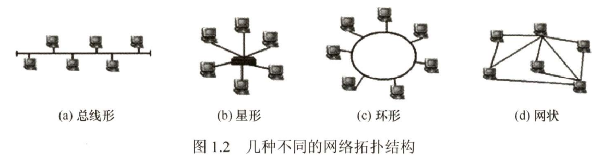
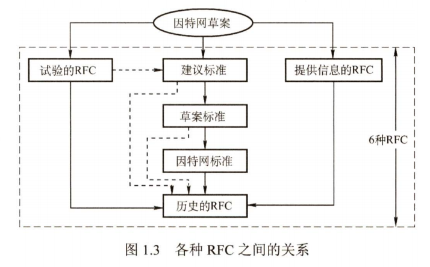
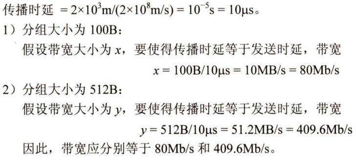
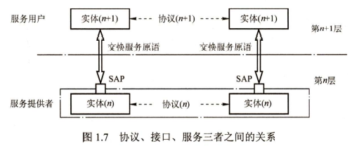
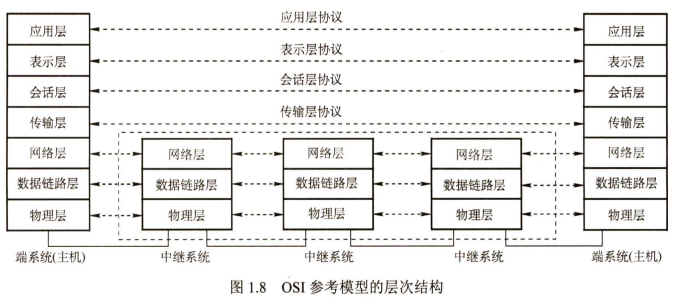
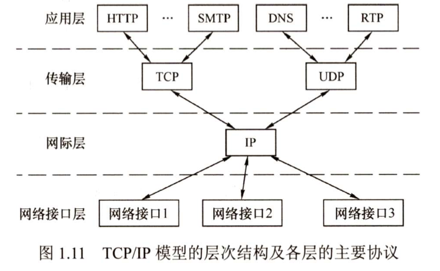
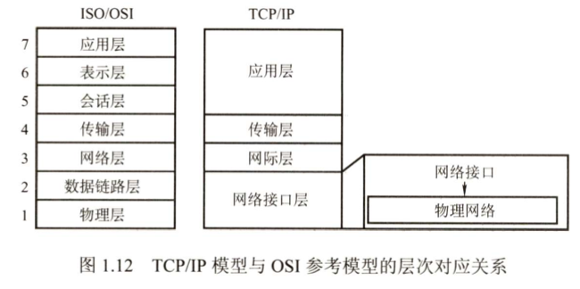

# 第一章：计算机网络体系结构

## 目录
[[toc]]

## 考纲

## 1.1 计算机网络的概述

### 计算机网络的概念
简而言之，计算机网络就是一些互联的自治的计算机系统的合集。以下三种定义反映了不同技术时期的水平：

- 广义观点：完成远程信息处理或进一步达到信息共享
- 资源共享观点：以能够互相共享资源的方式互联起来的自治计算机系统的集合。
   - 目的：资源共享
   - 组成单元：分布在各地的多台独立的自治计算机
   - 网络遵循统一规则：网络协议
- 用户透明性观点：存在一个为用户自动管理资源的网络操作系统，描述的是分布式系统。

### 计算机网络的组成

从不同角度有不同的分类。

#### 组成部分

主要包括硬件，软件和协议。

- 硬件：主机 (端系统)，通信链路，交换设备，通信处理机。
- 软件：各种实现资源共享的软件和方便用户使用的各种工具。**软件多属于应用层。**
- 协议：协议是计算机网络的核心，规定了网络传输数据的规范。

#### 工作方式

计算机网络 (Internet 部分) 分为边缘部分和核心部分。

- 边缘部分：所有连接到互联网，供用户直接使用的主机。
- 核心部分：大量网络和连接这些网络的路由器组成，为边缘部分提供连通性和交换服务。

#### 功能组成

计算机网络由通信子网和资源子网组成。

- 通信子网：各种传输介质，通信设备，相应的网络协议组成。
- 资源子网：实现资源共享功能的设备及其软件的集合。

### 计算机网络的功能

主要有以下五大功能：

- 数据通信：**是计算机最基本最重要的功能**，用于实现联网计算机之间的各种信息传输。
- 资源共享：**资源包括软件，硬件，数据。**使不同计算机之间实现分工协作。
- 分布式处理：将复杂任务分配给网络中多个主机协作，提高系统利用率。
- 提高可靠性：通过网络互为替代机。
- 负载均衡：将工作任务均衡的分配给各台计算机。

### 计算机网络的分类

#### 按分布范围分类

- 广域网 WAN：负责长距离通信，覆盖范围通常是直径为几十千米到几千千米。广域网是因特网的核心部分，连接广域网的各节点交换机的链路一般都是大通信容量的高速链路。

- 城域网 MAN：城域网直径范围是 5~50 千米。城域网大多采用以太网技术，常并入局域网讨论范围。

- 局域网 LAN：一般由微机和工作站用高速线路项链，范围小，数量上没有严格限制。传统上局域网使用广播技术，广域网使用交换技术。

- 个人局域网：个人用无线技术将设备相互连接的网络。

  > 若中央处理器距离非常近，如仅 1 米数量级或更小，一般成为多处理器系统，不成为计算机网络。

#### 按传输技术分类

- 广播式网络：所有联网计算机都共享一个公共通信信道。发送报文分组时，所有计算机都会接收到，检查目的地址判断是否接受。局域网基本采用广播式通信技术，广域网的无线，卫星通信网络也采用广播式通信技术。

- 点对点网络：每条物理链路连接一对计算机。如果没有直接链路，它们之间的分组传输需要通过中间结点进行接收，储存，转发，直至目的节点。

  > 是否采用分组储存转发与路由选择机制是点对点网络与广播式网络的重要区别，广域网基本都属于点对点网络。

#### 按拓扑结构分类

拓扑结构是指网络节点与通信线路之间的几何关系表示的网络结构。主要有总线型，星型，环形和网状网络。总线型，星型，环形多用于局域网，网状网络多用于广域网。四种网络可以互联成更复杂的网络。 

- 总线型：单根传输线连接，建网容易，节省线路，增减方便，但通信效率不高，总线对故障敏感。
- 星型网络：通过中间设备连接，中间设备起初是计算机，后续为交换机或路由器。便于管理和集中控制，缺点是成本高，中间设备对故障敏感。
- 环形网络：所有接口设备连接成环。环可以是单环或双环，环中信号单向传输。
- 网状网络：每个结点至少有两条路径与其他结点相连，有规则型和非规则型。可靠性高，但控制复杂，线路成本高。

#### 按使用者分类

- 公用网：指电信公司构建的大型网络。
- 专用网：某个部门满足本单位特殊业务而建造的网络。

#### 按交换技术分类

交换技术是指各台主机之间，各通信设备之间，或者彼此交换信息采用的数据格式和交换装置的方式。

- 电路交换网络：源节点和目的节点之间建立一条专用的通路用于传送数据。包括建立连接，传输数据，断开连接三个阶段，典型的是传统电话网络。数据连续的从源节点到目的节点，数据直接传送，时延小。但是线路利用率低，不能充分利用线路容量，不便进行差错控制。
- 报文交换网络：用户使用源地址，目的地址，校验码的信息封装成报文。整个报文传送到相邻结点，全部存储后查找转发表转发。这样充分利用线路容量，实现不同速率的转换，可以格式转换，实现多对一，一对多访问和差错控制。但是资源开销增大，出现缓冲时延，需要额外的控制机制保证报文不乱序，缓冲区难以管理。
- 分组交换网络：也称包交换网络，吧数据分成较短的固定长度的数据库阿池，加上目的地址，源地址组成分组包，用存储转发方式传输。单个分组传送到相邻结点，存储后转发到下一个结点。在报文管理网络的有点智商还有缓冲易于管理，包平均时延更小，网络占用的平均缓冲区更少，更易于标准化，更适合应用。

#### 按传输介质分类

- 有线连接：主要有双绞线网络，同轴电缆网络。
- 无线网络：主要分为蓝牙，微波，无线电。

### _计算机网络的标准化工作_

计算机网络的标准化对计算机网络的发展和推广起到了极为重要的作用。因特网的所有标准都以 RFC (Request For Comments) 的形式在因特网上发布，但并非每个 RFC 都是因特网标准，RFC 要上升为因特网的正式标准需经过以下 4 个阶段。

1. 因特网草案 (Internet Draft)。这个阶段还不是 RFC 文档。
2. 建议标准 (Proposed Standard)。从这个阶段开始就成为 RFC 文档。
3. 草案标准 (Draft Standard)。
4. 因特网标准 (Internet Standard)。

此外，还有试验的 RFC 和提供信息的 RFC。各种 RFC 之间的关系如图 1.3 所示。

在国际上，负责制定、实施相关网络标准的标准化组织众多，主要有如下几个：

- 国际标准化组织 (ISO)：其制定的主要网络标准或规范有 OSI 参考模型、HDLC 等。
- 国际电信联盟 (ITU)：其前身为国际电话电报咨询委员会 (CCITT)，其下属机构 ITU-T 制定了大量有关远程通信的标准。
- 国际电气电子工程师协会 (IEEE)：世界上最大的专业技术团体，由计算机和工程学专业人士组成。IEEE 在通信领域最著名的研究成果是 802 标准。

### 计算机网络的性能指标

性能指标从不同方面度量计算机网络的性能。常用性能指标如下：

- 带宽：表示网络的通信线路所能传送数据的能力，是数字信道所能传输的**最高数据传输速率**，单位是 `b/s`。
- 时延：指数据从网络的一端传输到另一端所需的总时间，由四部分组成：发送时延，传播时延，处理时延，排队时延。一般处理时延和排队时延忽略，对于高速链路提高的是发送速率而不是传播速率。
   - 发送时延：结点将分组的所有比特传输到链路所需时间。计算公式：$$发送时延 = 分组长度 / 信道宽度$$
   
   - 传播时延：电磁波在信道传播一定的距离需要花费的时间。计算公式：$$传播时延 = 信道长度/电磁波在信道上的传播速率$$
   
   - 处理时延：数据在经过交换节点进行储存转发进行的一些必要的处理所花费的时间。
   
   - 排队时延：分组进入路由器要在队列中等待处理。
- 时延带宽积：指发送端发送的第一个比特即将到达终点，发送端已经发送了多少比特，又称为以比特为单位的链路长度。
- 往返时延 RTT：指从发射端发出一个短分组，到发送端收到来自接收端确认总共经历的时延。在互联网中，往返时延还包括各中间结点的处理时延，排队时延及转发数据时的发送时延。
- 吞吐量 (Throughput)：指单位时间内通过某个网络 (或信道、接口) 的数据量。吞吐量受网络带宽或网络额定速率的限制。
- 速率 (Speed)：网络中的速率是指连接到计算机网络上的主机在数字信道上传送数据的速率，也称数据传输速率、数据率或比特率，单位为 b/s (比特/秒)(或 bit/s，有时也写为 bps)。数据率较高时，可用 kb/s (k=103)、Mb/s (M=106) 或 Gb/s (G=109) 表示。在计算机网络中，通常把最高数据传输速率称为带宽。
- 信道利用率：指出某一信道有百分之多少的时间是有数据通过的，即:$$信道利用率 = 有数据通过时间/(有 + 无) 数据通过时间$$。

### 本章习题精选

计算机网络最基本的功能是？

- [ ] 数据通信
- [x] 资源共享
- [ ] 分布式处理
- [ ] 信息综合处理

::: danger 

计算机网络最基本的功能是数据通信，而不是资源共享。所有的功能都是建立在数据可以通信的基础上的。

:::

---

下列不属于计算机功能的是？

- [x] 提高系统可靠性
- [ ] 提高工作效率
- [ ] 分散数据的综合处理
- [ ] 使个计算机相对独立

::: danger 

计算机网络使计算机之间联系更加紧密。

:::

---

计算机网络的资源主要是指？

- [x] 服务器、路由器、通信线路与用户计算机
- [ ] 计算机操作系统、数据库与应用软件
- [ ] 计算机硬件、软件与数据
- [ ] Web 服务器、数据库服务器与文件服务器

::: danger 

**资源包括软件，硬件，数据。**使不同计算机之间实现分工协作。

:::

---

局域网和广域网的差异不仅在于它们所覆盖的范围不同，还主要在于它们 ()。

- [ ] 所使用的介质不同
- [ ] 所使用的协议不同
- [x] 所能支持的通信量不同
- [ ] 所提供的服务不同

::: danger 

广域网和局域网之间的差异不仅在于它们所覆盖范围的不同，还在于它们所采用的协议和网络技术的不同，广域网使用点对点等技术，局域网使用广播技术。

:::

---

下列关于广播式网络的说法中，错误的是 ()。

- [ ] 共享广播信道
- [ ] 不存在路由选择问题
- [x] 可以不要网络层
- [ ] 不需要服务访问点

::: danger 

广播式网络共享广播信道 (如总线)，通常是局域网的一种通信方式 (局域网工作在数据链路层)，因此不需要网络层，因而也不存在路由选择问题。但数据链路层使用物理层的服务必须通过服务访问点实现。

:::

---

在 n 个结点的星形拓扑结构中，有 () 条物理链路。

- [ ] n-1
- [ ] n
- [x] n(n-1)
- [ ] n(n+1)/2

::: danger 

星形拓扑结构是用一个结点作为中心结点，其他 n - 1 个结点直接与中心结点相连构成的网络。中心结点既可以是文件服务器，也可以是连接设备。常见的中心结点为集线器。

:::

---

::: tip 带宽 MB 与 Mb 转换

:::

---

在两台计算机之间传输一个文件有两种可行的确认策略。第一种策略把文件截成分组，接收方逐个确认分组，但就整体而言，文件没有得到确认。第二种策略不确认单个分组，但当文件全部收到后，对整个文件予以确认。请讨论这两种方式的优缺点。

::: tip Answer

如果网络容易丢失分组，那么对每个分组逐一进行确认较好，此时仅重传丢失的分组。另一方面，如果网络高度可靠，那么在不发生差错的情况下，仅在整个文件传送的结尾发送一次确认，从而减少了确认次数，节省了带宽。不过，即使只有单个分组丢失，也要重传整个文件。

:::

---

有两个网络，它们都提供可靠的面向连接的服务，一个提供可靠的字节流，另一个提供可靠的报文流。请问两者是否相同？为什么？

::: tip Answer

字节流是纯粹的数据流，报文流会给一定的控制信息，具有协议控制的数据。

:::

## 1.2 计算机网络体系结构与参考模型

### 计算机网络分层结构

两个系统中的实体通信过程非常复杂，为了降低协议设计与调试过程的复杂性，方便研究，实现与维护，促进标准化工作，通常对于计算机网络的体系结构以分层的方式进行建模。

我们把计算机网络的各层及其协议的集合称为网络的体系结构，体系结构是抽象的，而实现是具体的，是真正在运行的计算机硬件和软件。

分层的基本原则如下：

1. 每层都实现一种相对独立的功能，降低大系统的复杂度。
2. 各层之间界面自然清晰，易于理解，相互交流尽可能少。
3. 各层功能的精确定义独立于具体的实现方法，可以采用最合适的技术来实现。
4. 保持下层对上层的独立性，上层单向使用下层提供的服务。
5. 整个分层结构应能促进标准化工作。

在计算机分层结构中，每一层的活动元素称为该层的实体，具体来说指的是任何可发送或接受信息的硬件或软件进程。不同机器上的同一层称为对等层，同一层实体称为对等实体。

每个层次中，每个报文都称为协议数据单元 PDU，分为数据部分服务数据单元 SDU 和控制信息部分协议控制信息 PCI。每一层的 PDU 都有一个通俗的名称，物理层为比特，数据链路层为帧，网络层为分组，传输层为报文段。

### 计算机网络协议、接口、服务的概念

#### 协议

协议就是规则的集合。这些规则明确规定所交换的数据的格式和有关的同步问题，这些为了进行网络中数据交换而建立的规则称为网络协议，是控制对等实体之间进行通信的两个节点。

协议由语法、语义和时序三部分组成。语法规定了传输数据的格式，语义规定了所要完成的功能，即需要发出何种控制信息、完成何种动作以及做出何种应答，时序规定了各种操作的条件时序关系。

#### 接口

接口是同一结点内相邻两层间交换信息的连接点，同一节点相邻两层通过服务访问点 (Server Access Point，SAP) 进行交互，每个 SAP 都有一个能够表示它的地址。

#### 服务

服务指的是下层为上层提供的功能调用，上层使用下层提供的服务需要与下层减缓一些命令，这些命令在 OSI 参考模型中称为服务原语，OSI 参考模型将原语分为 4 类：

- 请求：由服务用户发往服务提供者，请求完成某项工作。
- 指示：由服务提供者发往服务用户，指示用户做某件事情。
- 响应：由服务用户发往服务提供者，作为对指示的响应。
- 证实：优服务提供者发往服务用户，作为对请求的证实。

有应答服务包括全部四种原语，而无应答服务只有请求和指示两类原语。

协议和服务在概念上是不一样的。首先，只有本层协议的实现才能保证向上一层提供服务。本层的服务用户只能看见服务而无法看见下面的协议，即下面的协议对上层的服务用户是透明的。其次，协议是 “水平的”，即协议是控制对等实体之间通信的规则。但服务是 “垂直的”，即服务是由下层通过层间接口向上层提供的。另外，**并非在一层内完成的全部功能都称为服务，只有那些能够被高一层实体 “看得见” 的功能才称为服务**。

计算机网络提供的服务可按以下三种方式分类：

- 面向连接服务与无连接服务
  - 面向连接服务通信前双方需要先建立连接，分配响应资源，传输结束时释放。例如 TCP 就是一种面向连接服务的协议。
  - 无连接服务双方不需要提前建立连接，需要发送数据直接发送，是一种不可考服务，尽最大努力交付，不保证通信的可靠性，例如 IP、UDP 就是一种无连接服务。
- 可靠服务和不可靠服务
  - 可靠服务指网络具有纠错、检错、应答机制，能保证数据正确、可靠地传送到目的地。
  - 不可靠服务指网络指示尽量正确、可靠地传送，而不能保证数据正确、可靠地传送到目的地，是一种尽力而为的服务。不可靠服务需要上层或者用户才保证服务可靠。
- 有应答服务和无应答服务
  - 有应答服务是指接收方在收到数据后向发送方给出的应答，由传输系统内部自动实现而不由用户实现，应答可以肯定也可以否定。文件传输服务就是一种有应答服务。
  - 无应答服务是指接收方收到数据不自动给出应答，如果需要由高层实现，例如 www 服务，客户端收到服务器发送的页面文件后不给出应答。

### ISO/OSI 参考模型和 TCP/IP 模型

#### ISO/OSI 参考模型

国际标准化组织 (ISO) 提出的网络体系结构模型，称为开放系统互连参考模型 (OSI/RM)，通常简称为 OSI 参考模型。OSI 参考模型有 7 层，自下而上依次为物理层、数据链路层、网络层、传输层、会话层、表示层、应用层。低三层统称为通信子网，它是为了联网而附加的通信设备，完成数据的传输功能；高三层统称为资源子网，它相当于计算机系统，完成数据的处理等功能。传输层承上启下。

- 物理层：物理层的传输单位是比特，任务是透明的传输比特流，功能是在物理媒体上为数据端设备透明地传输原始比特流。物理层主要定义数据终端设备 (DTE) 和数据通信设备 (DCE) 的物理与逻辑连接方法，所以物理层协议也称物理层接口标准。物理层接口标准很多，如 EIA-232C、EIA/TIARS-449、CCITT 的 X.21 等。
  - 通信链路与通信结点的连接需要一些电路接口，物理层规定了这些接口的一些参数，如机械形状和尺寸、交换电路的数量和排列等，例如笔记本电脑上的网线接口，就是物理层规定的内容之一。
  - 物理层也规定了通信链路上传输的信号的意义和电气特征。例如物理层规定信号 A 代表数字 0，那么当结点要传输数字0时，就会发出信号 A，当结点接收到信号 A 时，就知道自己接收到的实际上是数字 0。
  - 传输信息所利用的一些物理介质，如双绞线、光缆、无线信道等，并不在物理层协议之内而在物理层协议下面。
- 数据链路层：数据链路层的传输单位是帧，任务是将网络层传来的 IP 数据报组装成帧。数据链路层的功能可以概括为成帧、差错控制、流量控制和传输管理等。典型的数据链路层协议有 SDLC、HDLC、PPP、STP 和帧中继等。
  - 差错控制：控制由于外界影响造成的数据出错，丢弃相关的错误信息。
  - 流量控制：协调两个节点的速率，防止两端传输速率不匹配。
  - 广播式网络在数据链路层还要处理新的问题，即如何控制对共享信道的访问。数据链路层的一个特殊的子层——介质访问子层，就是专门处理这个问题的。
- 网络层：网络层的传输单位是数据报，它关心的是通信子网的运行控制，主要任务是把网络层的协议数据单元 (分组) 从源端传到目的端，为分组交换网上的不同端系统提供通信服务。关键问题是对分组进行路由选择，并实现流量控制、拥塞控制、差错控制和网际互联等功能。网络层的协议有 IP、IPX、ICMP、IGMP、ARP、RARP 和 OSPF 等。
  - 路由选择：是根据网络的情况，利用相应的路由算法计算出一条合适的路径。
  - 流量控制：流量控制与数据链路层的流量控制含义一样，都是协调发送速率和接收速率
  - 差错控制：是通信两结点之间约定的特定检错规则，如奇偶校验码，接收方根据这个规则检查接收到的分组是否出现差错，如果出现了差错，那么能纠错就纠错，不能纠错就丢弃，确保向上层提交的数据都是无误的。
  - 拥塞控制：网络层要采取一定的措施来缓解由于结点都处于来不及接收分组而要丢弃大量分组的情况造成的拥塞状态。
  - 因特网是一个很大的互联网，它由大量异构网络通过路由器 (Router) 相互连接起来。因特网的主要网络层协议是无连接的网际协议 (Internet Protocol，IP) 和许多路由选择协议，因此因特网的网络层也称网际层或 IP 层。
- 传输层：传输层也称运输层，传输单位是报文段 (TCP) 或用户数据报 (UDP)，传输层负责主机中两个进程之间的通信，功能是为端到端连接提供可靠的传输服务，为端到端连接提供流量控制、差错控制、服务质量、数据传输管理等服务。数据链路层提供的是点到点的通信，传输层提供的是端到端的通信，两者不同，一个进程由一个端口来标识。使用传输层的服务，高层用户可以直接进行端到端的数据传输，从而忽略通信子网的存在，通过传输层的屏蔽，高层用户看不到子网的交替和变化。由于一台主机可同时运行多个进程，因此传输层具有复用和分用的功能。复用是指多个应用层进程可同时使用下面传输层的服务，分用是指传输层把收到的信息分别交付给上面应用层中相应的进程。传输层的协议有 TCP、UDP。
- 会话层：会话层允许不同主机上的各个进程之间进行会话。会话层利用传输层提供的端到端的服务，向表示层提供它的增值服务。这种服务主要为表示层实体或用户进程建立连接并在连接上有序地传输数据，这就是会话，也称建立同步 (SYN)。会话层负责管理主机间的会话进程，包括建立、管理及终止进程间的会话。会话层可以使用校验点使通信会话在通信失效时从校验点继续恢复通信，实现数据同步。
- 表示层：表示层主要处理在两个通信系统中交换信息的表示方式。不同机器采用的编码和表示方法不同，使用的数据结构也不同。为了使不同表示方法的数据和信息之间能互相交换，表示层采用抽象的标准方法定义数据结构，并采用标准的编码形式。数据压缩、加密和解密也是表示层可提供的数据表示变换功能。
- 应用层：应用层是 OSI 参考模型的最高层，是用户与网络的界面。应用层为特定类型的网络应用提供访问 OSI 参考模型环境的手段。因为用户的实际应用多种多样，这就要求应用层采用不同的应用协议来解决不同类型的应用要求，因此应用层是最复杂的一层，使用的协议也最多。典型的协议有用于文件传送的 FTP、用于电子邮件的 SMTP、用于万维网的 HTTP 等。

#### TCP/IP

ARPA 在研究 ARPAnet 时提出了 TCP/IP 模型，模型从低到高依次为网络接口层 (对应 OSI 参考模型中的物理层和数据链路层)、网际层、传输层和应用层 (对应 OSI 参考模型中的会话层、表示层和应用层)。TCP/IP 由于得到广泛应用而成为事实上的国际标准。TCP/IP 模型的层次结构及各层的主要协议如图所示。

网络接口层的功能类似于 OSI 参考模型的物理层和数据链路层。它表示与物理网络的接口，但实际上 TCP/IP 本身并末真正描述这一部分，只是指出主机必须使用某种协议与网络连接，以便在其上传递 IP 分组。具体的物理网络既可以是各种类型的局域网，如以太网、令牌环网、令牌总线网等，也可以是诸如电话网、SDH、x.25、帧中继和 ATM 等公共数据网络。网络接口层的作用是从主机或结点接收 IP 分组，并把它们发送到指定的物理网络上。

网际层 (主机-主机) 是 TCP/IP 体系结构的关键部分。它和 OSI 参考模型的网络层在功能上非常相似。网际层将分组发往任何网络，并为之独立地选择合适的路由，但它不保证各个分组有序地到达，各个分组的有序交付由高层负责。网际层定义了标准的分组格式和协议，即 IP。当前采用的 IP 协议是第 4 版，即 IPv4，它的下一版本是 IPv6。

传输层 (应用-应用或进程-进程) 的功能同样和 OSI 参考模型中的传输层类似，即使得发送端和目的端主机上的对等实体进行会话。传输层主要使用以下两种协议：
1。传输控制协议 (Transmission Control Protocol，TCP)。它是面向连接的，数据传输的单位是报文段，能够提供可拿的交付。
2。用户数据报协议 (User Datagram Protocol，UDP)。它是无连接的，数据传输的单位是用户数据报，不保证提供可靠的交付，只能提供 “尽最大努力交付”。

应用层 (用户-用户) 包含所有的高层协议，如處拟终端协议 (Telnet)、文件传输协议 (FTP)、域名解析服务 (DNS)、电子邮件协议 (SMTP) 和超文本传输协议 (HTTP)。

IP 协议是因特网中的核心协议；TCP/IP 可以为各式各样的应用提供服务 (所谓的 everything over IP)，同时 TCP/IP 也允许卫协议在由各种网络构成的互联网上运行 (所谓的 IP over everything)。正因为如此，因特网才会发展到今天的规模。

#### TCP/IP 模型与 OSI 参考模型的比较

首先两者有很多相似之处：

- 二者都采取分层的体系结构，将庞大且复杂的问题划分为若干较容易处理的、范围较小的问题，而且分层的功能也大体相似。
- 二者都是基于独立的协议栈的概念。
- 二者都可以解决异构网络的互联，实现世界上不同厂家生产的计算机之间的通信。

其次两者有很多差别：

- OSI 参考模型的最大贡献就是精确地定义了三个主要概念：服务、协议和接口，这与现代的面向对象程序设计思想非常吻合。而 TCP/IP 模型在这三个概念上却没有明确区分，不符合软件工程的思想。
- OSI 参考模型产生在协议发明之前，没有偏向于任何特定的协议，通用性良好。但设计者在协议方面没有太多经验，不知道把哪些功能放到哪一层更好。TCP/IP 模型正好相反，首先出现的是协议，模型实际上是对己有协议的描述，因此不会出现协议不能匹配模型的情况，但该模型不适合于任何其他非 TCP/IP 的协议栈。
- TCP/IP 模型在设计之初就考虑到了多种异构网的互联问题，并将网际协议 (IP) 作为一个单独的重要层次。OSI 参考模型最初只考虑到用一种标准的公用数据网将各种不同的系统互联。OSI 参考模型认识到 IP 的重要性后，只好在网络层中划分出一个子层来完成类似于 TCP/IP 模型中的卫的功能。
- OSI 参考模型在网络层支持无连接和面向连接的通信，但在传输层仅有面向连接的通信。而 **TCP/IP 模型认为可靠性是端到端的问题，因此它在网际层仅有一种无连接的通信模式，但传输层支持无连接和面向连接两种模式**。这个不同点常常作为考查点。

无论是 OSI 参考模型还是 TCP/IP 模型，都不是完美的，对二者的讨论和批评都很多。OSI 参考模型的设计者从工作的开始，就试图建立一个全世界的计算机网络都要遵循的统一标准。从技术角度来看，他们希望追求一种完美的理想状态，这也导致基于 OSI 参考模型的软件效率极低。OS1 参考模型缺乏市场与商业动力，结构复杂，实现周期长，运行效率低，这是它未能达到预期目标的重要原因。