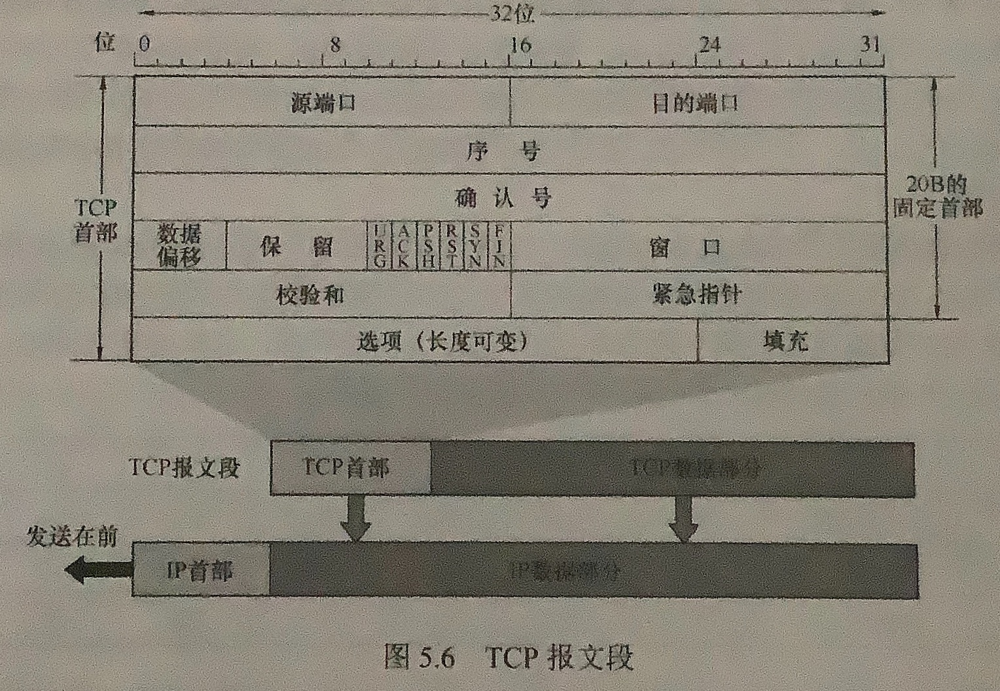
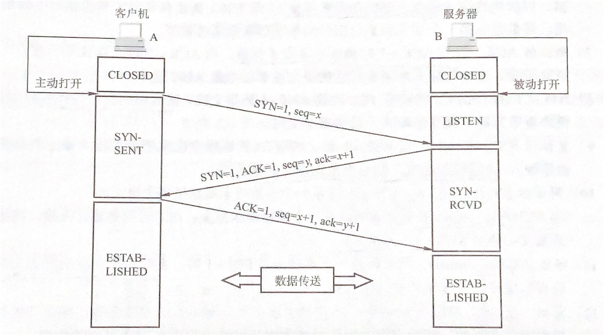
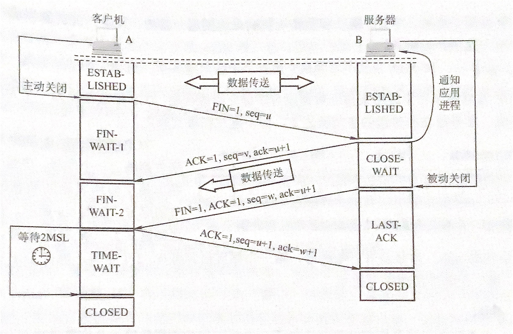
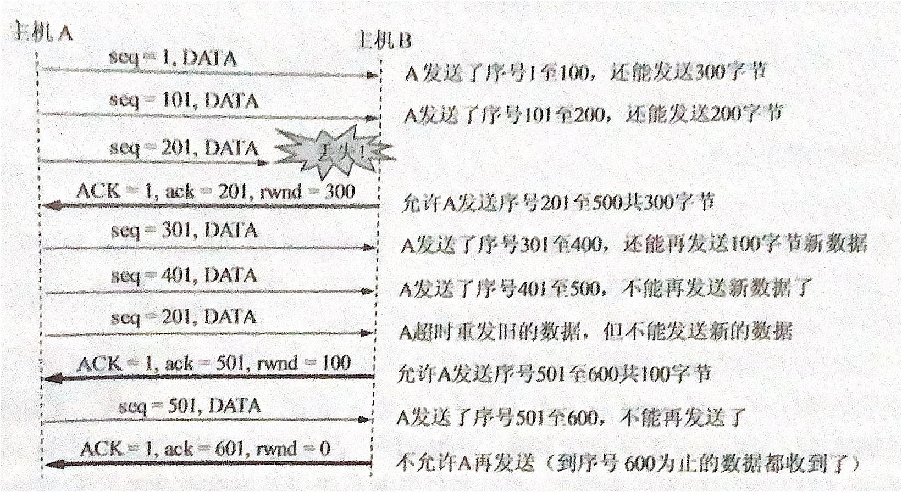
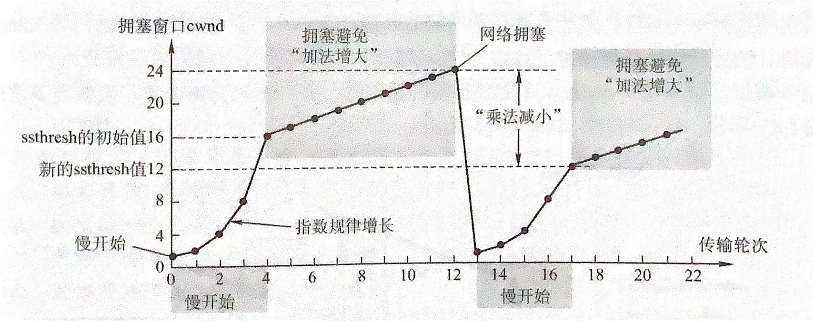
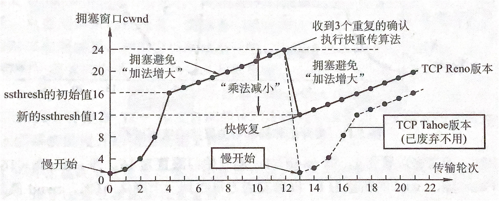

# 第五章：传输层

## 目录

[[toc]]

## 5.1 传输层提供的服务

### 传输层的功能

网络层提供了主机的逻辑通信，但是不提供可靠传输，这部分由传输层完成。传输层可以提供进程之间的可靠传输。

传输层只存在于通信子网以外的主机，事实上通信子网的主机只负责主机之间的传输，所以不存在传输层。

传输层的功能如下：

1. 传输层提供应用进程之间的逻辑通信，即端对端通信。逻辑通信指的是两者看似沿水平方向传输，但事实上不存在一条实际的信道连接两者。
2. 复用与分用。复用指发送方不同的应用程序可以使用同一协议发送数据包，分用指除去首部后你呢个够把数据正确交付到目的进程。网络层也有此功能，但是其复用表示不同的上层协议都可以封装成 IP 报文发送出去，分用指接收方剥去首部后把数据交付给对应协议。
3. 传输层还要提供差错检测，包括首部和数据，网络层只检测首部信息。
4. 提供两种服务，面向连接的 TCP 和无连接的 UDP。网络层不能同时实现两种协议，要么是面向连接的虚电路，要么是提供无连接服务，如数据报。

传输层屏蔽了下层协议的实现和细节，向上提供了一条逻辑信道，对于 TCP 这是一条可靠信道，对于 UDP 则是一条不可靠信道。

### 传输层的寻址与端口

#### 端口的作用

端口在传输层的作用类似于网络层中的 IP 和数据链路层中的 MAC，起到唯一标识的作用。端口是服务访问点 SAP，是应用程序定位的依据。传输层的端口是一种软件端口，事实上是虚拟的，这与硬件层面的端口有区别。

#### 端口号

应用程序使用端口标识，端口号长度是 16 位，也就是能标识 65536 个端口。端口号只标识本地主机的进程，因此互联网上相同的端口号之间没有联系，端口号可分为两类，服务器端使用的和客户端使用的端口号。

- 服务端使用的端口号：0 ～ 49151
  - 熟知端口号：由 IANA 分配的，给最重要的 TCP/IP 应用程序，让所有用户知道。0 ～ 1023
  - 登记端口号：使用需要向 IANA 登记，给没有熟知端口号的应用程序使用。1024 ～ 49151
- 客户端使用的端口号：49152 ～ 65536，应用程序运行时动态选择，临时端口号，连接关闭后回收供应用再次使用。

#### 常见的端口号

- FTP (File Transfer Protocol 文件传输协议 Port：21)：FTP 是一个 8 位的客户端-服务器协议，能操作任何类型的文件而不需要进一步处理，就像 MIME 或 Unicode 一样。
- TFTP (Trivial File Transfer Protocol，简单文件传输协议 Port：69)：是 TCP/IP 协议族中的一个用来在客户机与服务器之间进行简单文件传输的协议，提供不复杂、开销不大的文件传输服务。

#### 套接字

套接字 Socket 时通信端点，利用 IP 和端口号唯一定位网络上一个主机上的一个进程。Socket 就是由 IP 地址拼接上端口组成，发送报文时通过 Socket 定位。

### 无连接和面向连接服务

无连接服务指的是传输前不建立连接，消息需要发送直接放入网络传输，尽力传输。面向连接服务在通信前先建立连接然后再通信，通信过程监控整个连接状态，通信结束释放连接。TCP/IP 协议实现了 TCP 和 UDP 两种服务，对应面向连接和无连接服务。

TCP 提供面向连接服务，不提供组播和广播，提供全双工的可靠传输，因此增加了开销，诸如接受确认，流量控制，计时器，拥塞控制，连接管理。这使得头部大小增大，而且需要消耗更多处理机资源，适用于对可靠性要求高的服务，例如文件传输 FTP，超文本传输服务 HTTP，远程登录 TELNET 等。

UDP 提供无连接服务，是传输层对 IP 的进一步封装，增加了多路复用和差错检测。因为 UDP 简单，执行速度快，实时性好，使用的应用有小文件传输协议 TFTP，DNS，SNMP 和实时传输协议 RTP。

::: details IP 报文和 UDP 报文的区别

IP 数据需要路由器转发，而 UDP 的报文对网络层是不可见的。其次 UDP 中包含端口号，用于定位进程，而 IP 报文首部只有 IP 地址，定位主机。

:::

::: details TCP 和网络层虚电路的区别

TCP 报文段在传输层抽象的逻辑信道传输，对路由器不可见，虚电路在网络层，因此经过交换节点需要记录虚电路的状态信息。另外，网络层使用虚电路后无法提供无连接服务，而 TCP 使用并不影响网络层提供无连接服务。

:::

### 题目精选

---

::: danger 关于传输层的面向连接服务的特性是

- [ ] 不保证可靠和顺序交付
- [ ] 不保证可靠但保证顺序交付
- [x] 保证可靠但不保证顺序交付
- [ ] 保证可靠和顺序交付

:::

::: tip 顺序交付的理解

- [x] 保证可靠和顺序交付

保证顺序交付的意思应该是最后可以还原成正确顺序的包，此处错误理解成保证包顺序到达。到达的 TCP 包可能顺序打乱但最后交付是可以复原的，因此理解为保证顺序交付。

:::

---

#### IP 首部与 TCP 首部的长度

::: warning IP 首部与 TCP 首部的长度

两者首部大小均为 20B，这种情况指的是 TCP 和 IP 报文的首部都不包含附加字段。

:::

## 5.2 UDP 协议

### UDP 数据报

#### UDP 概述

当应用决定使用 UDP 后，几乎与 IP 打交道，需要自己保证完整性。虽然 TCP 提供了很多的功能和可靠的服务，但是造成的开销也是很大的。因此 UDP 提供的快速成为很多即时应用的选择。UDP 有以下的优点：

1. UDP 无需建立连接，不存在建立连接的时延。
2. 无连接状态，无需维护连接。相比维护连接的 TCP，服务器能支持更多活动机。
3. 分组首部开销小，TCP 有 20B 的首部开销，UDP 只有 8B。
4. 应用层能更好地控制发送时间，TCP 可能由于拥塞控制和流量控制导致发送延时。
5. UDP 支持一对一，一对多，多对一，多对多的交互通信。

UDP 的优势在于低时延，诸如 DNS 等服务，建立连接的时延是无法接受的。视频会议，实时通信和流媒体，直播等服务倾向使用 UDP，因为保证实时性和低延迟可以容忍部份数据丢失，或者说丢失的数据对于实时应用没有意义了。

UDP 不保证可靠交付，但不代表应用不需要可靠传输，而是 UDP 之上的应用层会自行保证可靠交付，一般来说这种可靠交付会比 TCP 更加宽松，但是更多保证低时延。

UDP 的报文是不分割的，添加首部后就会下传给 IP 层，因此应用层必须谨慎选择报文大小，报文太长会导致 IP 层分片，太小导致首部相对大小太大，两者都会降低 IP 层效率。

::: tip IP 层的分片如何保证有序性

IP 层的分片与 TCP 的分段事实上是一个意思，就是超出协议栈支持的最大大小单元的时候需要做出切分的操作。由于 TCP 有分段的概念，于是 IP 层一般不需要分片，但也存在不同第三层设备的最大支持大小不同导致中间的分片。主要分片还是在于 UDP 的报文，由于 UDP 的设计是为了快速，因此报文没有分段操作，太大就需要 IP 分层。

此处由于我没有按顺序复习，因此 IP 分层的知识可能没有印象。IP 保证分片的有序性是由 16 位标识位和 3 位标志位和 13 位偏移量组成的。标识位标识每一个包，识别一个包的不同段，偏移量用于复位包，单位是 8B。标识位 R 保留；DF (Don't Fragment) 标识的是不分段，此时如果需要分段该报文就会被丢弃；MF (More Fragment) 标识的是有更多的包，除了没有分段和分段的最后一段标记为 0，其他均为 1，表示还有还有分段。

需要注意 IP 没有重传机制，因此有报文丢失那么这整个段就会丢失，TCP 不存在分段，UDP 就需要应用层自己控制，因为 UDP 对丢包的处理就是不处理。此处还涉及 ICMP 的相关处理，如果要求不分段那么会返回 ICMP 差错报文。

参考资料：

[IP 分片浅析](https://www.cnblogs.com/diegodu/p/4647644.html) - [我是东东东](https://cloud.tencent.com/developer/user/1270711)

[TCP 分段与 IP 分片的区别与联系](https://cloud.tencent.com/developer/article/1173790) - [穆穆兔兔](https://home.cnblogs.com/u/diegodu/)

:::

#### UDP 的首部格式

UDP 的首部大小为 8B，分为四个字段，每个部分都是 2B，每个部分如下：

- 源端口号：在需要回信的时候填写，不需要全为 0
- 目的端口：交付时使用
- 长度：数据报文的长度，包括首部和数据段，单位为 Byte
- 校验和：用于差错检测，此子段可选，不需要时全置为 0

接收方如果发现对应的端口号未开放，就会丢弃包并且通过 ICMP 发送端口不可达的差错报文给发送方。

::: tip UDP 的组播广播实现

我们之前其实提到了 UDP 可以实现组播广播，但是在首部并没有看到相关的设计，那究竟是如何实现的呢。其实这部分功能是 IP 层实现的，就是依靠组播广播 IP 地址实现的，广播组播消息是不能被路由的，也就是只在局域网有效。UDP 因为不需要维护连接，所以可以很好的继承 IP 的组播广播功能，TCP 由于建立连接只能是一对一。

参考资料：

[UDP 单播、广播和多播](https://www.cnblogs.com/jingliming/p/4477264.html) - [Rimond_Jing](https://home.cnblogs.com/u/jingliming/)

:::

### UDP 校验

UDP 的校验和计算需要添加一个伪首部，这个首部包含源目的 IP 地址，UDP 长度和两个标志位，然后拼接在 UDP 报文之前，加上原本的 UDP 首部和数据部分，把校验和部分置为全零，然后计算。计算方法为按 16 位按位求和，最后不足 16 位就补零。最后结果取反即为结果。

接收方的校验比较简单，加上伪首部然后按 16 位取和，最后结果为全 1 校验成功。原理其实很简单，因为按照校验和为零算出来答案应该是校验和求反，因为发送方最后校验和求反了，所以加上没有取反的校验和应该就是全 1 的。

这种计算方式校验和作用比较有限，但是计算简单快速。校验和错误的报文不一定舍弃，可以上传但是需要携带错误报告。

::: details IP 的校验和与 UDP 对比

两者的计算方法其实很类似的，但是区别在于 IP 层的计算只针对首部计算校验和，而 UDP 的计算是包括数据部份的。

:::

::: tip 伪首部为什么包含 IP 地址

其实我很好奇的是这个首部包含了 IP 地址的原因。对比 IP 的首部这个伪首部却又太小了，而且伪首部不会参与发送，只在校验和计算的时候出现。查了相关信息，伪首部主要是为了快速确认 UDP 包确实是发送至本机的，由于 UDP 首部只有端口信息，显然不能很好区分目标主机的正确性。

虽然 IP 层确实会保证这一步，但是在路由过程中 IP 是有可能改变的，其实就是 NAT 的原因，因此路由过程中的错误 I 网络层是无法确认的。

参考资料：

[UDP 计算检验和的时候为什么要加上伪首部？- SegmentFault](https://segmentfault.com/q/1010000006209559)

:::

### 精选习题

---

::: details 校验和计算后结果为 0 怎么办？

校验和的计算为反码加法，所以存在循环进位，最高位如果进位则需要最后再加 1。计算结果为 0 并不能直接填入 0，因为 0 是不使用校验和，此处应该填入全 1，因为反码中全 1 和全 0 都表示 0。

其实也很好证明，最后接收方验证加完应该是全一才是正确的，那么校验和全零代表其他加起来是全 1，加上全 0 表示校验成功。但是全 1 加上全 1 在反码加法中最后结果也是全 1 （第一位第一次计算为 0，后续每一位都进一并且加完结果为 1，最后最高位进一所以第一位也加 1，答案为全 1。)，因此完美的让出全 0 给不使用校验和。

:::

---

::: danger 下列网络应用中，（）不适合使用 UDP 协议

- [ ] 客户机/服务器领域
- [x] 远程调用
- [ ] 实时多媒体应用
- [ ] 远程登录

本题确实不知道怎么选，只觉得 C 选项是适合的，其他确实分不清楚，觉得 UDP 都不太适合。只考虑到错误容忍度，没有考虑连接时间和包大小的影响。

:::

::: tip UDP 在重发代价小的时候也可考虑

- [x] 远程登录

客户机/服务器模式和远程调用的情况下，包的大小不大而且请求应该是交互式的，一来一回，因此使用 UDP 是合理的，远程调用重新发送可以由应用层控制，而且包大小比较小，重发的代价比建立可靠连接小；实时多媒体主要是低时延的要求，使用 UDP 也比较合理；远程登录涉及到全双工连接，并且连接一般比较持久，对可靠性要求高。

:::

---

::: details 为什么需要 UDP，不能使用原始的 IP 分组吗？

回答问题从 UDP 的几个功能入手。

- 一个是 UDP 的多路复用，就是在 IP 上实现了多个进程的复用，那么关键就是端口号的设计，标识了不同主机上的进程，这是 IP 做不到的。
- 另一方面做的是差错检测，IP 层只对首部进行差错检测，UDP 提供了对数据段的检测。

:::

---

::: warning IP 分段计算相关

首先 IP 分段是对 UDP 报文分段，因此 UDP 首部只有一个，因此不用重复加。一般来说取 MTU 为 1500B，除去每个 IP 固定段 20B，那么每段最多携带的 UDP 报文大小为 1480B。计算的如果是 IP 的数据子段长度那么是不包括 IP 首部的，那除了最后一段其余都应该是 1480B，计算偏移量注意偏移量的单位是 8B。

:::

---

## 5.3 TCP 协议

### TCP 协议的特点

TCP 主要在不可靠的 IP 层上实现可靠传输，包括传输可靠，有序，无丢失和不重复。TCP 是 TCP/IP 协议中非常复杂的一个协议，主要特点如下：

- TCP 是面向连接的协议，存在一条逻辑连接
- TCP 的连接是点对点的，只有两个端点
- TCP 提供可靠交付的服务，保证传输数据无差错，不丢失，不重复和有序
- TCP 提供全双工通信，并且设置有缓存，缓存针对发送与接收都有设置
  - 发送缓存有应用层下传的等待发送的数据和 TCP 发送但对方未确认的数据
  - 接受缓存包括按序到达但是未被应用程序接受的数据和乱序到达的数据
- TCP 是面向字节流的，尽管上层下方的数据为大小不一的数据块，但是 TCP 统一视为无结构的字节流

TCP 的报文长度由接收方的窗口值和网络的拥塞程度决定，TCP 会对数据进行切片，而 UDP 是不会的，UDP 报文长度由应用层决定。TCP 由于存在缓存，有部分数据可能会等待缓存区积累到一定数量再发送。

### TCP 报文段

TCP 的报文可以用于传送数据，也可以用于管理连接，分为首部和数据两部分。首部前 20B 固定，最小为 20B，最大为 60B，每次增加必须为 4B 的倍数，后续会说明。

TCP 的功能全部体现在首部的各个子段中，接下来逐一介绍：

- 源端口号与目的端口：各占 2B，主要实现传输层的复用与分用，标识进程
- 序号：占 4B，TCP 是面向字节流的，因此每个字节都有编号，序号标记的是当前的报文段的第一个字节的序号
- 确认号：占 4B，期望收到下一个报文段的第一个数据字节的序号。确认号为 N 标识前 N-1 的数据全部接收。确认号主要是接受方在确认包中使用的
- 数据偏移 （首部长度）：占 4bits，指的是 TCP 报文的数据段在整个 TCP 包中的位置，事实上就是首部的长度，因为 TCP 首部可变大小。数据偏移的单位是 32 位，也就是 4B，而数据偏移字段能表示的最大值为 15，因此首部最大值为 60B （说点题外话，我觉得首部最小值为 20B，那么完全可以把数据偏移定义成大于 20B 的部分，这样可以使首部最大值增加 20B，也许设计者也不想让首部太臃肿？)
- 保留：占 6bits，保留为今后使用，目前应置为 0
- 紧急位 URG：置为 1 表示有紧急数据需要及时传输，需要配合紧急指针字段使用，表示从第一个数据开始到紧急指针所指字节即为紧急数据
- 确认位 ACK：置为 1 标识确认号字段有效，TCP 规定建立连接后所有的报文段该字段都应为 1
- 推送位 PSH：置为 1 标识数据需要及时交付给应用程序，不等待缓存
- 复位位 RST：置为 1 表示当前的连接出现严重错误，必须释放连接重新建立连接
- 同步位 SYN：置为 1 表示是连接相关的报文，配合 ACK 可以区分连接请求和连接接受，请求报文 ACK 为 0，连接接受报文 ACK 为 1
- 终止位 FIN：用于释放连接，置为 1 表示**该报文的发送方**的数据发送完毕，并且请求释放连接
- 窗口：占 2B，表示允许对方发送的数据量，与接收缓存有关系，窗口代表可提供的最大接收缓存
- 校验和：占 2B，整体与 UDP 类似，包括首部和数据，需要加上 12B 伪首部，需要将 UDP 中的 17 改为 6，长度改为 TCP 长度
- 紧急指针：占 2B，表示紧急数据的字节数，紧急数据在数据最前，配合 URG 使用
- 选项：长度可变，最初 TCP 只规定了一种选项，最大报文段长度 MSS，表示的是数据部分的最大长度
- 填充：用于填充成 4B 的整数倍

### TCP 连接管理

TCP 是面向连接的协议，包括建立连接，传输数据和连接的释放三个阶段。TCP 的连接管理需要解决以下的问题：

- 每一方都知道对方的存在
- 允许双方协商一些参数
- 能够对运输实体资源进行分配

TCP 连接的两个端口是套接字 (Socket)，TCP 的连接建立采用的是客户/服务器模式。主动发起连接的应用进程成为客户，被动等待连接建立的应用进程称为服务器。

#### TCP 的三次握手

TCP 的连接建立需要三个步骤，称为三次握手，每次握手就是一个包。连接建立前，服务器进程处于 LISTEN 状态，等待客户端连接。

第一步，客户端的 TCP 首先向服务器的 TCP 发送请求连接报文段，此时同步位 SYN 置为 1，选择一个初始序号 `seq=x`。TCP 规定 SYN 报文段不能携带数据，但是需要消耗掉一个序号，此时客户端处于 `SYN-SENT` 状态。

第二步，服务器的 TCP 收到连接请求后，同意建立连接后向客户端发回确认，此时为该 TCP 连接分配缓存和变量。确认报文段中把 SYN 和 ACK 置为 1，同时确认号设置为 `x+1`，然后选择一个初始序号 `y`，确认报文段不能携带数据，但是也是消耗一个序号。此时 TCP 服务器处于 `SYN-RCVD` 状态。

第三步，客户端收到了连接确认报文后，需要给服务端发送确认消息，并且为该 TCP 连接分配缓存和变量。此消息 SYN 字段置为 0，ACK 开始置为 1，可以携带数据，如果不携带数据就不消耗序号。此时 `ack=y+1`，`seq=x+1`。此时客户端处于 `ESTABLISHED`，已建立连接状态。

完成第三步后接下来就可以进行全双工通信了，需要注意的是，服务器的资源在完成第二次握手时分配，所以会使得服务器易于遭受 SYN 泛洪攻击。

#### TCP 连接的释放

TCP 的连接释放称之为四次挥手，主要分为四步：

1. 客户端打算关闭连接的时候，向其 TCP 发送连接释放报文，停止发送数据。报文段 FIN 置为 1，序号继续延续之前的，`seq=u`。此报文不携带数据但是会消耗掉一个序号，TCP 客户端处于 `FIN-WAIT-1` 状态，但是 TCP 是全双工的，因此此时只是 TCP 客户端停止发送，但是接受还是不能停止。
2. 服务端收到上述的报文后，需要回复确认，`ack=u+1`，`seq=v` 也是延续了之前的序号。此时服务器进入 `CLOSE-WAIT` 状态，此时客户机到服务端的方向的连接关闭了，TCP 处于半关闭状态，但是服务端发送的信息客户端还要接收。
3. 服务器已经没有需要发送的消息了，就会通知 TCP 释放连接，发出 FIN 置为 1 的报文，该报文段序号为 `seq=w`，此时的 `ack=u+1` 重复发送，因为客户端没有发送消息了。此时服务端处于 `LAST-ACK` 状态。
4. 客户机收到连接释放的报文后，必须发送确认，确认位 `ACK` 置为 1，确认号 `ack=w+1`，`seq=u+1`，但是连接还未结束，需要计时器等待时间 `2MSL`，客户机才进入 `CLOSED` 状态。

::: details 为什么需要等待最后 2MSL 时间

等待 2MSL 时间是为了等待网络上的所有相关报文包消失，防止下次连接的时候出现上次的报文。入股快速重新建立连接就会导致延迟到达的报文混入新连接中。

:::

### TCP 可靠传输

TCP 在不可靠的 IP 层上建立了可靠传输，使用了校验，序号，确认和重传的机制，实现了接受方的缓冲区收到的数据与发送方发出的一样，其中校验与 UDP 基本相同，所以不赘述。

#### 序号

TCP 是面向字节流的，因此不对报文标号，而是针对每一个字节编号，对每个报文的编号使用的是该报文的第一个字节的序号，这部分指的都是数据部分的编号。

#### 确认

确认表示的是接收方期望接收到的下一个报文的第一个字节序号，发送方也会储存那些未被确认的报文，主要是用于后续的重发。TCP 默认的事累积确认，也就是只确认第一个丢失的字节，后续的包提前到达也不确认，知道字节流连续。

#### 重传

TCP 的重传机制有两种原因，一个是超时，另一个是冗余 ACK。

超时指的是 TCP 对每个报文的计时器，重传时间超时还未收到确认，那么就需要确认。事实上网络环境变幻莫测，因此往返时间变化很大，TCP 使用的是一个自适应算法，保存一个往返时间的加权平均值，根据每次的时间动态变化，记为 RTTs。但是重传时间应该略大于 RTTs，但是也不能太大，否则重传时间太久，时延会过大。

冗余 ACK 可以在超时时间内对丢包进行检测，由于 TCP 的确认是累积确认，因此前面的包丢失，后面的包到达就会导致确认号相同，也就是冗余 ACK。TCP 规定当发送方收到了同一个报文的三个冗余 ACK 后，就可以认为这个被确认报文之后的报文段已经丢失了，会立即对这个报文进行重传，也就是所谓的快速重传。

### 流量控制

TCP 提供的流量控制是为了防止发送方发送过快导致超出接受方缓存区，报文被丢弃，浪费网络资源的情况。TCP 提供一种基于滑动窗口协议的流量控制机制，这里介绍 TCP 如何利用窗口机制实现流量控制。

通信过程中，存在一个接收窗口 `rwnd`，还有一个 `cwnd`，用于拥塞控制。根据这两个数值确认最终发送的字节数。其中接收窗口的大小可以动态调整，根据确认报文中的窗口字段调整。最终发送方窗口大小取拥塞窗口和接收窗口的最小值。

传输层和数据链路层的流量控制区别是：传输层的窗口是可以动态变化的，而数据链路层不行。以及两者控制的流量对象不同，一个是端对端流量，一个是相邻两个节点。下面是动态变化的一个例子：

### TCP 拥塞控制

TCP 的拥塞控制针对的是整个网络的情况，但是通信双方不能直接的感知到网络的拥塞，一般是通过时延的增加和丢包表现出来。

拥塞控制和流量控制作用的对象相同，都是发送方的发送速率，但是两者控制速率的目的不同。流量控制是为了保证发送方和接受方两者的协调，防止数据来不及处理，发送方发送的数据被丢弃浪费了；拥塞控制是涉及到网络通信子网上的路由器和其他主机，保证网络的畅通，如果在网络拥塞的时候，发送方还不断增加发包重传，那么无疑是火上浇油，只会加速网络的瘫痪。

因特网建议标准定义了四种拥塞控制算法，分别是慢启动，拥塞避免，快速重传和快速恢复。控制发送方的发送窗口需要发送方维护两个窗口，也是上面提到的接收窗口 `rwnd` 和拥塞窗口 `cwnd`，发送窗口取两者最小值。接下来默认发送窗口由拥塞窗口确认方便讨论。

#### 慢启动算法

慢启动算法指的是启动初始值慢，`cwnd=1` 然后开始指数增长，1 应该指的是发送一个报文，不是发送一字节的数据，发出后每收到一个 ACK，`cwnd` 就增加一，如果每次都能收到，那么每经过一个 RTT，就会翻倍，可见增长速度是很快的，因此会设置一个慢启动阈值 `ssthresh`，然后改用拥塞避免算法。

#### 拥塞避免

指数增长速度太快，因此到达阈值后启动拥塞避免，此时开始每经过一个 RTT 后，如果没有出现拥塞，`cwnd` 只增加 1，开始线性增长。因此现在将根据 `cwnd` 的大小选择算法，小于阈值启用慢启动算法，大于阈值使用拥塞避免算法，等于阈值一般使用拥塞避免，也可以使用慢启动算法。当翻倍后 cwnd 超过阈值后，经过一个 RTT 后，cwnd 会强行设置为 ssthresh，而不是 2cwnd。

当发送方判断网络拥塞，也就是超时未收到确认的情况，那么此时会把拥塞窗口的一半作为新的阈值，同时把 cwnd 设置为 1 重新开始慢启动过程。目的是为了减少发包量，是发生拥塞的路由器能够尽快处理完大量的包。

如果频繁拥塞，说明网络状况很差，此时会使得阈值迅速降低，直到网络恢复正常，阈值才有可能重新上升。这是一个拥塞避免的示例图，拥塞控制不能避免拥塞，但是能够帮助拥塞快速恢复，不容易出现拥塞。

#### 快速重传和快速恢复

快速重传是在重传中讲过的机制，旨在丢包的快速重传而不等待计时器超时，在三个冗余 ACK 后立刻重传丢失的包，而非等待计时器超时。快速恢复算法也是同理的，在三个冗余 ACK 收到后，反映的问题是确实有包丢失，但是网络状况又不是那么糟糕，因为三个冗余 ACK 到达了，那么此时会将阈值设置为当前 cwnd 的一半，但是 cwnd 不执行慢启动，而是直接设置为阈值并且开始拥塞避免。以下是两种版本的对比，快速恢复已经成为了常用版本。

### 精选习题

---

::: danger TCP 中的滑动窗口的值设置太大，对主机的影响是

- [ ] 由于传送的数据过多而使路由器变得拥挤，主机可能丢失分组
- [ ] 产生过多的 ACK
- [ ] 由于接收的数据多，而使主机的工作速度加快
- [x] 由于接收的数据多，而使主机的工作速度加慢

滑动窗口应该是为了流量控制的，当滑动窗口的值太大小，会导致更多的 ACK，因为滑动窗口大可以累积 ACK 确认，太大会导致过多的包放入网络导致拥塞，可能出现丢包。

- [x] 由于传送的数据过多而使路由器变得拥挤，主机可能丢失分组

:::

---

::: danger 确认段的窗口值需要

【2010 统考真题】主机甲和主机乙之间建立一个 TCP 连接，TCP 最大段长为 1000B。若主机甲的当前拥塞窗口为 4000B，在主机甲向主机乙连续发送两个最大段后，成功收到主机乙发送的第一个段的确认段，确认段中通告的接收窗口大小为 2000B，则此时主机甲还可以向主机已发送的最大字节数是

- [ ] 1000
- [x] 2000
- [ ] 3000
- [ ] 4000

返回的 ACK 中的窗口字段针对的是这个报文以后的最大发送数量。第一个报文后的窗口是 2000B，但是第二个报文已经发送出去了，所以窗口值需要减去第二个报文长度，所以应该是 1000B。

- [x] 1000

:::

---

::: danger 发送窗口需要取最小值

主机甲和乙建立了 TCP 连接，甲始终以 MSS=1KB 大小的段发送数据，并一直有数据发送；乙每收到一个数据段都会发出一个接收窗口为 10KB 的确认段。若甲在 t 时刻发生超时的时候拥塞窗口为 8KB，则从 t 时刻起，不再发生超时的情况下，经过 10 个 RTT 后，甲的发送窗口是

- [ ] 10KB
- [x] 12KB
- [ ] 14KB
- [ ] 15KB

小心一点，需要取最小值。

- [x] 10KB

:::

---

::: danger 状态名称的记忆

【2021 统考真题】若客户首先向服务器发送 FIN 段请求断开 TCP 连按，则当容户收到服务器发送的 FIN 段并向服务器发送 ACK 段后，客户的 TCP 狀态转换为

- [x] CLOSE_WAIT
- [ ] TIME_WAIT
- [ ] FIN_WAIT_1
- [ ] FIN_WAIT_2

主动发起结束的一方的状态一直是 `WAIT`，按顺序分别是 `FIN-WAIT-1`，`FIN-WAIT-2`，`TIME-WAIT`。`CLOSE_WAIT` 状态是服务端确认客户端发送的请求后发送的。

:::

---

::: details TCP 没有定义收到失序豹纹如何处理，由实现者自己决定，分析丢弃和缓存的优劣

- 丢弃方案会导致失序到达的报文重复发送，占用网络带宽，但是不会浪费接受方的缓冲空间
- 缓存方案会等待缺失报文，减少了网络压力，但是增加了接受方的缓存消耗

:::

---

## 5.4 本章小结及疑难点
