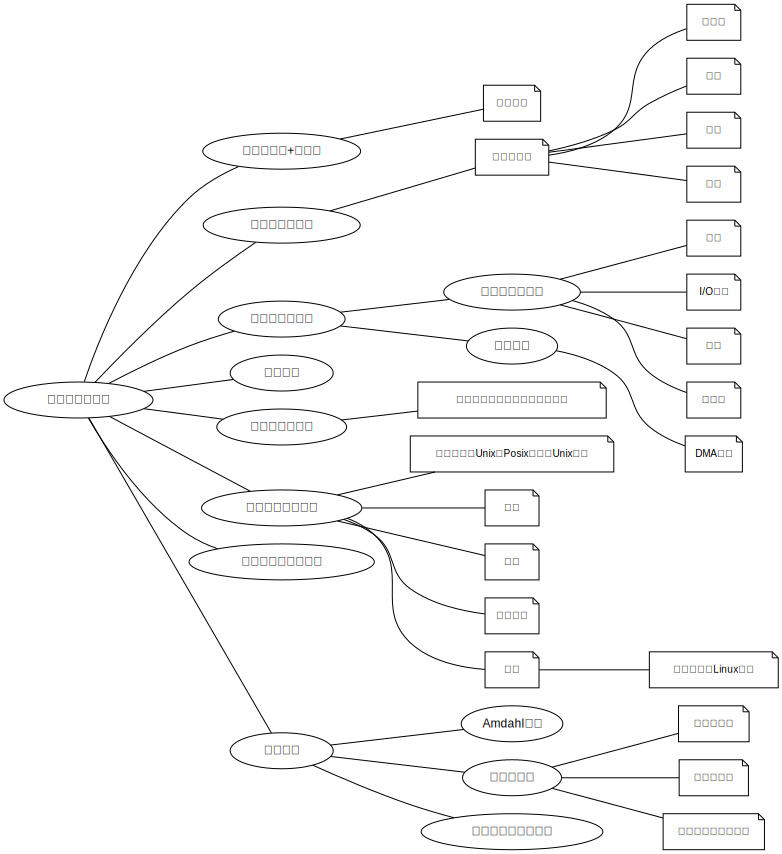
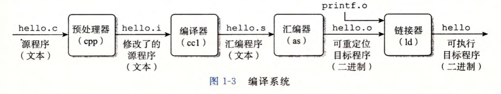
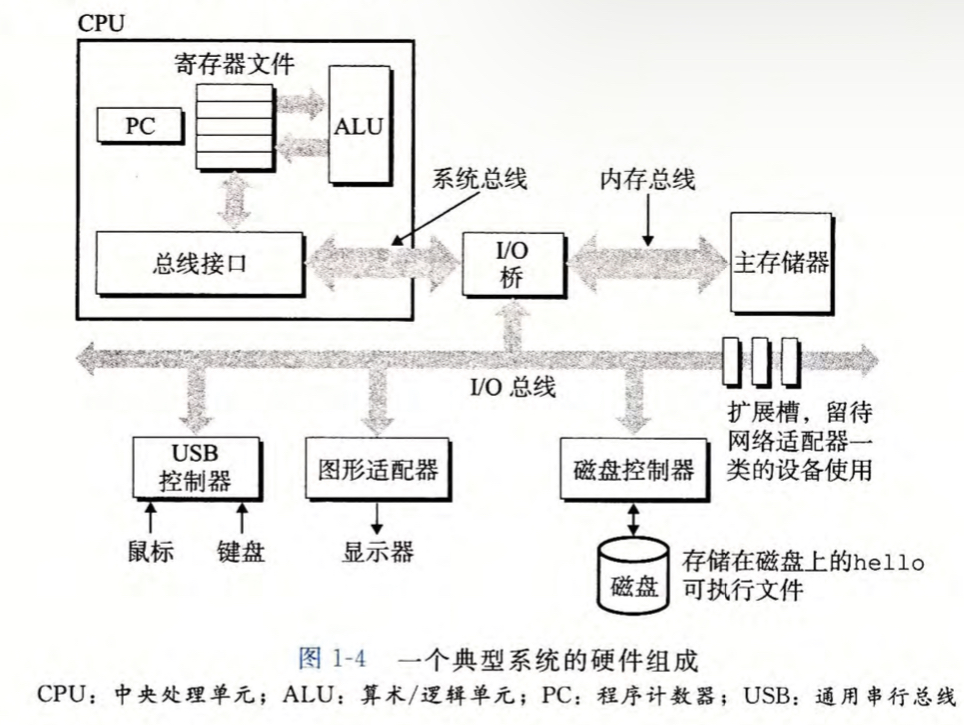
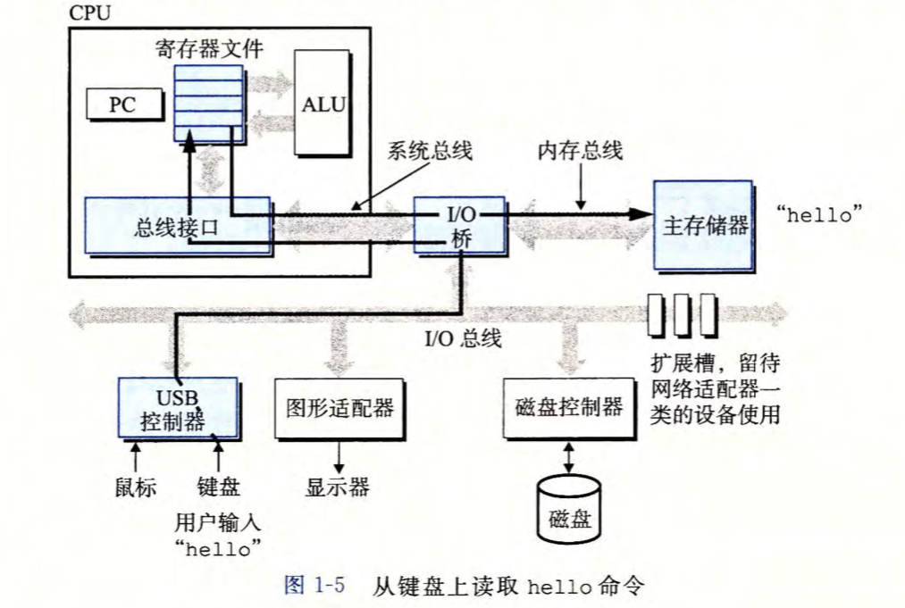
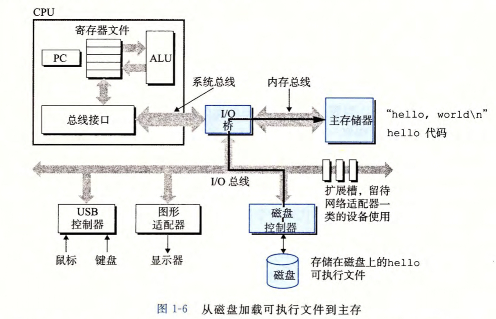
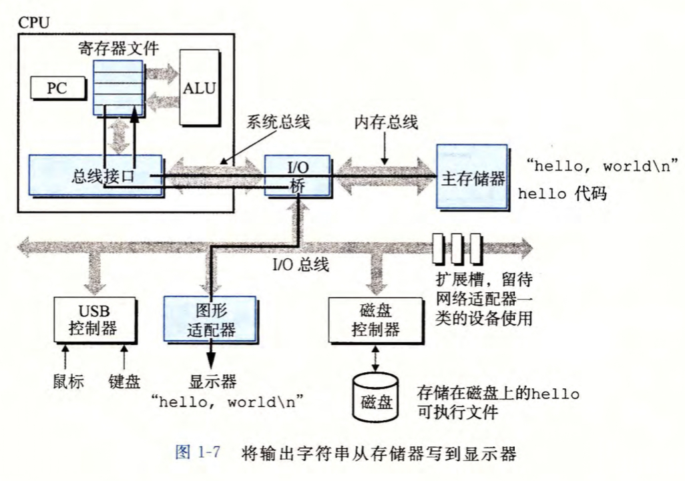
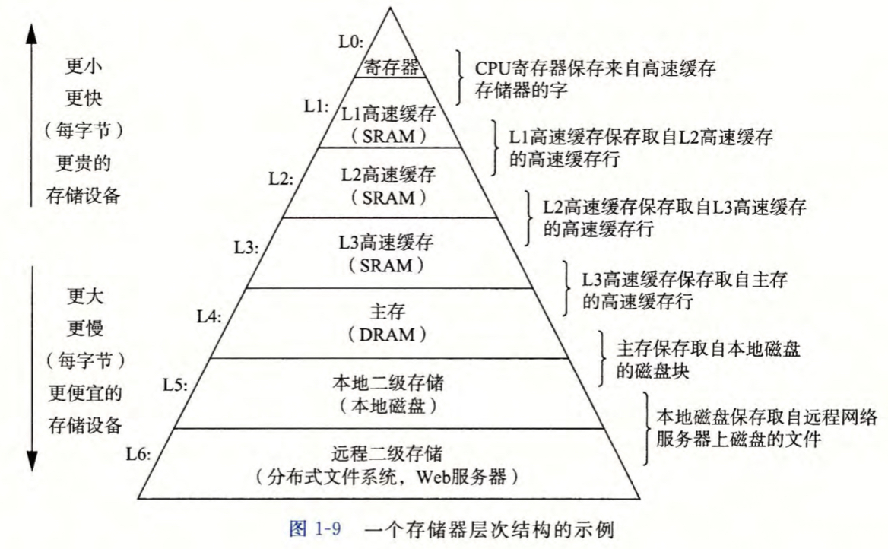
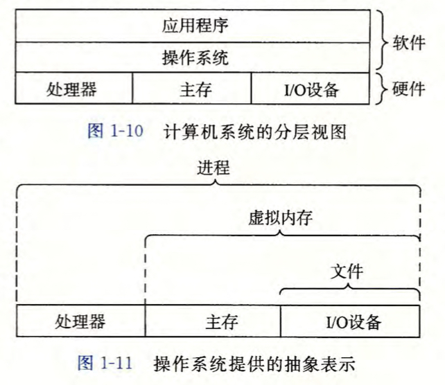
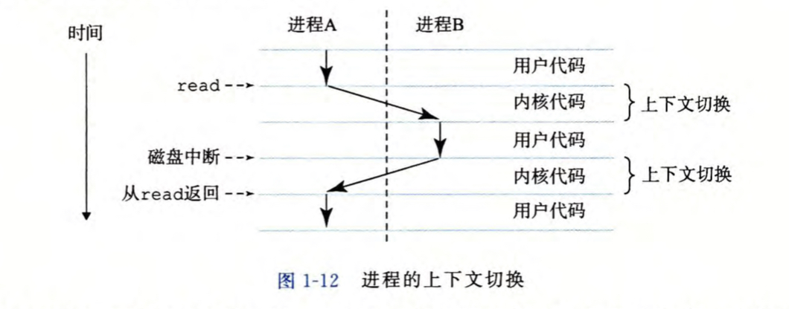
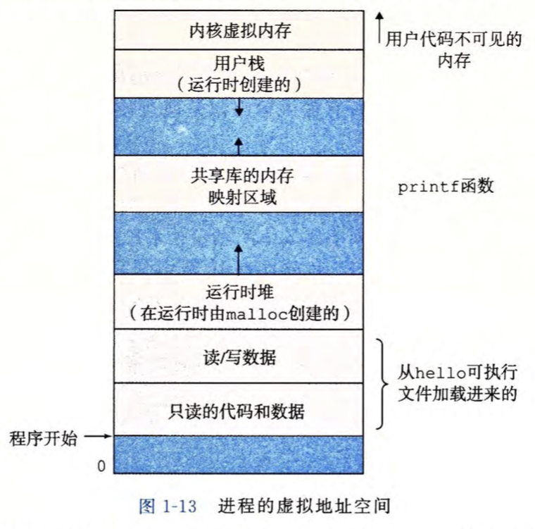

# 第 1 章：计算机系统漫游

大部分人并不直接参与系统开发，但是程序员理解计算机系统是为了更好地理解系统内程序如何运行，从而使程序更好配合系统，写出更好的程序。



## 1.1 信息就是位+信息位

接下来先通过一个程序的生命周期来展开。

```c
# include <stdio.h>

int main() {
		print("Hello, world!\n");
  	return 0;
}
```

这个程序起源于源文件，`hello.c` 是一个文本文件，源文件是一系列 `01` 比特序列构成的文本字符。这部分涉及文件编码问题，所有文件都是以 `01` 形式存在，那么就需要规定编码。这部分在第二章会详细讲解，但此处还是写点文本编码相关的。利用好现有的技术，我们要站在巨人的肩膀上。

::: tip ChatGPT 跟我简单谈谈文本编码和常见的几种文本编码

文本编码是将字符转换成二进制数字以便计算机存储和处理的过程。由于不同的语言和字符集采用不同的字符集编码方式，因此需要选择适当的编码方式来确保文本的正确存储和处理。

下面是几种常见的文本编码方式：

1. ASCII 编码：ASCII 编码是美国信息交换标准代码，用于将英文字符编码成 7 位或 8 位二进制数字。它是最早的字符编码标准，只支持英文字符，不能处理其他语言的字符。
2. Unicode 编码：Unicode 是国际组织制定的字符编码标准，支持全球范围内的语言和字符集。它用 16 位或 32 位的二进制数字表示字符，可以处理包括中文、日语、韩语等在内的各种语言字符。
3. UTF-8 编码：UTF-8 是 Unicode 的一种变体，采用可变长度的编码方式，可以根据字符的不同使用 1 到 4 个字节来表示，节省了存储空间。它是现代互联网应用中最常用的编码方式之一，支持所有 Unicode 字符。
4. GB2312 编码：GB2312 是中国国家标准局颁布的中文字符集编码标准，使用 2 个字节表示一个中文字符，可以处理大约 7000 个汉字。
5. Big5 编码：Big5 是台湾地区的中文字符集编码标准，使用 2 个字节表示一个中文字符，可以处理大约 13000 个汉字。它是繁体中文文本处理的主要编码方式。

以上是一些常见的文本编码方式，每种编码方式都有其优点和缺点，应根据实际情况选择合适的编码方式。

:::

::: info ChatGPT C 编程语言的起源

C 语言是一种高级编程语言，是由贝尔实验室的 Dennis Ritchie 于 20 世纪70年代初期开发的。当时，Ritchie 为了开发 Unix 操作系统，需要一种高效、简洁、易于移植的编程语言来实现系统的底层功能和设备驱动程序。他发现当时已有的编程语言都无法满足他的需求，于是决定自己开发一种新的编程语言。

C 语言最初的设计是在 PDP-11 计算机上完成的，它采用了 B 语言的许多思想，并加入了一些新的特性。C 语言的设计目标是简单、高效、可移植，因此它的语法非常简洁，但又非常灵活，能够方便地操作内存和位操作，同时又具有很好的可移植性。

C 语言的诞生对计算机软件的发展产生了重大影响，它成为了许多操作系统、编译器、应用程序等软件的开发基础，同时也为后来的 C++、Java 等高级编程语言的发展打下了基础。C 语言是一种广泛使用的编程语言，目前仍被广泛地使用在嵌入式系统、操作系统、游戏开发、图形处理等领域。

:::

## 1.2 程序被其他程序翻译成不同的格式

高级程序方便理解，经过编译系统转化为低级机器语言指令，按照可执行命令格式打包。



- 预处理阶段：将包含的头文件的内容插入源代码，得到另一个 C 程序
- 编译阶段：把 C 语言程序转化为一个汇编程序
- 汇编阶段：此时会将汇编代码转换为对应的机器指令，并且打包为一种可重定位目标程序的格式，结果存储在 `hello.o`。这是个二进制文件，包含指令编码
- 链接阶段：例子中有输出函数，这个函数存在于一个预编译的文件 `printf.o` 中，链接器负责处理这种合并

::: info ChatGPT GNU 项目

GNU 是一个自由软件运动的项目，其目标是开发一个完全由自由软件组成的操作系统。GNU 是由理查德·斯托曼 (Richard Stallman) 创建的，其名称 GNU 即 “GNU is Not Unix” 的缩写，意为 “GNU 不是 Unix”。

GNU 项目起源于1983年，当时斯托曼在 MIT 计算机科学实验室工作，他发现当时的计算机软件市场缺乏自由软件，大部分软件都是专有的，用户无法自由地使用、修改和分发。为了解决这个问题，斯托曼开始了 GNU 项目，希望开发一款自由软件的操作系统，让人们能够自由地使用、修改和分发操作系统和应用程序。

GNU 项目不仅开发了操作系统内核，还包括了许多常用的工具软件，如文本编辑器 Emacs、编译器 GCC 等。GNU 项目的工具软件都是自由软件，使用 GNU 通用公共许可证 (GPL) 授权，保证用户能够自由地使用、修改和分发这些软件。

虽然 GNU 操作系统的内核 Hurd 尚未成熟，但是 GNU 的工具软件已经被广泛使用在 Linux 操作系统中，成为了开源软件开发的重要基础。GNU 项目不仅对自由软件的发展产生了巨大影响，而且也促进了开源软件的发展和普及，为计算机领域的自由、开放和创新做出了重要贡献。

:::

## 1.3 了解编译系统如何工作是大有益处的

- 优化程序性能：编译系统逐渐发达，程序逐渐高效，但是了解内部原理，能够选择更高效的代码编写方式
- 理解链接时出现的错误：能够快速排查解决故障
- 避免安全漏洞：包括缓冲区溢出等，需要理解底层的原因

## 1.4 处理器读并解释储存在内存中的指令

在 shell 中运行上述的程序，输入命令后识别第一个词是否为内置指令，如果不是会将第一个单词解释为程序名称。

::: tip ChatGPT 为什么当前目录的可执行文件需要加上相对地址标识"./"

在 Unix 和类 Unix 操作系统中，包括 Linux 和 macOS，在终端中运行当前目录下的可执行文件时，需要使用相对地址标识 “./”。这是因为当前目录 “。” 不被默认包含在系统的可执行文件搜索路径中。

如果你直接输入可执行文件名而不加上 “./”，系统会尝试在 \$PATH 变量所包含的目录中搜索可执行文件，而不会在当前目录中查找。因此，如果可执行文件没有在 \$PATH 变量所包含的目录中，也没有加上 “./”，则系统会报错 “Command not found”。

因此，为了能够在当前目录中运行可执行文件，需要在文件名前加上相对地址标识 “./”，这样系统就会在当前目录中查找可执行文件并执行它。

:::

::: warning ChatGPT 出于什么原因，当前目录 "." 不被默认包含在系统的可执行文件搜索路径

当前目录 “。” 不被默认包含在系统的可执行文件搜索路径中，是出于安全考虑。

如果当前目录包含恶意的可执行文件，并且该目录在系统的可执行文件搜索路径中，那么攻击者就可以通过伪装成合法命令的可执行文件来执行恶意代码。这种攻击方式被称为 “Trojan Horse”，是计算机安全领域的一个常见威胁。为了防止这种攻击，Unix 和类 Unix 操作系统默认不将当前目录包含在可执行文件搜索路径中。

因此，为了在当前目录中运行可执行文件，需要明确地指定相对路径 “./” 或绝对路径，以告知系统要在当前目录中查找可执行文件。这样做可以避免意外地执行恶意代码，并提高系统的安全性。

:::

### 1.4.1 系统硬件组成

需要先了解计算机系统的硬件组织。



#### 总线

系统的公路，传输固定长度的字，字中的字节数即字长是系统的基本参数。大多数机器为 4 个字节和 8 个字节，也就是 32 位和 64 位。

#### I/O 设备

是系统与外部交流的通道，每个 I/O 设备都通过控制器或适配器与 I/O 总线连接。区别在封装方式，控制器一般为设备本身或者主板上的芯片。

::: tip ChatGPT I/O设备控制器与适配器有什么区别吗

在计算机系统中，I/O (输入/输出) 设备控制器和适配器是两种不同的设备，它们有一些区别，具体如下：

1. I/O 设备控制器：是一个硬件设备，负责管理和控制计算机系统与外部 I/O 设备之间的数据传输。I/O 设备控制器通常包含一些输入/输出端口，以及一个或多个命令寄存器，用于发送指令和控制数据传输的速度和方向。它负责将数据从外部设备传输到计算机内存或从内存传输到外部设备。I/O 设备控制器是针对特定设备的，不同的 I/O 设备需要不同的控制器。
2. 适配器：也称为 I/O 适配器、网络适配器或网卡，是一种在计算机系统与外部设备之间传输数据的硬件设备。适配器通常包括一个网卡芯片、一组网络接口、缓冲器和一些控制逻辑。适配器的作用是将计算机系统的数字信号转换为能够在物理层面上传输的模拟信号，然后将模拟信号发送到外部设备或接收来自外部设备的模拟信号并转换为数字信号。适配器通常用于连接计算机与网络、存储设备或其他外部设备。

因此，I/O 设备控制器和适配器虽然都是用于控制和管理数据传输的硬件设备，但它们的作用和功能是不同的。I/O 设备控制器主要是针对特定的 I/O 设备，控制和管理数据在计算机系统和设备之间的传输；而适配器则是一种广泛使用的硬件设备，用于连接计算机与外部设备，主要是网络、存储设备或其他外部设备。

:::

#### 主存

主存储器是临时存储设备，用于储存程序和程序处理的数据，能够动态随机读取。C 语言对应的数据类型所占大小也是根据类型变换的。

#### 处理器

CPU，中央处理器，负责解释或执行存储在主存的指令。核心是大小为一个字的寄存器，程序计数器 PC，指向某条机器语言指令 (储存地址)。处理器是一个指令处理模型，模型由指令集架构决定。CPU 在指令的要求下，可能会加载主存数据到寄存器，存储寄存器数据到主存，对寄存器数据计算和跳转到某个指令，利用修改 PC 寄存器。

处理器的工作看似简单，但是现代处理器用非常复杂的机制实现了加速程序的运行，因此分开讨论处理器的指令集架构和微体系结构。其中指令集架构主要描述每条指令的效果，微体系架构描述处理器具体怎么实现。

### 1.4.2 运行 hello 程序

#### 键入命令

键入命令同时，输入设备将输入内容储存在寄存器，然后储存在主存。



#### 执行命令

命令输入结束后，将目标文件包括数据和指令从磁盘传输到主存，随后执行指令。利用 DMA 技术可以不经过处理器，直接从硬盘传输到主存。



#### 显示结果

指令将字符串传输到寄存器文件，再从寄存器文件复制到显示设备，最终显示在显示器。



## 1.5 高速缓存至关重要

上述运行可以发现，字符串发生了很多次复制，这些都是开销。这些复制操作如果能快速完成，会有很大的帮助。但是高速读取和容量无法兼顾，事实上加快处理器的速度比加快内存要简单，寄存器文件只有几百字节而主存有几十亿字节。

因此人们设计了一种更小更快的设备，称为高速缓存存储器，简称 `cache` 或缓存。当然我更喜欢另一个译法，快取。快取提供快速的访问，用于储存近期可能使用的数据。其中 `L1` 快取基本达到了寄存器文件的访问速度，大小在几万字节，`L2` 快取虽然速度比 `L1` 慢，但是也是主存的 $5～10$ 倍。这两个级别的快取使用的是 `SRAM`，静态随机访问存储器。课间提升的速度比较明显，因此在代码中充分利用就显得比较重要，也能够使程序更加高效。

## 1.6 存储设备形成的层次结构

在处理器与大型存储设备之间插入快取，已经是一个非常常见的设计。图中展示了，较大的存储设备作为较小一级的高速快取，直到主存和本地磁盘。在分布式系统中，本地磁盘还可以是其他系统的存储数据的快取。



理解存储快取的原理，能指导我们利用相关的性质，合理利用快取，提高程序性能。

## 1.7 操作系统管理硬件

上述程序没有直接操控键盘、显示器、磁盘和内存等，但是却能够与硬件交流。这一切的工作都是操作系统完成的，操作系统在硬件和软件之间提供服务。

> 很多的教科书 (特别是国内的) 追求对操作系统的一个精确定义，这意味着会变得 `useless`，但是教科书必须有个定义，于是作者可能被迫下了定义。因此不用过多关注定义，更应关注全貌，之后自己下的定义也是对的。
>
> [操作系统概述 - 南京大学 2023 操作系统 - P1 蒋炎岩](https://www.bilibili.com/video/BV1Xx4y1V7JZ/)

操作系统主要提供两个功能：

1. 防止失控应用滥用硬件
2. 向应用程序提供一套简单一致的机制来控制复杂而又通常不大相同的低级应用设备。



操作系统通过几个抽象概念实现了上述的功能，主要包括进程、虚拟内存和文件。将设备抽象成文件，通过虚拟内存对设备和内存磁盘进行抽象，进程则是对处理器、内存和设备的抽象。

::: info ChatGPT 简单介绍一下 Unix、Posix 和标准 Unix 规范

Unix 是一个类 Unix 操作系统的家族，最初由 AT&T Bell 实验室的肯·汤普森和丹尼斯·里奇等人开发。Unix 操作系统于 1969 年首次出现，并在 1970 年代被广泛使用。Unix 操作系统的特点包括具有强大的命令行界面和工具、良好的可扩展性和可定制性、良好的网络支持等等。

POSIX (Portable Operating System Interface，可移植操作系统接口) 是由 IEEE 制定的一组操作系统接口标准，它定义了一套跨平台的 API 标准，以便在不同的操作系统中实现可移植性。POSIX 的标准版本由 IEEE 组织定义，旨在提高操作系统间的兼容性和互操作性。

标准 Unix 规范 (Single UNIX Specification，SUS) 是由 X/Open 公司创建的一组 Unix 操作系统标准规范，目的是定义一组具有可移植性和互操作性的 Unix 系统接口和应用程序接口 (API)，以确保在各种 Unix 系统中实现可移植性。标准 Unix 规范的主要版本包括 SUSv2 和 SUSv3，这些规范已被 ISO 和 IEEE 批准为国际标准。

:::

### 1.7.1 进程

在操作系统中，运行的程序有一种假象，整个系统只有自己在运行，自己独占处理器、主存、`I/O` 设备。程序不断读取指令并且运行，这是利用进程的抽象完成的。

但实际上，系统中的程序是交错执行的，这是并发执行。一般来说计算机系统中的进程数是大于处理器的核心数的，早期的单处理器更是如此。处理器在进程间切换，这种交错机制称为上下文切换。以下讨论单处理器的情况。

操作系统维护上下文，也就是 PC 寄存器，寄存器文件和主存等，因此进程切换需要保存当前进程上下文，恢复接下来进程的上下文。示例中涉及两个进程，`shell` 和 `hello` 进程，`shell` 在执行 `hello` 程序的时候，会向内核发起系统调用。此时控制权交给操作系统，操作系统新建进程和上下文并切换后运行。执行结束后，再次返回 `shell` 进程。

进程的切换是操作系统内核管理的，内核是操作系统常驻主存的代码片段，但不是进程。准确来说内核管理所有的进程。应用程序需要操作系统操作，通过系统调用转交给内核执行。



### 1.7.2 线程

尽管认为进程只有单一的控制流，但是现代操作系统中，一个进程往往有多个线程的执行单元。由于网络服务器对并行运行的要求，线程在一个进程上下文运行，切换代价小，是更高效的方法。而且现代处理器一般为多核，也使得多线程优势更为明显。

### 1.7.3 虚拟内存

虚拟内存营造一个假象，所有的进程独享内存。针对 `Linux` 而言，所有程序的上层为内核代码，底部为用户代码和数据。



每个进程的虚拟空间大量定义了许多准确的段，从低到高分别为：

- 程序代码和数据
- 堆
- 共享库
- 栈
- 内核虚拟内存

---

未完待续

