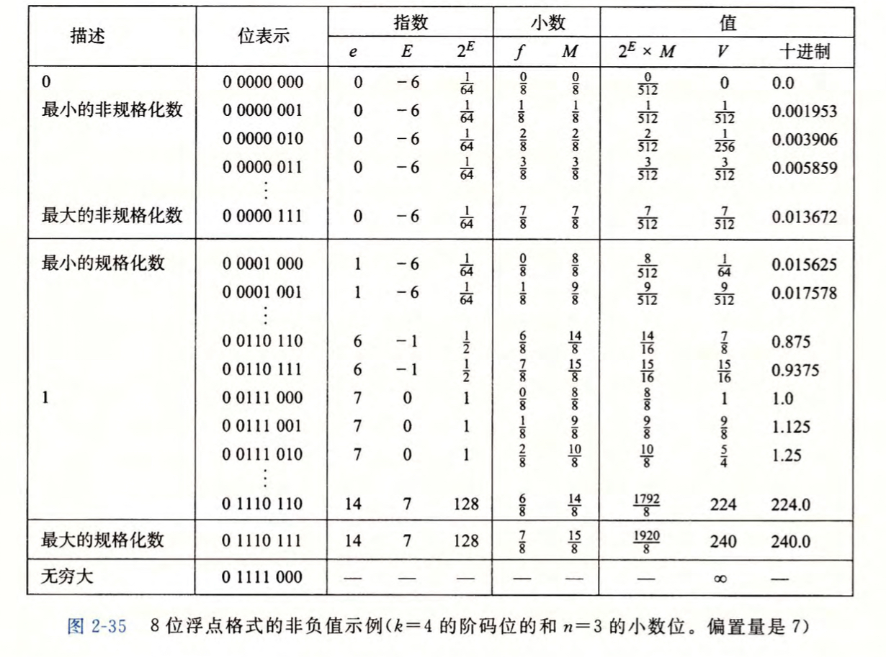

# 第 2 章：信息的表示和处理

## 2.3 整数运算

### 2.3.4 无符号乘法

无符号乘法的溢出采用的是截断，也就是按照 $2^w$ 取模，注意乘法溢出不只一位！

### 2.3.5 补码乘法

补码乘法与无符号乘法类似，但是毕竟多了符号，好像有点差别，但是补码的性质决定了，无符号数和有符号数截断后的结果相同。书中称之为无符号和补码乘法的位级等价性，有兴趣可以阅读。

::: tip

此处提及一下练习题 2.31 与 2.35，刚才提了一下我的猜想，溢出在一位以内，事实上隐含了取模的数这个信息，因此加减法溢出运算没有丢失溢出前数据，在阿贝尔群内还是能恢复溢出前的数字的。乘法不同，截断后会丢失很多信息，这是不能恢复的。

:::

### 2.3.6 乘以常数

乘法在运算中是很占时间周期的，相比起移位，位运算和加减法。因此对于常数，我们可以利用左右移和加法加上二进制思想，实现常数的乘法。

二进制思想对于算法竞赛的人来说并不陌生，简单左移只能乘以 2，但是乘 2 以后加上原数就能实现乘 3，至于什么时候加，取决于乘的数的二进制表示。

现在部分编译器也会对常数进行改写，例如 `x*14` 改写成 `(x<<3)+(x<<2)+(x<<1)`，但具体还是取决于乘法指令的速度和移位次数。

### 2.3.7 除以 2 的幂

除法比乘法还要耗时，但是类似左移，右移也能实现除以 2 的幂，但是由于不像乘法配以加法，无法除以任何数。

对于负数，我们对于舍弃小数部分的需求是无法通过简单的算术右移实现的，此时引入一个偏置值的概念，事先加入一个偏置值，根据右移位数 $k$ 决定，事先加上 $(1<<k) - 1$ ，这样如果正好整除，没有加一，如果不整除能够将整数部分加一。

### 2.3.8 关于整数运算的最后思考

C 语言的整数运算本质上还是一种模运算，在实现上，无符号数和有符号数的位级实现也基本是一致的。其次无符号数的出现在程序设计中也比较常见，需要使用时格外小心，否则会导致很多隐晦的错误。

## 2.4 浮点数

浮点数的实现难点在于对于非常大的数字和非常接近 $0$ 的数字，以及实数运算中的近似值。在 $20$ 世纪 `80` 年代以前，各大计算机产商还是以速度和简便性为导向，没有统一的标准，一切是 `IEEE754` 标准制定后，浮点数的表示才比较统一。这项工作还是 `Intel` 赞助的，旨在为 `8087` 芯片的设计中使用一种较好的浮点数标准。

::: tip Ask ChatGPT 简单介绍 IEEE

IEEE 指的是 “电气和电子工程师学会” (Institute of Electrical and Electronics Engineers)，是全球最大的技术专业组织之一。该组织致力于推动电气、电子和计算机等领域的技术创新和发展，其会员遍布全球超过 160 个国家和地区。IEEE 的使命是通过技术的力量支持人类的利益，提供专业技术支持以及教育服务，以推动在各个领域的进步和发展。IEEE 旗下有多个不同的学会和委员会，涵盖了电力、电子、计算机、通信、生物医学、航空航天、自动化等多个领域，为会员提供各种学习和交流机会、出版物、标准等服务。

:::

### 2.4.1 二进制小数

当今的十进制表示法，本质上就是 $10$ 的幂为底，小数点左侧为整数部分，也就是非负次幂，右边为负数次幂。显然，这种表示形式无法表示部分分数，这个与十进制类似。

这种方式称为定点数表示，这对于非常大的数字是无法表示的。因此接下来引入 IEEE 浮点表示。

### 2.4.2 IEEE 浮点表示

浮点标准用下面的公式表示一个数字：
$$
V=(-1)^s \times M \times 2^E
$$
说明各参数的意义

- `s`：符号位，单独表示正负，1 位
- `M`：尾数，用于表示数字的小数部分，总共 n 位，32 位浮点数 24 位，64 位浮点数 52 位
- `E`：表示阶数，用于表示较大的数字，k 位，32 位浮点数 7 位，64 位浮点数 11 位

可见这是一种近似表示，因为有限的位数限制，而之所以称为浮点数，可见阶数的变动本质上就是小数点的移动。

按照规定，这里有四种值，分别为规范化的，非规范化的，无穷大，NaN：

- 规范化的：阶数不为 0，也不为全 1，这类数比较普遍，要求 $1 \leq M \lt 2$，可以发现，这里隐含的条件是，数字不溢出一定可以表示为上述 $M$，因此隐含小数点前为 1，节省一位，但是就无法表示 0 了。此处的阶数还有一个偏置，阶数的偏置服务于正负阶数，也就是把阶数分为了正负两部分
- 非规范化的：阶数为 0，非规范化解决的问题为 0 的表示和比较小数字的表示，尾数位数有限，加上规范化的数字 $M$ 默认整数部分为 1，因此需要填补这部分空缺。这里的偏置服务于较小的数，因此默认为负数，我们认为越小越好，那么应该为 $2^{-Bias}$，但是此处设计为 $2^{1-Bias}$，实际上是为了与规范化的数字的平滑连接。此时的尾数不再默认整数部分为 1 而是 0
- 无穷大：浮点数运算难免会溢出，出现溢出后会使用无穷大表示，表示方法为阶数全为 1 并且尾数全为 0，符号位表示正负无穷
- NaN：对于无意义的运算，会出现错误，此时需要表示 Not a Number，使用阶数全为 0 和尾数不全为 0

### 2.4.3 数字示例

这里使用一张书中的图片，说明一下上面非规范化数字的偏置设置的巧妙之处。可见，较小的数字连贯在一起，这样设计会合理一点。

### 2.4.4 舍入

未完待续