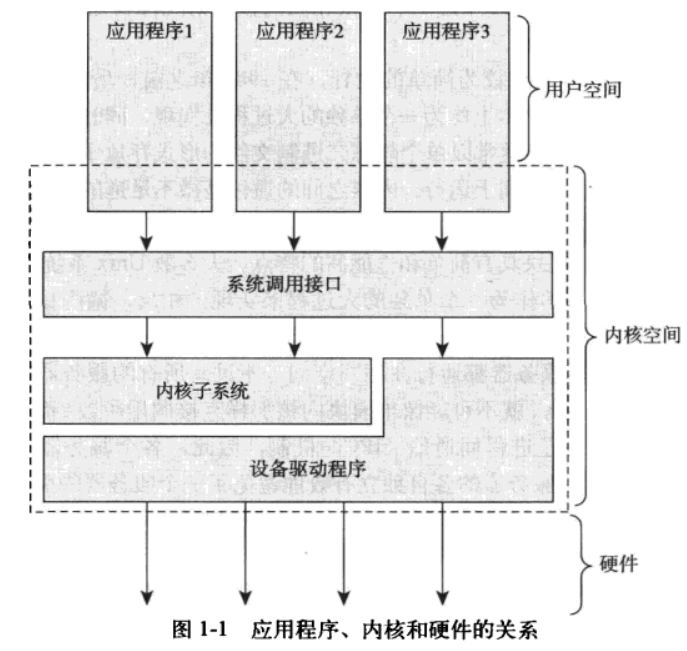
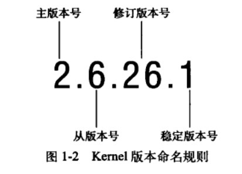

# 第一章 Linux 内核简介

## 目录
[[toc]]

## 1.1 Unix 的历史

Unix 已经存在 50 年，计算机科学家任然认为它是最强大最优秀的操作系统。 
许多组织对 Unix 进行重开发，影响最大的一个是加州大学伯克利分校的 BSD，其中的 csh，vi 等工具现在还在使用。伯克利在 3BSD 开始自主研发，引入虚拟内存。 
Unix 强大的根本原因：

- 设计简洁，几百个系统调用且有明确的设计目的
- 万物皆文件，几乎所有的东西都表示为文件，可以通过同一套系统调用控制
- 内核和相关的系统工具都是使用 C 编写的，可移植性非常高
- 进程创建快，有一个独特的 `fork()` 系统调用
- 有一套简单稳定的通信元语，使程序集中目标在**一次执行保质保量地完成一个任务**

## 1.2 追寻 Linus 的足迹：Linux 简介

1991 年 Linus Torvalds 为新推出的计算机开发了一款全新的操作系统，就是 Linux。 
当时的 DOS 除了玩波斯王子一无用处，而 Linux 喜欢的 Minix 系统，一款教学用的廉价 Unix，却由于许可证原因不能修改。那么 Linus 开始自己写操作系统。写完原型后在网上发布后得到很多人的认可，并且对其代码进行完善和修改。事实上归功于其许可证，GPL2，所有人都可以拿到代码并修改，但是需要保证修改后的代码保持相同的许可证。 
Linux 并没有直接使用 Unix 的代码，很多时候实现方式大相径庭，但是保持应用程序接口一致的原则。Linux 我们一般指的是内核。
## 1.3 操作系统和内核简介

操作系统包括内核，内核处于核心和管理者地位，用户界面属于外壳。一般内核由一个负责响应处理中断的程序，一个负责管理多个进程分享处理器时间的调度程序，负责管理进程地址空间的内存管理程序和网络，进程间通信等系统服务程序组成。 
现代操作系统具有保护机制，内核独立其他应用程序，处于内核态，具有保护的内存空间和访问所有硬件设备。一般的应用程序只运行在用户态。系统根据运行的不同，运行内核，以内核态进入内核空间运行；应用程序运行时以用户态进入用户空间运行。 
应用程序通过系统调用与内核通信，一般通过库函数进入系统调用界面，让内核代其执行任务。例如调用 `printf` 函数的时候，会执行 `write()`，而 `strcpy` 根本没有调用系统调用。应用程序如果执行一条系统调用，我们称为**内核正在代其运行**，应用程序通过系统调用在内核空间运行，内核则运行在**进程上下文**中。应用程序通过系统调用陷入内核空间，这是应用程序完成其工作的基本行为方式。 
内核还要负责管理硬件设备，一般通过中断机制，硬件设备在想要与系统通信时，会发出一个异步中断信号，打断处理器运行和内核，通过携带的中断号查找对应的中断处理程序，调用其处理中断。中断可以被屏蔽，为了数据的同步，而且许多操作系统，包括 Linux，中断服务系统都运行于中断上下文，与所有的进程无关，为了能第一时间响应中断。 

上下文代表活动范围，任意时刻处理器总是处于以下三者之一：

- 运行于用户空间，执行用户进程
- 运行在内核空间，处于进程上下文，代某个特定进程执行
- 运行在内核空间，处于进程上下文，与任何进程无关，处理某个特定中断

就算是处理器没有任何工作，内核就运行一个空进程，处于进程上下文，但运行在内核空间。

## 1.4 Linux 内核和传统 Unix 内核的比较

Unix 内核基本都是一个不可分割的静态可执行库，也就是说他们必须运行在一个单独的地址空间，需要硬件系统提供页机制 (MMU) 管理内存。

::: tip 单内核和微内核设计的比较

单内核与微内核是操作系统阵营中的两大阵营。第三阵营是外内核，主要用于科研系统中。Unix 系统大部分都是单内核设计，表现为单个静态二进制文件，内核整体上作为一个单独的大过程。这样内核通信和应用程序内部通信一样简单，运行在单独的内核地址空间。
微内核按照功能被分割成多个部分，每个称为服务器。此时内核不再是一个大过程，除非在强烈请求特权服务的情况下才会进入内核空间，否则服务器运行在用户空间，相互独立并且通过消息传递机制处理微内核通信，使用 IPC (进程间通信) 机制，各个服务器之间通过 IPC 互换服务。模块化的系统允许一个服务器为了另一个服务器为了另一个服务器而换出。
由于 IPC 机制的开销大于函数调用，又涉及内核空间和用户空间的上下文转换，所以消息传递具有周期，而单内核并没有。于是大部分基于微内核的系统都直接让服务器运行在内核空间，消除频繁的上下文切换，这与设计初衷相违背了。

Linux 是单内核设计，但是汲取了微内核设计的精华，采用模块化设计，抢占式内核，支持内核线程和动态模块装载能力。

:::

Linux 没有放弃 Unix 的底蕴，但是也针对每个问题分析出更好的方案，以下是 Linux 和 Unix 的显著差异：

- Linux 支持动态装载模块，在某些时候可以卸载掉不需要的内核代码。
- Linux 支持对称多处理机制 (SMP)，传统的 Unix 并不支持尽管有的变体支持了。
- Linux 内核可以抢占，允许在内核的任务优先执行，大多数 Unix 内核不支持抢占。
- Linux 没有明显区分线程与进程，只不过有些线程共享一些资源而已。
- Linux 提供具有设备类的面向对象的设备模型，热插拔事件，以及用户空间的设备文件系统 sysfs。
- Linux 是自由的精髓 , 因为当一个想法很差没有人会去实现 , 也没有人强迫开发者实现 , 而好的想法 , 更简洁的设计却解决了很多实际的问题.

## 1.5 Linux 内核版本

内核分为稳定版和开发版 , 顾名思义 . 区分主要通过版本号 , 如图可发现有四个版本号 , 主版本号和从版本号描述了版本的系列 , 从版本号的奇偶决定为开发版或稳定版 , 开发版稳定后会进入稳定版 , 但周期一般较长 . 

修订版本号一开始改动很小 , 但后面因为开发周期变长 , 修订版本号也开始几月更新一次 , 于是有了稳定版本号 , 稳定版本号更新一般是 BUG 的修复 . 

