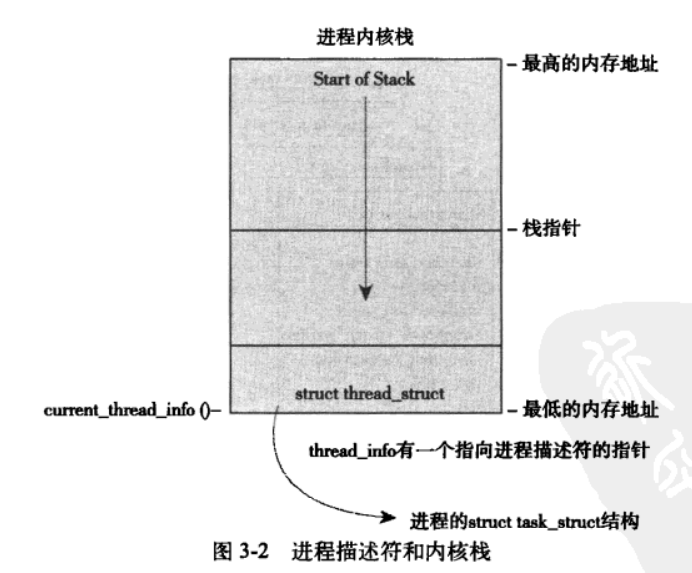

# 第三章 进程管理

进程是 Unix 系统抽象概念中最基本的一种，本章介绍进程相关概念，以及操作系统如何管理进程，以及进程的生命周期。

## 目录

[[toc]]

## 3.1 进程

**进程是运行中的程序，是程序代码运行的实时结果，是处于执行期的程序以及相关资源的总称。**但不局限于程序代码，还包括资源打开的文件，挂起的信号，内核内部数据，处理器状态，一个或者多个内存地址空间和一个或多个执行线程。

执行线程，简称线程，是在进程中活动的对象。线程是内核调度的对象，一般拥有一个单独的程序计数器，进程栈和一组进程寄存器。传统 Unix 系统一个进程只有一个线程，现代操作系统多线程已经司空见惯。Linux 吧线程看做一种特殊的进程。

进程提供两种虚拟机制，虚拟处理器和虚拟内存。虚拟处理器给进程一种错觉，自己独享所有处理器，事实上是共享的。虚拟内存让内存以为自己独占了整个系统的内存。线程在进程中共享虚拟内存，但是每个线程都有一组自己的虚拟处理器。

Linux 中调用 `fork()` 系统调用复制当前进程，该系统调用返回两次，一次返回父进程继续执行，一次返回子进程开始执行。现代 Linux 系统通过 `clone()` 实现 `fork()`。最后程序调用 `exit()` 退出执行，此函数会终结进程并将资源释放，父进程通过 `wait4()` 系统调用查询子进程是否终结。进程退出执行后处于僵死状态，直到父进程调用 `wait()` 或者 `waitpid()`。

::: tip 任务 (task)

进程别名为任务，作者以内核视角看待进程会称之为任务。

:::

## 3.2 进程描述符及任务结构

内核将进程放入双向循环链表，称为任务队列。每一项都是 `task_struct`，称为进程描述符。与进程控制块 (PBC) 的关系是，PCB 是一个抽象概念，而进程描述符就是 Linux 对这一抽象概念的实现。一句话 Linux 的进程控制块就是进程描述符。

`task_struct` 在 32 位系统中大约是 1.7KB，但是包含了管理一个进程需要的所有信息。

### 分配进程描述符

Linux 通过 slab 分配器分配进程描述符，能达到对象复用和缓存着色。2.6 以前的内核中，各个进程的进程描述符在它们内存栈的尾部，方便寄存器少的硬件体系通过栈指针计算出位置。现在使用 slab 动态分配，在栈底生成 `thread_info`，结构中的 `task` 指针指向进程描述符。

```c
struct thread_info {
    struct task_struct   *task;
    struct exec_domain   *exec_domain;
    ...
}
```



::: info

栈底统一指向下生长的栈，也就是进程的栈的最低地址空间。

:::

