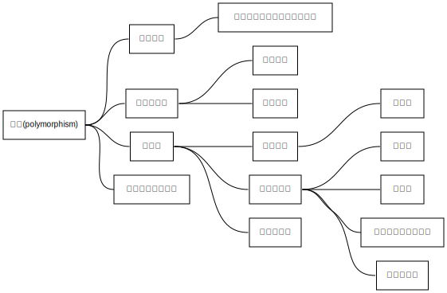

# 第七章 多态

## 7.1 概念引入

我们尝试使用基类指针指向一个派生类的对象，这是可行的，同时我们尝试调用一个在派生类中重写过的接口，会发生什么呢。有意思的是，此时会调用基类的接口，而直接使用派生类对象调用会调用派生类的接口。

这是奇怪的，虽然我们使用的是基类指针，但事实上指向对象还是派生类。在内存结构中，派生类其实包含了两个函数版本，但是此时由于指针类型的限制，编译器认为这是一个基类对象。其实我们可以使用类型转换来调用正确的接口，但是一点都不优雅。所以多态出现了。

## 7.2 多态的概念

多态主要有两种，事实上能解决上述问题的是动态多态，还有静态多态，实现方式都是函数重载。简单来说，多态就是一个接口，多种实现，在不同环境下呈现多种状态。

### 静态多态

通过参数，返回值的不同，我们可以很简单的实现重载。这种多态是静态的，也就是说在编译阶段，编译器通过调用参数类型判断，确定调用的具体函数版本。显然无法处理上述的情况。

> 此处需要提及一下 C 语言并不存在函数重载，可以发现编译后的函数接口只是增加了下划线，而 C++ 会在函数名后额外添加参数返回值类型。

### 动态多态

动态多态的实现是通过虚函数的机制，让对象能够正确调用自己的接口，就算基类指针指向派生类，派生类也能知道自己应该调用哪个版本的接口。这个过程是动态过程中实现的，编译器无法提前知道，只能在运行的时候判断。

## 7.3 虚函数

怎么实现呢，本质上还是函数重载，只是简单的重载无法帮助指针判断，那我们就告诉编译器，这个函数需要覆盖掉基类的版本就好了。就是利用 `virtual` 关键字声明虚函数，编译器便会覆盖这个函数。

### 实现原理

我们先说原理吧，编译器怎么实现虚函数呢？利用的是虚表指针和虚表，如果基类声明或者有虚函数，那么编译器会在构造对象时，在对象前面插入一个虚指针，指向一个虚表。虚表记录所有虚函数和其函数指针，覆盖实际上覆盖的就是函数指针，因此调用虚函数时，会通过虚表顺利调用正确的函数。

### 作用和性质

