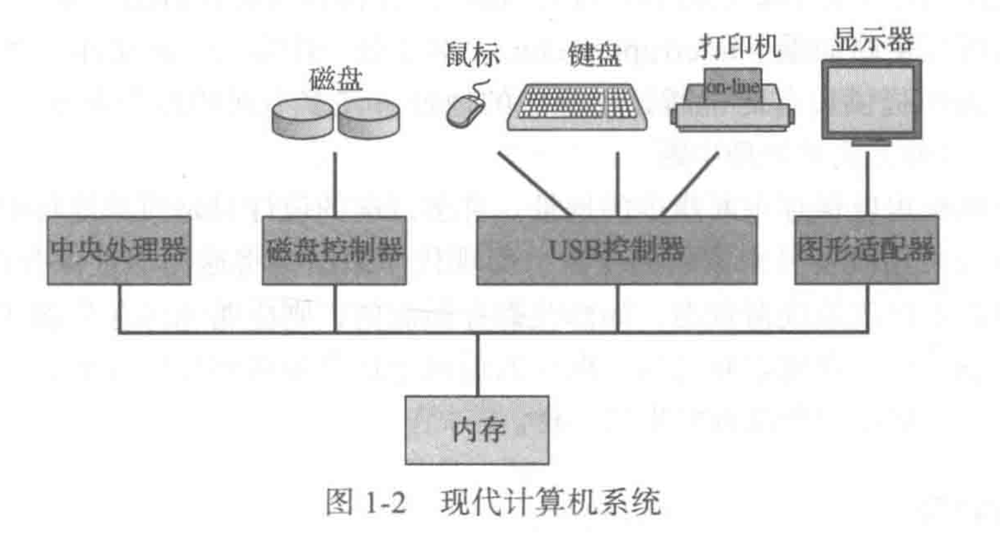
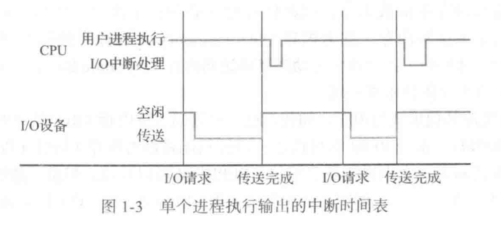
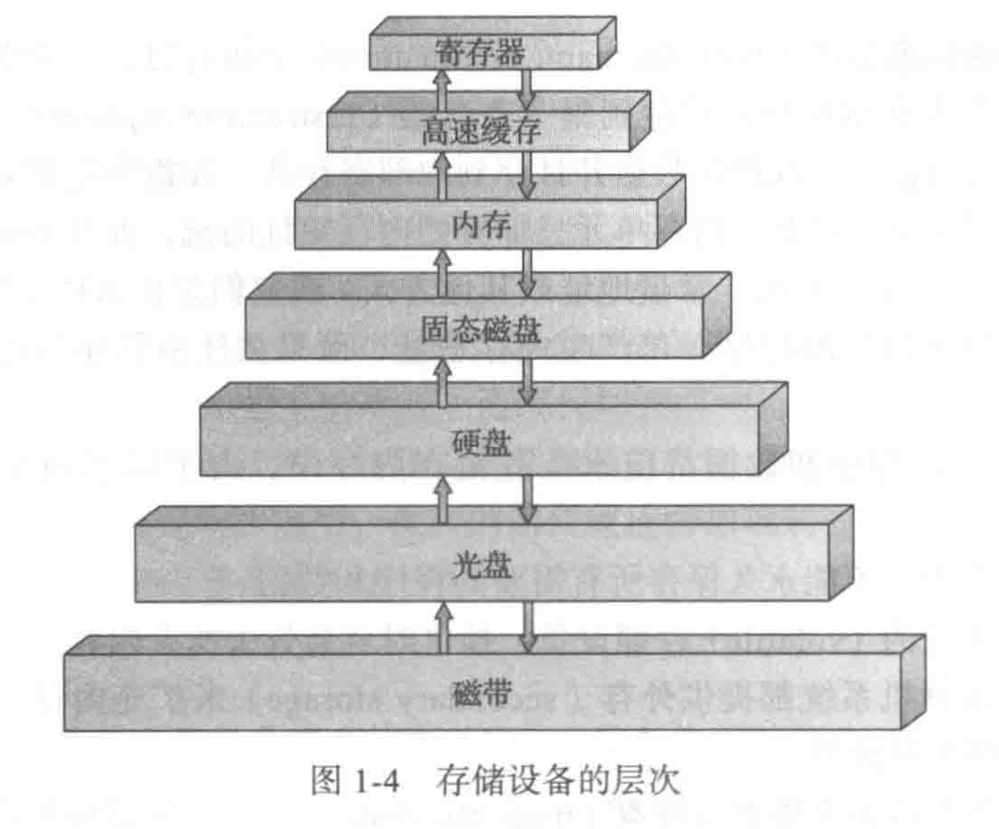
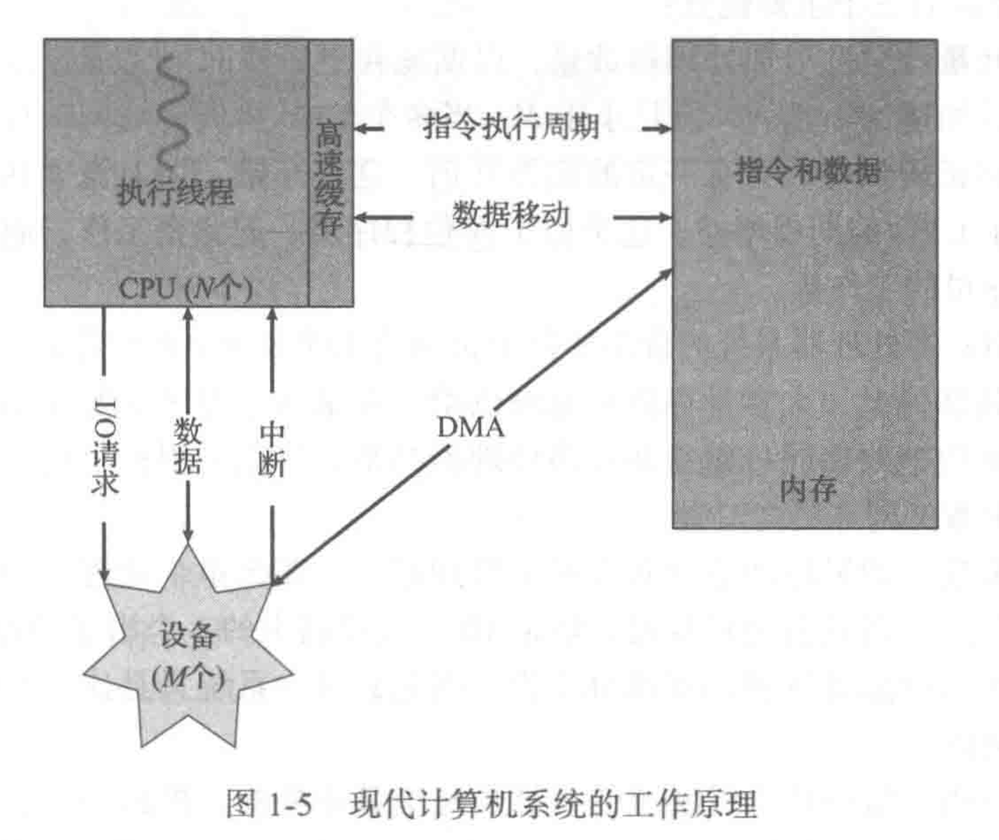
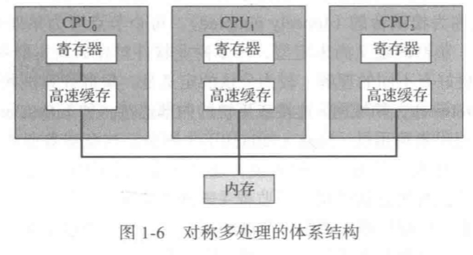

# 第 1 章：导论

[[toc]]
## 1.1 操作系统的功能

计算机系统粗分为硬件、软件、应用程序和用户。

从用户视角来说，操作系统封装了复杂的硬件，使用者可以简单的通过用户接口使用计算机。不同用户也可以通过终端访问同一套资源，现在的智能手机一般是单用户，那么更在乎性能。

从系统视角来说，操作系统是与硬件相连的程序，主要作用就是，资源分配；其次就是管理程序的执行。

接下来提到了一个关于操作系统的定义，这里的说法非常好。

::: tip 操作系统的定义

一般来说，我们没有一个关于操作系统的完全准确的定义。操作系统的存在是因为它们提供了合理方式来解决创建可用计算系统的问题，计算机系统的根本目的是，执行用户程序并且更容易解决用户问题。为实现这一目的，构造了计算机硬件。由于硬件本身并不十分容易使用，因此开发了应用程序。这些应用程序需要一些共同操作，如控制 IO 设备。这些控制和分配 I/O 设备资源的共同功能则被组成一个软件模块：操作系统。

:::

## 1.2 计算机系统的组成

### 1.2.1 计算机系统的运行

现代系统包括处理器和多个设备控制器组成，通过总线连接竞争访问内存。不同控制器和 CPU 之间可以并行运行，通过总线访问内存需要通过内存控制器协调。

计算机启动时，需要运行初始化程序。这个初始化程序 (Boot) 位于计算机的固件，可能是 ROM 或者 EPPROM 中。这个程序会先完成初始化，包括寄存器，设备管理器和内存内容。其次 Boot 需要知晓操作系统内核的相关信息，主要是需要把操作系统加载到内存中，完成启动。

::: tip Tell me, ChatGPT: ROM 和 EPPROM

ROM 和 EPROM 是两种常见的非易失性存储器类型，用于存储计算机和其他电子设备中的程序和数据。它们在存储原理和可编程性方面有所不同。

1. ROM (只读存储器)：
ROM 是一种只能读取而不能编程或擦除的存储器。它在制造时被编程，一旦编程完成，其中的数据就无法更改。ROM 存储器包含一个固定的指令集和数据，这些数据被永久存储在芯片中。ROM 的内容通常由计算机制造商或芯片设计者预先设置，用于存储引导程序、固件、操作系统和其他重要数据。

2. EPROM (可擦除可编程只读存储器)：
EPROM 是一种可擦除可编程的存储器，它可以被多次擦除和重新编程。EPROM 存储器在制造时是空白的，可以被程序员编程，一旦编程完成，数据将一直保存，直到被擦除。EPROM 芯片具有一个透明的窗口，通过这个窗口，可以使用特殊的设备将紫外线照射到芯片上以擦除其中的数据。擦除后，EPROM 可以重新编程，并且可以多次重复这个擦除-编程-读取的过程。

EPROM 的可擦除性使得它在开发和测试阶段非常有用，因为可以多次修改和更新其中的数据。然而，EPROM 需要特殊的擦除设备，并且擦除操作是相对较慢的。因此，为了提高可擦除存储器的易用性，后来出现了闪存存储器 (Flash Memory)，它是一种在不需要特殊设备的情况下可以擦除和编程的存储器类型，常用于计算机、手机和其他电子设备中。

总结：ROM 是只读存储器，数据在制造时被编程，无法更改。EPROM 是可擦除可编程的存储器，可以多次擦除和重新编程。两者都是非易失性存储器，可以长时间保存数据，但 EPROM 在可编程性和擦除方面更灵活一些。

:::

内核加载到内存后，开始为系统和其他程序提供服务。系统启动过程也会启动其他系统进程或后台服务，在 Unix 中通过的是 init 进程完成的初始化，之后通过软硬件的中断实现事件的通知，硬件随时可以通过总线把中断信号传送到 CPU，软件可以通过特定的系统调用触发中断。

CPU 在触发中断时会做出反映，可以通过优先级决定是否相应，随后保存现场，停止运行，根据中断向量表去执行中断处理程序，随后再继续执行之前的工作。

中断是计算机体系结构的重要部分，不同的计算机有自己的中断机制，但是有些功能是类似的。中断处理可以通过一个程序实现，但是这个程序必须响应快。由于预定义的中断并不多，所以可以通过中断程序的指针表或者中断向量实现间接调用，在低地址内存防止指针表，中断触发通过设备号等快速读取对应的程序指针执行。

中断结构体系也需要保存中断地址，以前使用的是固定位置或可用设备号索引的固定位置，现代计算机体系一般是堆栈。其次如果中断程序需要修改 CPU 状态，要保存现场并在执行完毕前返回保证被中断程序的正常的访问。

::: info 存储定义与符号

计算机的存储基本单位是位 (bit)，也就是比特，表示 0 或者 1。通过不同的编码可以表示多种的信息。但是一般计算机中的最小单位是字节 (byte)，也是大多数计算机操作的最小单位，大多数没有直接移动一位的指令，但是有移动一位字节的。下一个是字 (word)，一般根据计算机的位数决定字长，许多操作都是针对字的。

关于单位，计算机一般是使用的是字节计数，也就是 KB、MB、GB、TB 和 PB。1024 一进位。但是计算机制造商一般使用圆整，1000 一进位，例如硬盘厂商，其实这部分是用在一些管理文件上。网络相关的会使用 Kb，Mb，Gb，区别是 B 和 b，因为网络一次移动一位。注意大小写，1B = 8b，也就是 Byte 和 bit 的转换

:::

### 1.2.2 存储结构

CPU 只能从内存中读取指令，因此基本所有程序都是在内存中的。只有少部分位于 ROM 和 EEPROM 中，分别有 Boots 和手机厂商的开机预装软件。一般内存用的是 RAM，随机可访问内存，大多数是动态可访问内存，DRAM，一般使用半导体材料生产。

计算机一般调用 load 和 store 指令从内存取数据以及存数据，load 从内存取数据存入寄存器，store 把寄存器的数据存到内存中。CPU 还会自动获取指令到 CPU。在冯·诺依曼体系中，计算机总是会完成取指，然后完成计算，然后继续获取指令。指令一开始位于内存，取指就是把指令放在 CPU 的指令寄存器，经过解码，可能会取操作数，送入 CPU 后完成计算，结果可能会放回内存。内存只能看到内存流，无法得知数据如何获得，我们也不用关心如何产生的地址，专注于产生的地址。

理想情况下，所有东西都应该放在内存，因为其速度快。但是由于内存是易失性存储设备，以及其造价昂贵，所以比较小，因此需要外存来扩充内存。

最常用的是硬盘和磁盘，由于内存的易失性以及昂贵，大多数据还是在外存中的，因此磁盘的管理很重要。广义的存储其实不止内存和外存，包括高速缓存和寄存器都可以是存储设备，而存储设备其实是在速度、容量和价格上的平衡。技术的发展和技艺的提高使得硬盘和磁盘造价降低，因此磁带等被淘汰。显然，越快的存储设备，价格越贵，违反这条规则的产品会被市场自动淘汰。

其中值得一提的是固态硬盘，我们知道固态硬盘可以支持随机读取，而且能耗低。磁盘的高速转动能耗较高，而且随着半导体技术的发展，固态硬盘价格也逐渐下降？固态分为两类，一类是 DRAM 加上一个备用电源，长时间不通电数据还是会丢失；另一类是闪存，存储不依赖电源，因此长期不通电数据不丢失。

我在网上找不到好的资料，好多推销自己产品的，但是这里的闪存指的就是断电数据不丢失的，而且这种闪存速度没有 DRAM 快。

### 1.2.3 I/O 结构

存储器只是其中一种 I/O 设备，操作系统的大部分的代码都是处理 I/O 管理的，主要是因为不同设备各不相同，以及这对系统的性能特别重要。

计算机系统是由处理器和多个设备控制器组成，通过总线连接。每个控制器通常与一类设备相连，例如 SCSI (小型计算机系统接口，Small Computer System Interface)。每个设备控制器操作系统会分配一个设备驱动程序，主要是管理设备控制器，并向操作系统提供统一的可访问接口。

::: tip Tell me, ChatGPT: 简单介绍一下 SCSI

SCSI (Small Computer System Interface) 是一种用于连接计算机系统和外部设备的接口标准。它最初在上世纪80年代被引入，并广泛用于服务器、存储设备和其他高性能计算机系统。

以下是一些关于 SCSI 的简要介绍：

1. 多设备支持：SCSI 接口支持多设备连接，允许同时连接多个设备，如硬盘驱动器、光驱、打印机、扫描仪和磁带驱动器等。这种多设备支持使得 SCSI 成为服务器和存储系统中常用的接口。
2. 高性能：SCSI 接口设计用于提供高性能数据传输。它支持并行传输和高速数据总线，能够在数据传输过程中实现较低的延迟和较高的数据吞吐量。这使得 SCSI 成为需要高速数据传输的应用场景的理想选择。
3. 灵活性和可扩展性：SCSI 接口提供了灵活性和可扩展性，支持不同类型的设备和连接。它可以通过链路连接 (daisy-chaining) 或者使用 SCSI 总线 (bus) 连接多个设备。此外，SCSI 还提供了广泛的设备支持，包括硬盘驱动器、磁带驱动器、光盘驱动器、扫描仪、打印机等。
4. 多种传输模式：SCSI 支持多种传输模式，包括同步传输和异步传输。同步传输提供更高的数据传输速度，而异步传输则更加灵活和兼容。
5. 灵活的命令集：SCSI 定义了一套命令集，允许主机系统与连接的设备进行通信和控制。这些命令集可以用于执行各种操作，如数据读写、格式化、查询设备信息等。
6. 操作系统支持：SCSI 得到了广泛的操作系统支持，包括 Windows、Linux、UNIX 等。这意味着可以在不同的计算机系统上使用 SCSI 设备，而无需担心兼容性问题。

尽管随着时间的推移，SCSI 在某些领域被其他接口标准 (如 SATA、USB、Thunderbolt) 所取代，但它仍然广泛应用于一些需要高性能和可靠性的领域，例如服务器、大型存储系统和专业音视频制作等。

:::

设备控制器具有自己的缓存，同时还有寄存器。开始 I/O 的时候，设备驱动程序会重置设备控制器的寄存器，控制器通过寄存器识别命令。对于读指令，控制器开始从设备读取输入到本地缓存，等待传输完成通过中断提醒驱动程序，然后驱动程序幸运处理。对于读指令返回数据或指针，其他操作返回状态信息。

中断驱动的设备适合数据量小的情况，否则会造成大量开销。于是出现了 DMA (直接内存访问，Direct Memory Access)。为这类控制器设置好缓冲，指针和计数器后，设备控制器可以自动在内存和缓存之间传输数据，不需要每个字节触发一次中断，而是每个块触发一次。

一些高端的系统交换不使用总线，因此 DMA 更为有效。

## 1.3 计算机系统的体系结构

计算机系统的分类方式与组织形式不一，下面通过简单的处理器分类并介绍。

### 1.3.1 单处理器系统

单处理器系统不是指只有一个处理器，是指通用 CPU 只有一个。可以拥有一些协处理器，事实上，早期的 8086 处理器就可以搭配一个 8087 的浮点协处理器；其他的控制器也可以有自己的处理器，如键盘控制器可以有一个转换输入的处理器，磁盘控制器有一个处理器处理磁盘调度等，我的理解显卡也是一种图像处理器。

所以这里的定义是说的通用的处理器只有一个，其他的处理器需要通用处理器分配任务，同时被监控，操作系统一般无法与之直接通信。作者说大部分计算机还是单处理器，由于本书是 2018 年出版，我认为还是有些日子，但是目前应该还有许多的系统还是单处理器。

### 1.3.2 多处理器系统

多处理器系统又称多核系统，并行系统，具有多个通用的处理器，一开始用于服务器，现在的移动设备以及个人电脑也基本普及了。多个处理器可以带来很多好处：

- 提高吞吐量和效率：多个并行的处理器，速度的提升是明显的，但会损失部分效率在处理器的同步上。因为在合作过程中，1+1 必定小于2，这在团队中也是一样的。
- 经济规模：多个处理器可以共享内存等资源，这比多个单处理器系统拥有自己的内存和磁盘是很省资源的。
- 增加可靠性：多处理器可以实现某个处理器损坏系统保持正常运行，提升可靠性。

对于许多应用，系统的可靠性非常重要，因此需要多处理器提供冗余，这样可以容忍部分的硬件损坏。早期有的系统采用的是 CPU 对，两个处理器运行出结果不一致后交另外一对验证，这种是比较奢侈的做法了。

现在的多处理器一般有两种处理方式，**非对称多处理(asymmetric multiprocessing)**和**对称多处理(SMP，Symmetric MultiProcessing)**。非对称多处理有一个主处理器和其他从处理器，是一种主仆关系，主处理器分配任务以及协调，其他处理器执行任务。最常用的还是 SMP，这里的处理器平等执行命令，拥有自己的缓存，但是共用内存。但是这里涉及到数据的同步，例如 CPU 缓存的同步，以及分配调度，就需要共享部分数据结构实现。

非对称与对称的区分可以在硬件上，也可以在软件，软件也可设计为主从模式。例如在同样硬件上实现不同的操作系统，不过基本所有主流操作系统都支持 SMP。

