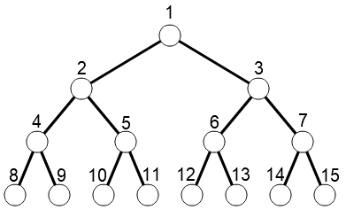

# Atcoder Beginner Contest 285

这次 ABC 是第一次尝试使用 iPad 全程编码完成的，使用的是 [Code on iPadOS](https://github.com/thebaselab/codeapp)。编码速度缓慢，debug 比较麻烦。

## A - Edge Checker 2

### 题目大意

有一棵如下所示的树，给定两个编号 $a$ 和 $b$ （$1 \leq a \lt b \leq 15$），判断是否有边连接两个节点。



### 参考代码

```cpp
#include <cstdio>
using namespace std;

int main()
{
    int A, B, ans = 0;
    scanf ("%d %d", &A, &B);
    printf("%s\n", (B/2==A)?"Yes":"No");
    return 0;
}
```

## B - Longest Uncommon Prefix

### 题目大意

长度为 $N$ 的字符串，记第 $x$ 个字符为 $S_x$，对于所有 $i$（$1 \leq i \leq N-1$），找出满足条件的最大 $l$：

- $l + i \leq N$
- 对于所有 $1 \leq k \leq l$，均满足 $S_k \neq S_{k+i}$

$l = 0$ 总是满足条件。

### 解题思路

模拟就好了。

### 参考代码

```cpp
// Created on Inzam的iPad.

#include <iostream>
using namespace std;

string s;
int n;

int main() {
    cin >> n >> s;
    s = " " + s;
    for (int i = 1; i < n; ++i) {
        int ans = 0;
        for (int j = 1; j + i <= n; ++j) {
            if (s[j] == s[j + i]) {
                ans = j - 1;
                break;
            }
            if (j + i == n)
                ans = j;
        }
        cout << ans << '\n';
    }
    return 0;
}
```

## C - abc285_brutmhyhiizp

### 题目大意

给 $10^{16}$ 个问题编号，使用大写字母，首先使用一个字母编号，随后使用两个字母，低位字母先增长，随后进位。给定一个字符串，输出题目编号。

### 解题思路

类比一下，就是个二十六进制。

### 参考代码

```cpp
// Created on Inzam的iPad.

#include <iostream>
using namespace std;

string s;
long long n = 0;

int main() {
    cin >> s;
    int len = s.length();
    for (int i = 0 ; i < len; ++i)
        n = n * 26 + s[i] - 'A' + 1;
    cout << n << endl;
    return 0;
}
```

## D - Change Usernames

### 题目大意

你有 $N$ 个改名请求，你可以随意安排他们的顺序，但需要保证同一时间用户名没有重复。

### 解题思路

简单的拓扑排序题目，改名是一条有向边，每一次选取出度为 $0$ 的点，找到上一个结点，减少上一个点的出度。最后如果出度均为 $0$ 说明改名顺利，否则改名无法完成。

会出现多个人会改同一个名字，此时不需要记录多个*上一个节点*，直接覆盖即可，因为最后只有一个可以改名成功。此外还需要对字符串进行哈希或者离散化。

### 参考代码

```cpp
// Created on Inzam的iPad.

#include <iostream>
#include <map>
#include <queue>
using namespace std;

#define maxn 200010
string s1, s2;
int n, ans = 0, id = 1;
int outdeg[maxn], pa[maxn];
queue<int>q;
map<string, int>mp;

int main() {
    cin >> n;
    for (int i = 0 ; i < n; ++i) {
        cin >> s1 >> s2;
        if (mp.count(s1) == 0)
            mp[s1] = id++;
        if (mp.count(s2) == 0)
            mp[s2] = id++;
        outdeg[mp[s1]]++;
        pa[mp[s2]] = mp[s1];
    }
    for (int i = 1; i < id; ++i) {
        if (outdeg[i] == 0)
            q.push(i);
    }
    while (!q.empty()) {
        int cur = q.front(); q.pop();
        if (--outdeg[pa[cur]] == 0)
            q.push(pa[cur]);
    }
    for (int i = 1; i < id; ++i)
        ans |= outdeg[i];
    if (ans == 0)
        cout << "Yes\n";
    else
        cout << "No\n";
    return 0;
}
```

## E - Work or Rest

### 题目大意

一周有 $N$ 天，每周都一样并且循环，一天可以是假期或者工作日，假期的产出为 $0$ ，工作日产出为 $A_{\min(x,y)}$ ，其中 $x$ 为距离上个假期的天数，$y$ 为距离下一个假期的天数。你可以随便安排假期分布，找出一周的最大产出。

### 解题思路

典型的动态规划题目，首先假设第一天为假期，因为必定有一个假期，所以假设其为第一天。$dp_i$ 表示第 $i$ 天为假期，那么现在的最大贡献为多少。每次转移都需要计算连续 $len$ 长度的产出 $P_{len}$ ，然后尝试转移：
$$
dp_i = \max_{k=1}^{i-1} dp_k + P_{i-k-1}
$$

$$
dp_1 = 0
$$

接下来处理一下产出，事实上是一个回文数组，其实可以列出一个通项公式：
$$
P_{len}=(len \% 2) \times A_{\lfloor len/2 \rfloor + 1} + \ 2 \times \sum_{i=1}^{\lfloor len/2 \rfloor} A_i
$$

还有个细节，最后答案应该是 $dp_{N+1}$ ，也就是两端应该是本周的第一天和下一周的第一天。

### 参考代码

```cpp
// Created on Inzam的iPad.

#include <iostream>
#include <map>
#include <queue>
using namespace std;

#define maxn 10010
string s1, s2;
int n, ans = 0, id = 1;
long long sum[maxn], val[maxn], dp[maxn];

int main() {
    cin >> n;
    sum[0] = 0;
    for (int i = 1 ; i <= n; ++i) {
        cin >> val[i];
        sum[i] = sum[i - 1] + val[i];
    }
    dp[1] = 0;
    for (int i = 2; i <= n; ++i) {
        for (int j = i - 1; j >= 1; --j) {
            int len = i - j - 1;
            long long res = 0;
            if (len & 1)
                res = sum[len / 2] * 2 + val[len / 2 + 1];
            else
                res = sum[len / 2] * 2;
            dp[i] = max(dp[i], dp[j] + res);
        }
    }
    for (int i = n - 1; i >= 1; --i) {
        int len = n - i;
        long long res = 0;
        if (len & 1)
            res = sum[len / 2] * 2 + val[len / 2 + 1];
        else
            res = sum[len / 2] * 2;
        dp[n] = max(dp[n], dp[i] + res);
    }
    cout << dp[n] << endl;
    return 0;
}
```

以上
